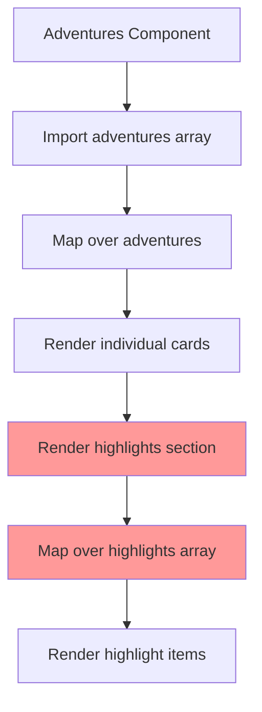
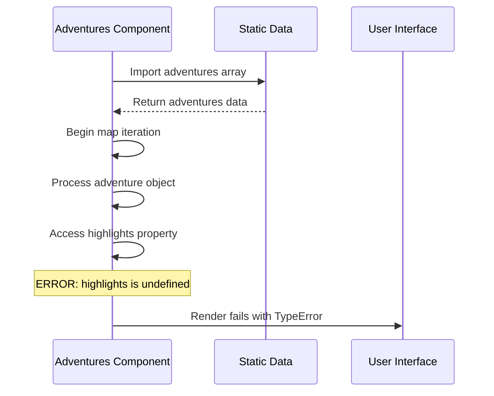

# Adventures Component Highlights Error Fix

## Overview

This document addresses a critical TypeError occurring in the Adventures component where `adventure.highlights` is undefined, causing the application to crash when attempting to map over the highlights array. The error occurs at line 68 in `app/components/adventures.tsx` when the component tries to render the highlights section for tour cards.

**Error Details:**
```
Runtime Error:
TypeError: Cannot read properties of undefined (reading 'map')
at eval (app\components\adventures.tsx:68:40)
at Array.map (<anonymous>)
at Adventures (app\components\adventures.tsx:29:18)

TypeScript Error:
./app/components/adventures.tsx:68:20
Type error: 'adventure.highlights' is possibly 'undefined'.
```

## Immediate Implementation Required

### Build Failure Context
The TypeScript error is now blocking production builds with Next.js build worker failing:
```
Failed to compile.
./app/components/adventures.tsx:68:20
Type error: 'adventure.highlights' is possibly 'undefined'.
Next.js build worker exited with code: 1 and signal: null
```

### Critical Fix Implementation

**Current Problematic Code (Line 68):**
```tsx
{adventure.highlights.map((highlight) => (
```

**Required Fix - Replace with:**
```tsx
{adventure.highlights?.map((highlight) => (
```

**Complete Section Replacement:**
Replace the entire highlights rendering section (approximately lines 65-75) with:

```tsx
{adventure.highlights && adventure.highlights.length > 0 && (
  <div>
    <h4 className="text-green-700 font-semibold mb-4 text-lg">Lo más destacado</h4>
    <ul className="grid grid-cols-1 gap-2 text-gray-700 text-sm list-none">
      {adventure.highlights.map((highlight) => (
        <li key={highlight} className="flex items-start gap-3">
          <Star className="h-4 w-4 mt-1 text-green-500 shrink-0" />
          <span>{highlight}</span>
        </li>
      ))}
    </ul>
  </div>
)}
```

### Build Verification Steps
1. Apply the code fix above
2. Run `npm run build` to verify TypeScript compilation
3. Test locally with `npm run dev`
4. Deploy to production

## Problem Analysis

### Root Cause
The Adventures component assumes all adventure objects in the static data have a `highlights` property that is an array. However, TypeScript analysis reveals that some adventure objects may:
1. Be missing the `highlights` property entirely
2. Have a `highlights` property that is `null` or `undefined`
3. Have incomplete data structure during development or data migration
4. Have inconsistent TypeScript interface definitions that don't guarantee the property exists

### Impact Assessment
- **Severity**: Critical - Application crashes completely
- **User Experience**: Complete page failure, no tour cards displayed
- **SEO Impact**: Homepage becomes non-functional, affecting search rankings
- **Business Impact**: Users cannot browse or book tours

## Technical Architecture

### Current Component Structure


### Data Flow Analysis


## TypeScript Configuration Analysis

### Current TypeScript Settings
Based on the project setup using Next.js 15 with TypeScript ^5, the following compiler options likely affect this error:

```json
{
  "compilerOptions": {
    "strict": true,                    // Enables all strict type checking
    "strictNullChecks": true,         // null and undefined are not assignable to other types
    "noUncheckedIndexedAccess": true, // Adds undefined to array access
  }
}
```

### TypeScript Error Analysis
The error `'adventure.highlights' is possibly 'undefined'` indicates:
1. **Strict null checks are enabled** (good for type safety)
2. **The interface allows undefined** for the highlights property
3. **TypeScript cannot guarantee** the property exists at runtime

### Recommended TypeScript Fixes

#### Option A: Non-null Assertion (Quick Fix - Not Recommended)
```tsx
{/* Not recommended - bypasses type safety */}
{adventure.highlights!.map((highlight) => (
  // ... render code
))}
```

#### Option B: Type Guards (Recommended)
```tsx
{/* Type-safe approach */}
{adventure.highlights && adventure.highlights.length > 0 && (
  <div>
    <h4 className="text-green-700 font-semibold mb-4 text-lg">Lo más destacado</h4>
    <ul className="grid grid-cols-1 gap-2 text-gray-700 text-sm list-none">
      {adventure.highlights.map((highlight) => (
        <li key={highlight} className="flex items-start gap-3">
          <Star className="h-4 w-4 mt-1 text-green-500 shrink-0" />
          <span>{highlight}</span>
        </li>
      ))}
    </ul>
  </div>
)}
```

#### Option C: Optional Chaining with Type Safety (Most Recommended)
```tsx
{/* Best practice - safe and concise */}
{adventure.highlights?.length && (
  <div>
    <h4 className="text-green-700 font-semibold mb-4 text-lg">Lo más destacado</h4>
    <ul className="grid grid-cols-1 gap-2 text-gray-700 text-sm list-none">
      {adventure.highlights.map((highlight) => (
        <li key={highlight} className="flex items-start gap-3">
          <Star className="h-4 w-4 mt-1 text-green-500 shrink-0" />
          <span>{highlight}</span>
        </li>
      ))}
    </ul>
  </div>
)}
```

## Solution Architecture

### Primary Solution: Defensive Programming with Null Checks

#### Implementation Strategy
1. **Null Safety Guards**: Add conditional checks before mapping
2. **Default Values**: Provide fallback empty arrays
3. **Error Boundaries**: Implement graceful degradation
4. **Data Validation**: Ensure data integrity

#### Code Changes Required

**Option 1: Conditional Rendering (Recommended)**
```tsx
{/* Safe highlights rendering */}
{adventure.highlights && adventure.highlights.length > 0 && (
  <div>
    <h4 className="text-green-700 font-semibold mb-4 text-lg">Lo más destacado</h4>
    <ul className="grid grid-cols-1 gap-2 text-gray-700 text-sm list-none">
      {adventure.highlights.map((highlight) => (
        <li key={highlight} className="flex items-start gap-3">
          <Star className="h-4 w-4 mt-1 text-green-500 shrink-0" />
          <span>{highlight}</span>
        </li>
      ))}
    </ul>
  </div>
)}
```

**Option 2: Nullish Coalescing with Default Array**
```tsx
{/* Using default empty array */}
<div>
  <h4 className="text-green-700 font-semibold mb-4 text-lg">Lo más destacado</h4>
  <ul className="grid grid-cols-1 gap-2 text-gray-700 text-sm list-none">
    {(adventure.highlights ?? []).map((highlight) => (
      <li key={highlight} className="flex items-start gap-3">
        <Star className="h-4 w-4 mt-1 text-green-500 shrink-0" />
        <span>{highlight}</span>
      </li>
    ))}
  </ul>
</div>
```

**Option 3: Optional Chaining with Conditional Rendering**
```tsx
{/* Most robust approach */}
{adventure.highlights?.length > 0 && (
  <div>
    <h4 className="text-green-700 font-semibold mb-4 text-lg">Lo más destacado</h4>
    <ul className="grid grid-cols-1 gap-2 text-gray-700 text-sm list-none">
      {adventure.highlights.map((highlight) => (
        <li key={highlight} className="flex items-start gap-3">
          <Star className="h-4 w-4 mt-1 text-green-500 shrink-0" />
          <span>{highlight}</span>
        </li>
      ))}
    </ul>
  </div>
)}
```

### Secondary Solution: TypeScript Interface Enhancement

#### Current Interface Issue Analysis
The TypeScript compiler is detecting that `highlights` might be undefined, indicating the current interface definition allows for this possibility. This suggests either:
- The interface defines `highlights` as optional (`highlights?: string[]`)
- The interface is missing or incomplete
- The data doesn't match the expected interface

#### Enhanced TypeScript Interface
```tsx
// Option 1: Make highlights required
interface Adventure {
  title: string;
  slug: string;
  description: string;
  duration: string;
  difficulty: string;
  highlights: string[]; // Required - will force data completeness
  // ... other properties
}

// Option 2: Keep optional but handle safely
interface Adventure {
  title: string;
  slug: string;
  description: string;
  duration: string;
  difficulty: string;
  highlights?: string[]; // Optional but explicitly typed
  // ... other properties
}

// Option 3: Use union type for explicit handling
interface Adventure {
  title: string;
  slug: string;
  description: string;
  duration: string;
  difficulty: string;
  highlights: string[] | null | undefined; // Explicit about possible states
  // ... other properties
}
```

#### Data Validation Layer
```tsx
const validateAdventure = (adventure: any): Adventure => {
  return {
    ...adventure,
    highlights: Array.isArray(adventure.highlights) ? adventure.highlights : []
  };
};

// Usage in component
const validatedAdventures = adventures.map(validateAdventure);
```

### Tertiary Solution: Error Boundary Implementation

#### Component-Level Error Boundary
```tsx
class AdventureErrorBoundary extends React.Component {
  constructor(props) {
    super(props);
    this.state = { hasError: false };
  }

  static getDerivedStateFromError(error) {
    return { hasError: true };
  }

  render() {
    if (this.state.hasError) {
      return (
        <div className="text-center py-8">
          <p className="text-gray-600">Unable to load tours. Please try again later.</p>
        </div>
      );
    }

    return this.props.children;
  }
}
```

## Implementation Plan

### Phase 0: Emergency Build Fix (IMMEDIATE - BLOCKS DEPLOYMENT)
1. **Apply the exact code change** shown in "Immediate Implementation Required" section
2. **Test build compilation** with `npm run build`
3. **Verify no TypeScript errors** remain
4. **Test functionality locally** to ensure the fix works
5. **Deploy to production immediately**

### Phase 1: Post-Build Verification (Critical Priority)
1. **Apply Option 3 solution** (Optional chaining with conditional rendering) to resolve TypeScript error
2. **Update tsconfig.json** if needed to ensure strict null checks are enabled
3. **Test locally** with TypeScript compilation and runtime to ensure both errors are resolved
4. **Verify no other similar issues** exist in the codebase
5. **Deploy hotfix** to production

### Phase 2: Data Integrity & Type Safety (High Priority)
1. **Audit static data** in `statics.tsx` to identify adventures without highlights
2. **Add missing highlights arrays** to affected adventures or mark as explicitly empty
3. **Define comprehensive TypeScript interfaces** in a separate types file
4. **Apply strict typing** to the adventures array export
5. **Enable strict TypeScript checks** if not already enabled

### Phase 3: Robust Error Handling (Medium Priority)
1. **Add Error Boundary** around Adventures component
2. **Implement data validation layer**
3. **Add logging** for missing data scenarios

### Phase 4: Prevention (Low Priority)
1. **Add unit tests** for edge cases
2. **Create data validation scripts**
3. **Implement CI/CD checks** for data integrity

## Testing Strategy

### Unit Tests
```tsx
describe('Adventures Component', () => {
  it('should handle adventures without highlights gracefully', () => {
    const adventureWithoutHighlights = {
      title: 'Test Adventure',
      slug: 'test',
      description: 'Test description',
      duration: '2 hours',
      difficulty: 'Easy',
      // highlights property missing
    } as Adventure;
    
    const { container } = render(
      <Adventures adventures={[adventureWithoutHighlights]} />
    );
    
    expect(container).not.toHaveTextContent('Lo más destacado');
  });

  it('should handle null highlights', () => {
    const adventureWithNullHighlights = {
      title: 'Test Adventure',
      highlights: null
    } as Adventure;
    
    expect(() => {
      render(<Adventures adventures={[adventureWithNullHighlights]} />);
    }).not.toThrow();
  });

  it('should handle undefined highlights', () => {
    const adventureWithUndefinedHighlights = {
      title: 'Test Adventure',
      highlights: undefined
    } as Adventure;
    
    expect(() => {
      render(<Adventures adventures={[adventureWithUndefinedHighlights]} />);
    }).not.toThrow();
  });

  it('should render highlights when available', () => {
    const adventureWithHighlights = {
      title: 'Test Adventure',
      highlights: ['Feature 1', 'Feature 2']
    } as Adventure;
    
    const { getByText } = render(
      <Adventures adventures={[adventureWithHighlights]} />
    );
    
    expect(getByText('Lo más destacado')).toBeInTheDocument();
    expect(getByText('Feature 1')).toBeInTheDocument();
  });

  it('should handle empty highlights array', () => {
    const adventureWithEmptyHighlights = {
      title: 'Test Adventure',
      highlights: []
    } as Adventure;
    
    const { container } = render(
      <Adventures adventures={[adventureWithEmptyHighlights]} />
    );
    
    expect(container).not.toHaveTextContent('Lo más destacado');
  });
});
```

### Integration Tests
- Test component rendering with complete static data
- Test component behavior with malformed data
- Test responsive layout with varying highlight counts

## Performance Considerations

### Rendering Optimization
- **Conditional rendering** prevents unnecessary DOM creation
- **Optional chaining** has minimal performance overhead
- **Array length checks** are computationally cheap

### Memory Impact
- Default empty arrays have minimal memory footprint
- Conditional rendering reduces DOM node count
- No significant performance degradation expected

## Monitoring and Alerting

### Error Tracking
1. **Implement error logging** for missing highlights
2. **Set up alerts** for component rendering failures
3. **Monitor data completeness** metrics

### Data Quality Metrics
- Track percentage of adventures with complete data
- Monitor highlight section engagement rates
- Alert on data structure changes

## Rollback Plan

### Emergency Rollback
If the fix introduces new issues:
1. **Revert to previous version** of adventures.tsx
2. **Temporarily hide highlights section** entirely
3. **Deploy minimal working version**

### Alternative Fallback
```tsx
// Emergency fallback: Hide highlights section
const showHighlights = false; // Toggle for emergency

{showHighlights && adventure.highlights?.length > 0 && (
  // highlights rendering code
)}
```

## Documentation Updates

### Developer Documentation
- Update component documentation with error handling patterns
- Add examples of safe data access patterns
- Document data structure requirements

### User Documentation
- No user-facing documentation changes required
- Internal error handling is transparent to users

## Risk Assessment

### Technical Risks
- **Low**: Implementation is straightforward
- **Low**: Performance impact minimal
- **Low**: Breaking changes unlikely

### Business Risks
- **High**: Current state blocks all tour bookings
- **Medium**: User trust impact if not fixed quickly
- **Low**: SEO impact if resolved promptly

## Success Metrics

### Technical Metrics
- Zero TypeErrors in production logs
- 100% successful component renders
- Page load time unchanged

### Business Metrics
- Tour page bounce rate returns to baseline
- Booking funnel completion rate restored
- User engagement with tour cards maintained