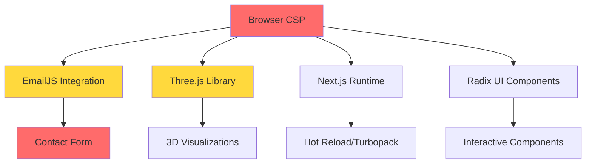
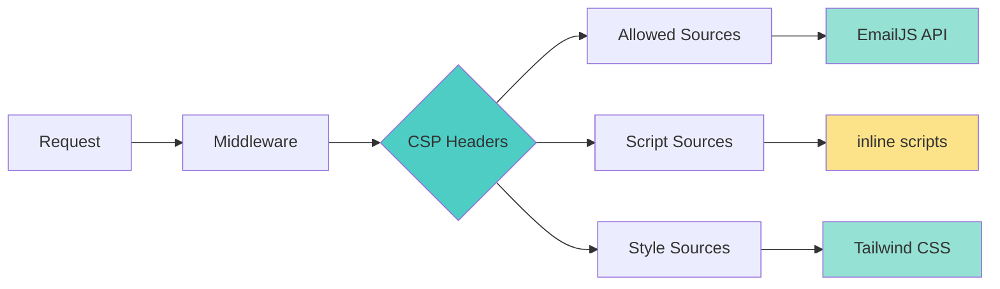
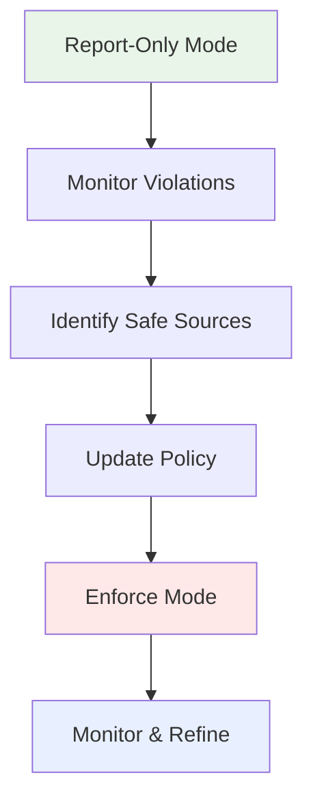
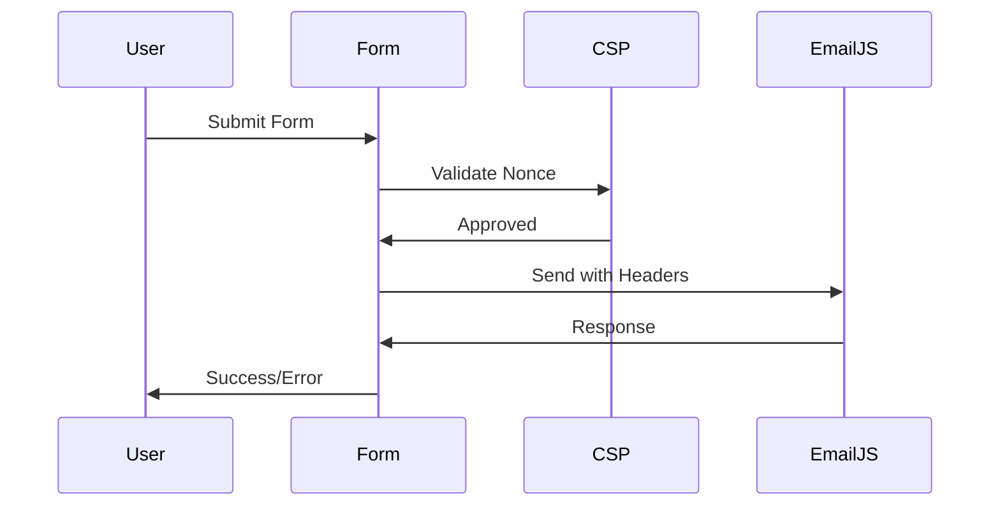
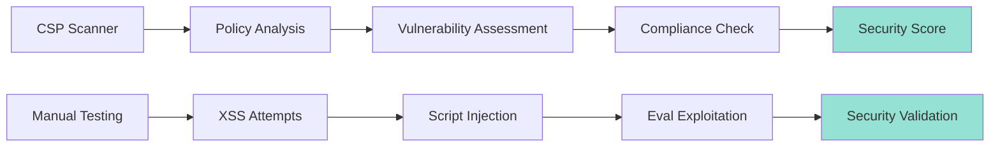

# Content Security Policy Eval Blocking Resolution

## Overview

The llvvaa Next.js application is experiencing Content Security Policy (CSP) violations due to JavaScript `eval()` usage blocking. This design addresses the implementation of a comprehensive CSP strategy that maintains security while allowing necessary functionality for third-party libraries like EmailJS, Three.js, and other dependencies.

## Problem Analysis

### Current CSP Issues
- Browser blocking `eval()` usage in JavaScript execution
- Third-party libraries potentially using unsafe-eval
- No explicit CSP configuration in the application
- Potential impact on EmailJS contact form functionality
- Three.js dependency might require dynamic code execution

### Affected Components


## Architecture

### CSP Implementation Strategy

#### 1. CSP Header Configuration
Implement CSP headers through Next.js middleware or security headers configuration.



#### 2. Nonce-Based Script Security
Implementation of cryptographic nonces for inline scripts and dynamic content.

| Component | Nonce Usage | Security Level |
|-----------|-------------|----------------|
| EmailJS Integration | Required for API calls | Medium |
| Three.js Shaders | Required for WebGL | High |
| Next.js Hot Reload | Development only | Low |
| Inline Event Handlers | Replace with listeners | High |

### CSP Directive Configuration

#### Core Security Policies
- **default-src**: `'self'` - Restrict all resources to same origin by default
- **script-src**: `'self' 'nonce-{random}' https://cdn.emailjs.com` - Allow scripts with nonce
- **style-src**: `'self' 'unsafe-inline'` - Allow inline styles for Tailwind
- **connect-src**: `'self' https://api.emailjs.com` - Allow EmailJS API connections
- **img-src**: `'self' data: https:` - Allow images from trusted sources

#### Progressive CSP Implementation


## Implementation Plan

### Phase 1: CSP Header Implementation

#### Middleware Enhancement
Extend existing `middleware.ts` to include CSP headers:

```typescript
// Enhanced middleware structure
export function middleware(request: NextRequest) {
  // Existing internationalization logic
  const intlResponse = createIntlMiddleware(/* config */);
  
  // Generate nonce for this request
  const nonce = generateNonce();
  
  // Set CSP headers
  const cspHeader = buildCSPHeader(nonce, isDevelopment);
  intlResponse.headers.set('Content-Security-Policy', cspHeader);
  
  return intlResponse;
}
```

#### CSP Policy Definition
| Directive | Development | Production |
|-----------|-------------|------------|
| script-src | `'self' 'nonce-{nonce}' 'unsafe-eval'` | `'self' 'nonce-{nonce}' https://cdn.emailjs.com` |
| style-src | `'self' 'unsafe-inline'` | `'self' 'unsafe-inline'` |
| connect-src | `'self' https://api.emailjs.com localhost:*` | `'self' https://api.emailjs.com` |
| frame-src | `'none'` | `'none'` |

### Phase 2: Component Security Hardening

#### EmailJS Integration Security
- Replace inline event handlers with addEventListener
- Implement API key rotation mechanism
- Add request validation and sanitization

#### Three.js Compatibility
- Evaluate WebGL shader compilation requirements
- Implement safe shader loading mechanisms
- Test 3D rendering functionality with strict CSP

#### Form Security Enhancement


### Phase 3: Error Handling & Monitoring

#### CSP Violation Reporting
Implement violation reporting endpoint:
- `/api/csp-report` - Capture and log violations
- Dashboard for monitoring policy effectiveness
- Automated alerts for new violation patterns

#### Fallback Mechanisms
- Graceful degradation for blocked scripts
- Alternative contact methods if EmailJS fails
- User-friendly error messages for CSP violations

## Testing Strategy

### CSP Validation Tests
1. **Automated Testing**
   - Unit tests for CSP header generation
   - Integration tests for form submission
   - E2E tests for critical user flows

2. **Browser Compatibility**
   - Chrome/Edge CSP Level 3 support
   - Firefox CSP implementation differences
   - Safari WebKit security model

3. **Performance Impact**
   - Nonce generation overhead measurement
   - Script loading performance analysis
   - Cache behavior with CSP headers

### Security Verification


## Configuration Management

### Environment-Specific Policies
- **Development**: More permissive for debugging and hot reload
- **Staging**: Production-like with reporting enabled
- **Production**: Strict enforcement with monitoring

### Dynamic Policy Updates
- Feature flag system for CSP directive testing
- A/B testing for policy effectiveness
- Gradual rollout mechanism for policy changes

## Rollback Strategy

### Phased Deployment
1. **Report-Only**: Monitor violations without blocking
2. **Gradual Enforcement**: Enable for percentage of traffic
3. **Full Enforcement**: Complete CSP implementation

### Emergency Procedures
- Immediate CSP disable mechanism
- Alternative contact form activation
- User communication for service disruption

## Monitoring & Maintenance

### Key Metrics
- CSP violation frequency and types
- Form submission success rates
- User experience impact metrics
- Security incident detection

### Regular Review Process
- Monthly CSP policy effectiveness review
- Quarterly security assessment
- Annual third-party dependency audit

### Documentation Updates
- CSP policy change log
- Developer guidelines for CSP compliance
- Incident response procedures