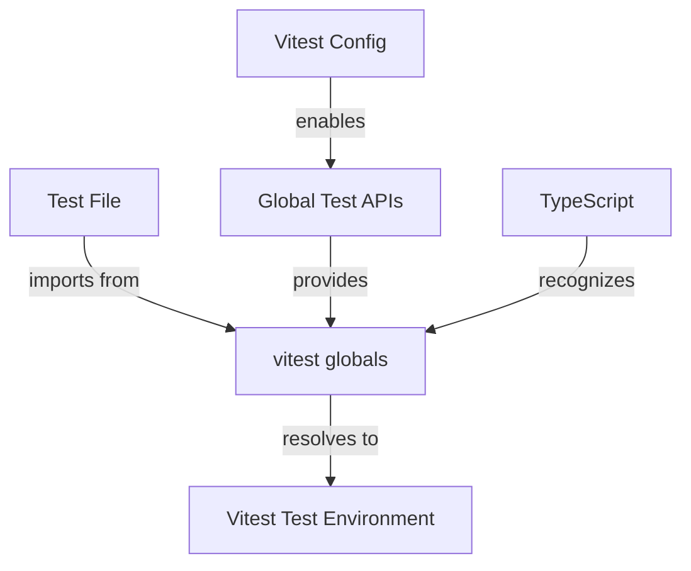
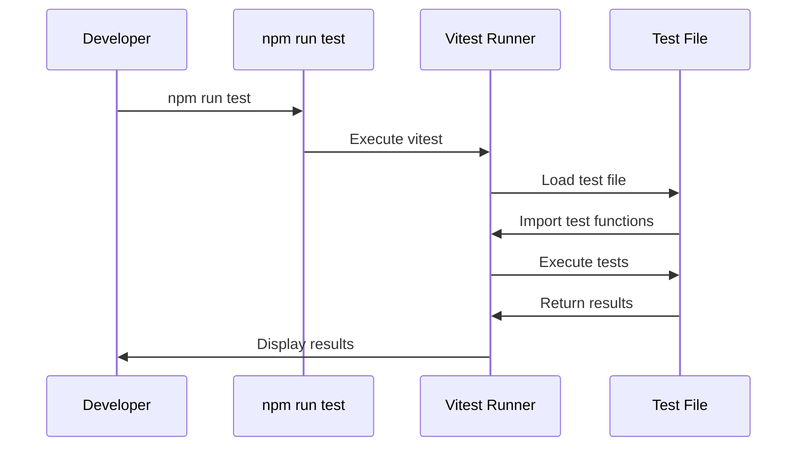

# Fix Jest Module Import Issue Design

## Overview

The project is experiencing a TypeScript error where the test file `app/__tests__/locale-functionality.test.ts` is trying to import from `@jest/globals`, but the project is actually using Vitest as the test runner. This creates a module resolution error since Jest is not installed as a dependency.

**Error**: `Cannot find module '@jest/globals' or its corresponding type declarations`

The core issue is a mismatch between the testing framework used (Vitest) and the import statement in the test file (Jest globals).

## Technology Stack Analysis

**Current Testing Setup**:
- **Test Runner**: Vitest 3.2.4 (configured in package.json)
- **Test Command**: `npm run test` → `vitest`
- **Test Framework**: Vitest with built-in test globals
- **TypeScript**: v5 with strict mode enabled

**Problem Root Cause**:
- Test file imports `describe`, `it`, `expect` from `@jest/globals`
- Project uses Vitest, not Jest
- No Jest dependencies installed
- Vitest provides its own test globals

## Architecture

### Current Test Architecture

```mermaid
graph TB
    A[Test File] -->|imports from| B[@jest/globals]
    B -->|NOT FOUND| C[Module Resolution Error]
    
    D[Package.json] -->|defines| E[vitest as test runner]
    E -->|provides| F[Built-in test globals]
    
    A -.->|should import from| F
```

### Target Test Architecture



## Solution Design

### Option 1: Use Vitest Globals Import (Recommended)

**Implementation**:
```typescript
// Replace current import
import { describe, it, expect } from '@jest/globals'

// With Vitest import
import { describe, it, expect } from 'vitest'
```

**Pros**:
- Aligns with project's actual test runner
- No additional dependencies needed
- Maintains all existing test functionality
- TypeScript support included

**Cons**:
- Requires import statement change

### Option 2: Enable Vitest Global APIs

**Implementation**:
```typescript
// Remove import entirely - use globals
// import { describe, it, expect } from '@jest/globals'

// Add vitest.config.ts configuration:
export default defineConfig({
  test: {
    globals: true
  }
})
```

**Pros**:
- Cleaner test files without imports
- Jest-like experience
- No import changes needed in test files

**Cons**:
- Requires vitest configuration file
- Global APIs can conflict with other code

### Option 3: Add Jest Compatibility Layer

**Implementation**:
- Install Jest types: `@types/jest`
- Add Jest aliases in Vitest config

**Pros**:
- Minimal test file changes
- Jest compatibility

**Cons**:
- Adds unnecessary dependencies
- Mixing two testing frameworks
- Potential confusion

## Component Integration

### Test File Structure
```
app/
  __tests__/
    locale-functionality.test.ts  ← Fix import here
```

### Dependencies Integration
```json
{
  "devDependencies": {
    "vitest": "^3.2.4"  ← Already installed
  }
}
```

### TypeScript Integration
- Vitest types are included with vitest package
- No additional type declarations needed
- Compatible with existing tsconfig.json

## Implementation Details

### Primary Solution: Update Import Statement

**File**: `app/__tests__/locale-functionality.test.ts`

**Current Code**:
```typescript
import { describe, it, expect } from '@jest/globals'
```

**Fixed Code**:
```typescript
import { describe, it, expect } from 'vitest'
```

### Alternative: Global APIs Configuration

**Create**: `vitest.config.ts`
```typescript
import { defineConfig } from 'vitest/config'

export default defineConfig({
  test: {
    globals: true,
    environment: 'node'
  }
})
```

**Update**: `app/__tests__/locale-functionality.test.ts`
```typescript
// Remove import statement completely
// Tests use global describe, it, expect
```

### TypeScript Configuration

**Current**: `tsconfig.json` already includes test files
```json
{
  "include": [
    "**/*.ts",
    "**/*.tsx"
  ]
}
```

**If using globals**: Add Vitest types
```json
{
  "compilerOptions": {
    "types": ["vitest/globals"]
  }
}
```

## Testing Strategy

### Test Execution Flow


### Validation Steps

1. **Import Resolution**: Verify TypeScript can resolve vitest imports
2. **Test Execution**: Ensure all existing tests pass with new imports
3. **IDE Support**: Confirm autocomplete and type checking work
4. **CI/CD**: Validate tests run correctly in automated environments

### Test Categories Affected

| Test Type | Current Status | After Fix |
|-----------|---------------|-----------|
| Locale Middleware | ❌ Import Error | ✅ Working |
| Language Switcher | ❌ Import Error | ✅ Working |
| Translation Fallback | ❌ Import Error | ✅ Working |
| Error Boundary | ❌ Import Error | ✅ Working |

## Risk Assessment

### Low Risk Changes
- Import statement modification
- No functional test logic changes
- Existing test structure maintained

### Potential Issues
- **IDE Cache**: May need to restart TypeScript language server
- **Module Resolution**: Ensure vitest types are properly loaded
- **Team Sync**: All developers need to use same test runner

### Mitigation Strategies
- Test locally before committing
- Update documentation to clarify Vitest usage
- Add vitest.config.ts for explicit configuration

## Performance Impact

### Build Time
- **No impact**: Same test runner, different import source
- **Potential improvement**: Direct vitest imports may be faster than Jest compatibility layer

### Runtime Performance
- **Identical**: Same test execution engine
- **Memory**: No additional overhead from Jest imports

### Developer Experience
- **Improved**: Consistent with project's testing framework
- **Better IntelliSense**: Native Vitest type support