# Internationalization Implementation Design for La Vieja Adventures

## Overview

This document provides a complete implementation plan for internationalizing the La Vieja Adventures tourism platform. Building upon the existing multi-language foundation with next-intl, this design addresses the comprehensive translation of static adventure data, UI components, and dynamic content while maintaining optimal performance and SEO.

The implementation leverages the existing Next.js 15 App Router architecture and extends the current middleware and translation infrastructure to support bilingual content delivery across all application layers.

## Architecture Overview

### Current i18n Foundation
The application already implements basic internationalization infrastructure:

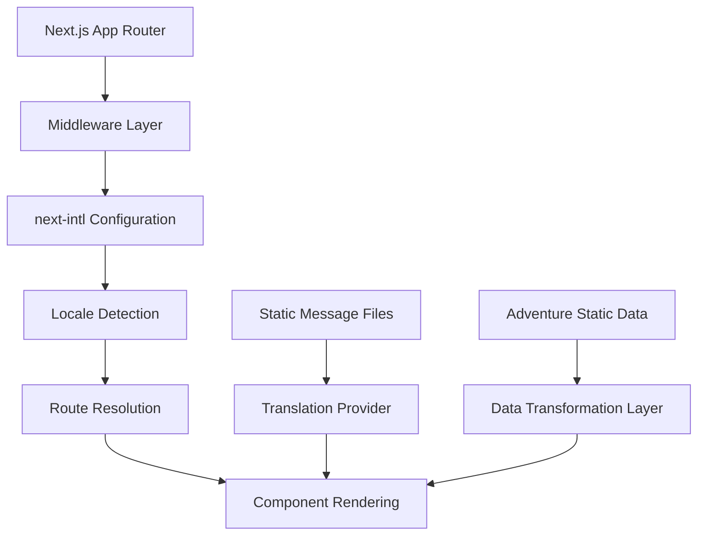

### Enhanced Architecture Integration
The implementation extends the current structure to handle complex static data translation:

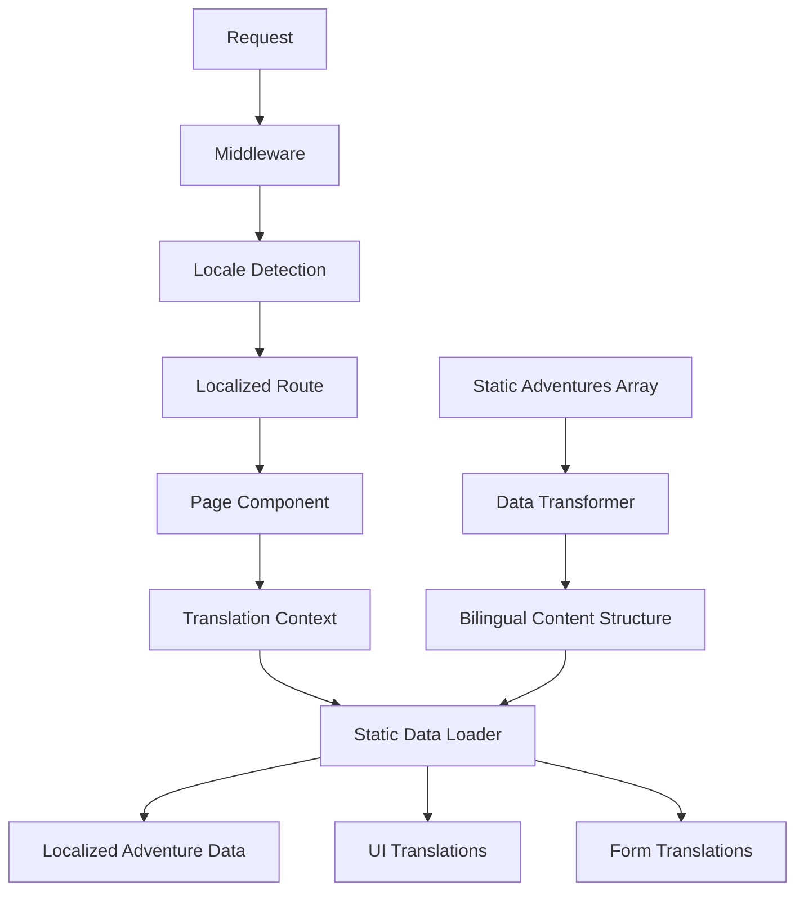

## Static Data Internationalization Strategy

### Adventure Data Structure Transformation

The current `adventures` array in `statics.tsx` contains rich Spanish content that requires systematic translation. The transformation approach maintains backward compatibility while enabling bilingual access:

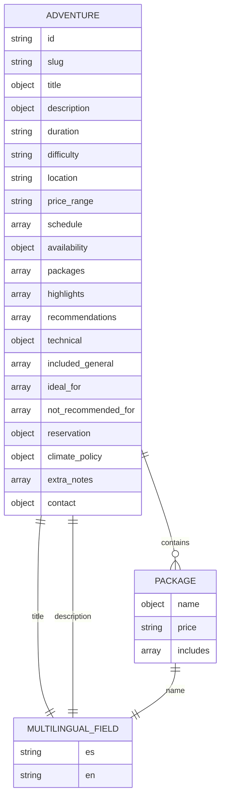

### Data Transformation Implementation

The static data transformation follows a structured approach that converts string fields to multilingual objects:

```typescript
// Current Spanish-only structure
{
  title: "Expedición al Cañón Esmeralda",
  description: "Adéntrate en un cañón escondido...",
  highlights: [
    "Cascada Zafiro y senderos secretos",
    "Descensos guiados y cruces de río emocionantes"
  ]
}

// Transformed bilingual structure
{
  title: {
    es: "Expedición al Cañón Esmeralda",
    en: "Emerald Canyon Expedition"
  },
  description: {
    es: "Adéntrate en un cañón escondido...",
    en: "Venture into a hidden canyon..."
  },
  highlights: [
    {
      es: "Cascada Zafiro y senderos secretos",
      en: "Sapphire Waterfall and secret trails"
    },
    {
      es: "Descensos guiados y cruces de río emocionantes",
      en: "Guided descents and exciting river crossings"
    }
  ]
}
```

### Translation File Organization

The message files structure expands to accommodate adventure-specific content:

```
messages/
├── es/
│   ├── common.json              # UI elements, buttons, forms
│   ├── navigation.json          # Navigation menus
│   ├── adventures/
│   │   ├── canon-esmeralda.json
│   │   ├── birdwatching-quetzal.json
│   │   ├── expedicion-nocturna.json
│   │   └── [other-adventures].json
│   ├── services.json           # Service descriptions
│   ├── contact.json            # Contact form content
│   └── metadata.json           # SEO meta content
└── en/
    ├── common.json
    ├── navigation.json
    ├── adventures/
    │   ├── emerald-canyon.json
    │   ├── quetzal-birdwatching.json
    │   ├── night-expedition.json
    │   └── [other-adventures].json
    ├── services.json
    ├── contact.json
    └── metadata.json
```

## Component Architecture Updates

### Multilingual Data Access Layer

A data access abstraction layer handles locale-aware content retrieval:

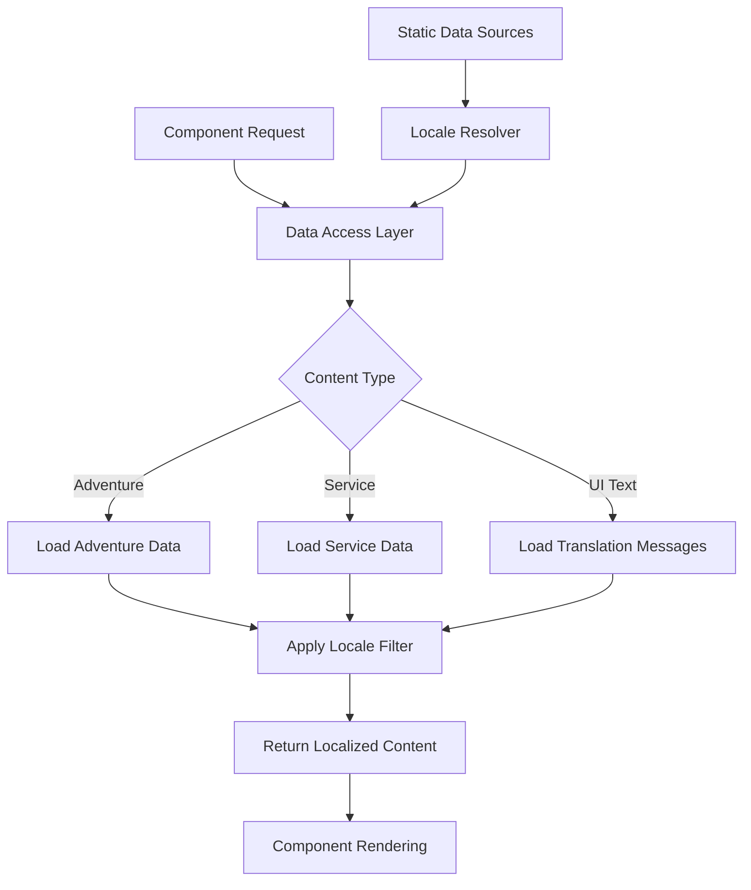

### Hook Implementation for Localized Data

Custom hooks provide clean interfaces for accessing translated content:

```typescript
// useLocalizedAdventures hook pattern
const useLocalizedAdventures = () => {
  const locale = useLocale()
  const t = useTranslations('adventures')
  
  return useMemo(() => {
    return adventures.map(adventure => ({
      ...adventure,
      title: adventure.title[locale] || adventure.title.es,
      description: adventure.description[locale] || adventure.description.es,
      highlights: adventure.highlights.map(highlight => 
        highlight[locale] || highlight.es
      )
    }))
  }, [locale, t])
}
```

### Adventure Component Integration

The adventures component integrates seamlessly with the translation layer:

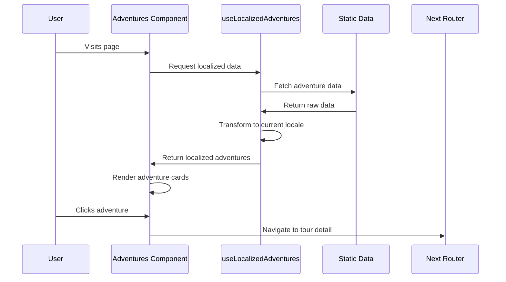

## Dynamic Routing and Localization

### Localized Tour Routes

The dynamic routing system accommodates localized slugs and maintains SEO-friendly URLs:

```mermaid
graph LR
    A[User Request] --> B{Locale Detection}
    B --> |Spanish| C[/es/tours/canon-esmeralda]
    B --> |English| D[/en/tours/emerald-canyon]
    
    C --> E[Spanish Tour Page]
    D --> F[English Tour Page]
    
    E --> G[Load Spanish Content]
    F --> H[Load English Content]
    
    I[Adventure Data] --> J[Slug Mapping]
    J --> G
    J --> H
```

### Slug Management Strategy

A slug mapping system handles bilingual URL structures while maintaining internal consistency:

```typescript
// Slug mapping configuration
const slugMappings = {
  'canon-esmeralda': {
    es: 'canon-esmeralda',
    en: 'emerald-canyon'
  },
  'birdwatching-quetzal': {
    es: 'birdwatching-quetzal',
    en: 'quetzal-birdwatching'
  }
  // Additional mappings...
}
```

## Translation Message Structure

### Adventure-Specific Translation Files

Each adventure maintains its own translation file for maintainability:

```json
// adventures/canon-esmeralda.json (Spanish)
{
  "title": "Expedición al Cañón Esmeralda",
  "description": "Adéntrate en un cañón escondido entre selvas tropicales...",
  "highlights": [
    "Cascada Zafiro y senderos secretos",
    "Descensos guiados y cruces de río emocionantes",
    "Equipo de seguridad completo incluido"
  ],
  "packages": {
    "basic": {
      "name": "Básico",
      "includes": [
        "Tour guiado",
        "Equipo de seguridad completo",
        "Acceso a la cascada Zafiro"
      ]
    }
  }
}
```

```json
// adventures/emerald-canyon.json (English)
{
  "title": "Emerald Canyon Expedition",
  "description": "Venture into a hidden canyon among tropical jungles...",
  "highlights": [
    "Sapphire Waterfall and secret trails",
    "Guided descents and exciting river crossings",
    "Complete safety equipment included"
  ],
  "packages": {
    "basic": {
      "name": "Basic",
      "includes": [
        "Guided tour",
        "Complete safety equipment",
        "Access to Sapphire waterfall"
      ]
    }
  }
}
```

### UI Component Translations

Common UI elements maintain consistent translation keys:

```json
// common.json structure
{
  "buttons": {
    "readMore": "Read more",
    "bookNow": "Book now",
    "viewDetails": "View details",
    "contact": "Contact us"
  },
  "labels": {
    "duration": "Duration",
    "difficulty": "Difficulty",
    "location": "Location",
    "price": "Price",
    "schedule": "Schedule"
  },
  "difficulty": {
    "low": "Low",
    "moderate": "Moderate",
    "high": "High",
    "extreme": "Extreme"
  }
}
```

## Search Functionality Enhancement

### Multilingual Search Implementation

The search component requires enhancement to handle bilingual content matching:

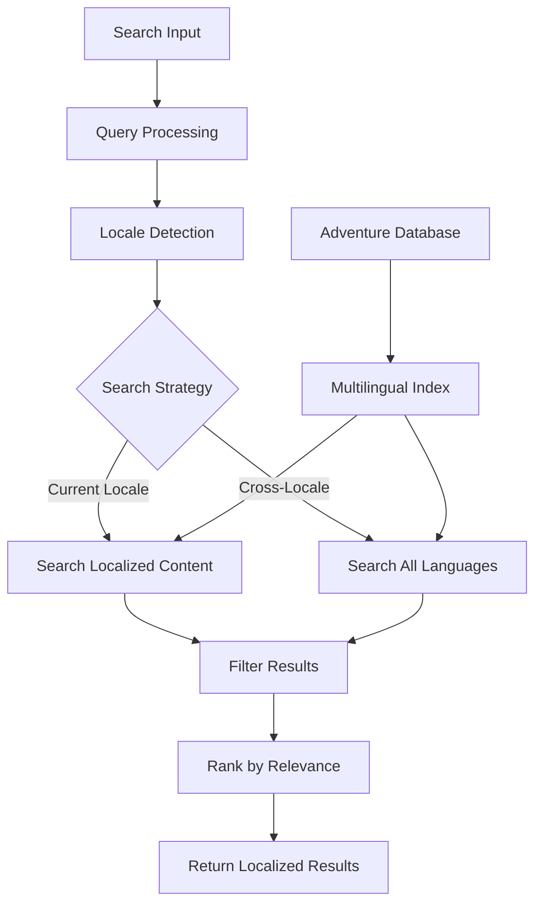

### Search Algorithm Enhancement

The search functionality extends to handle multilingual content effectively:

```typescript
// Enhanced search hook pattern
const useMultilingualSearch = (query: string) => {
  const locale = useLocale()
  const adventures = useLocalizedAdventures()
  
  return useMemo(() => {
    if (!query.trim()) return adventures
    
    const searchFields = [
      'title', 'description', 'highlights', 
      'location', 'ideal_for'
    ]
    
    return adventures.filter(adventure =>
      searchFields.some(field => {
        const value = adventure[field]
        if (Array.isArray(value)) {
          return value.some(item => 
            item.toLowerCase().includes(query.toLowerCase())
          )
        }
        return value?.toLowerCase().includes(query.toLowerCase())
      })
    )
  }, [query, adventures, locale])
}
```

## Form Localization

### Contact Form Enhancement

The contact form requires comprehensive localization including validation messages and field labels:

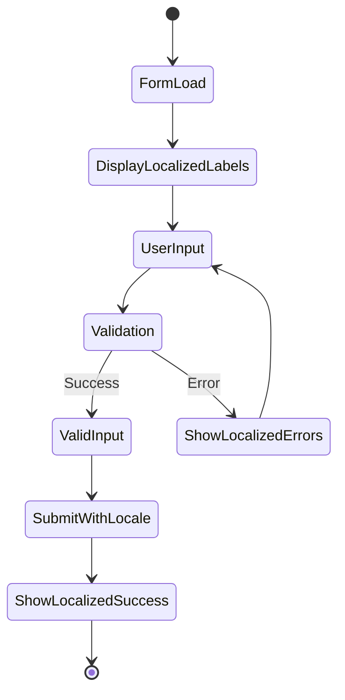

### Form Translation Structure

Comprehensive form translations cover all user-facing text:

```json
// contact.json
{
  "form": {
    "title": "Contact Us",
    "subtitle": "Plan your Costa Rican adventure",
    "fields": {
      "name": {
        "label": "Full Name",
        "placeholder": "Enter your full name"
      },
      "email": {
        "label": "Email Address",
        "placeholder": "your@email.com"
      },
      "message": {
        "label": "Message",
        "placeholder": "Tell us about your adventure preferences..."
      }
    },
    "validation": {
      "required": "This field is required",
      "invalidEmail": "Please enter a valid email address",
      "minLength": "Message must be at least {min} characters"
    },
    "buttons": {
      "submit": "Send Message",
      "submitting": "Sending...",
      "reset": "Clear Form"
    },
    "messages": {
      "success": "Thank you! We'll contact you soon.",
      "error": "Error sending message. Please try again."
    }
  }
}
```

## SEO and Metadata Localization

### Multilingual SEO Strategy

Comprehensive SEO implementation ensures optimal search engine visibility across languages:

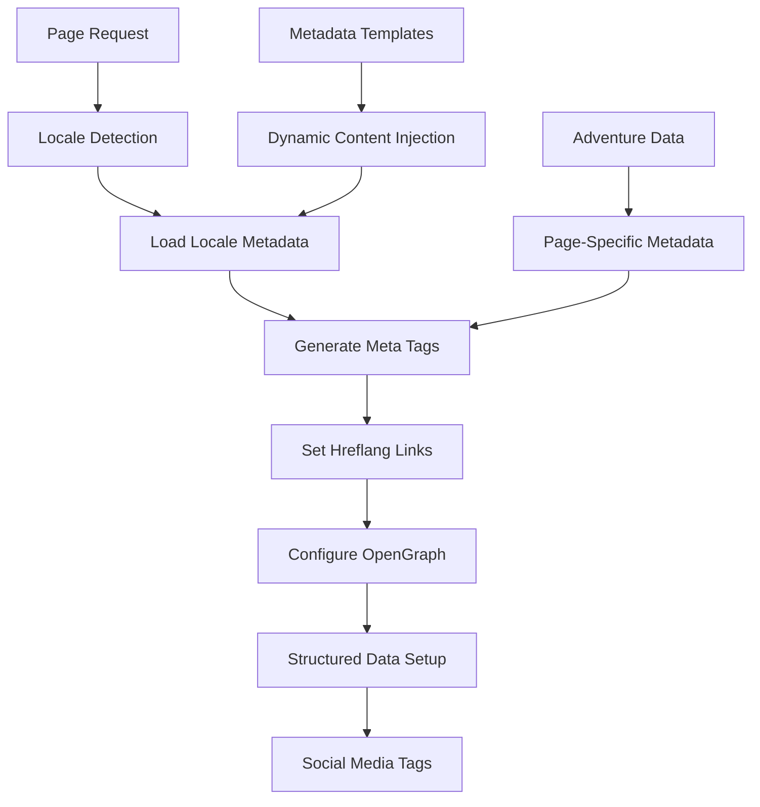

### Metadata Configuration

Localized metadata generation for enhanced SEO performance:

```typescript
// generateMetadata implementation pattern
export async function generateMetadata({
  params: { locale, slug }
}: {
  params: { locale: string; slug: string }
}): Promise<Metadata> {
  const t = await getTranslations({ locale, namespace: 'metadata' })
  const adventure = await getLocalizedAdventure(slug, locale)
  
  return {
    title: `${adventure.title} | ${t('siteName')}`,
    description: adventure.description.substring(0, 160),
    keywords: t('keywords').split(','),
    alternates: {
      languages: {
        'es-CR': `/es/tours/${getLocalizedSlug(slug, 'es')}`,
        'en-US': `/en/tours/${getLocalizedSlug(slug, 'en')}`,
      }
    },
    openGraph: {
      title: adventure.title,
      description: adventure.description,
      locale: locale,
      alternateLocale: locale === 'es' ? 'en' : 'es',
      images: [
        {
          url: adventure.image,
          width: 1200,
          height: 630,
          alt: adventure.title
        }
      ]
    }
  }
}
```

### Structured Data Implementation

JSON-LD structured data supports multilingual content discovery:

```typescript
// Structured data generation
const generateTourStructuredData = (adventure: Adventure, locale: string) => ({
  "@context": "https://schema.org",
  "@type": "TouristTrip",
  "name": adventure.title,
  "description": adventure.description,
  "image": adventure.image,
  "provider": {
    "@type": "TouristInformationCenter",
    "name": "La Vieja Adventures",
    "url": `https://laviejaadventures.com/${locale}`
  },
  "offers": {
    "@type": "Offer",
    "priceCurrency": "USD",
    "price": adventure.price_range.split('–')[0].replace('$', '')
  },
  "duration": adventure.duration,
  "location": {
    "@type": "Place",
    "name": adventure.location
  }
})
```

## User Interface Enhancements

### Language Switcher Component

A sophisticated language switcher maintains user context during language changes:

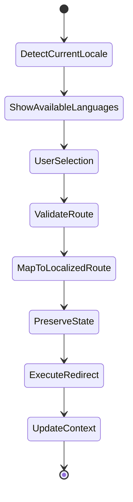

### Component Integration Pattern

UI components seamlessly integrate translation capabilities:

```typescript
// Language switcher implementation pattern
const LanguageSwitcher = () => {
  const locale = useLocale()
  const pathname = usePathname()
  const router = useRouter()
  
  const switchLanguage = (newLocale: string) => {
    const segments = pathname.split('/').filter(Boolean)
    const pathWithoutLocale = segments.slice(1).join('/')
    const localizedPath = `/${newLocale}/${pathWithoutLocale}`
    
    router.push(localizedPath)
  }
  
  return (
    <div className="language-switcher">
      {locales.map(lang => (
        <button
          key={lang}
          onClick={() => switchLanguage(lang)}
          className={`lang-btn ${locale === lang ? 'active' : ''}`}
        >
          {lang.toUpperCase()}
        </button>
      ))}
    </div>
  )
}
```

## Performance Optimization

### Bundle Size Management

Strategic code splitting and lazy loading optimize performance across languages:

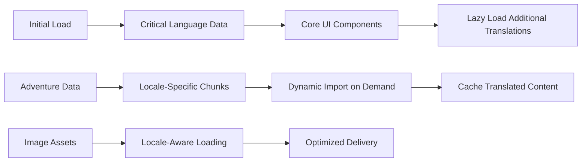

### Caching Strategy

Comprehensive caching ensures optimal performance:

```typescript
// Translation caching strategy
const translationCache = new Map()

const getCachedTranslation = (locale: string, namespace: string) => {
  const key = `${locale}-${namespace}`
  if (translationCache.has(key)) {
    return translationCache.get(key)
  }
  
  const translation = loadTranslation(locale, namespace)
  translationCache.set(key, translation)
  return translation
}
```

### Static Generation Optimization

Next.js static generation supports both languages efficiently:

```typescript
// Static params generation
export async function generateStaticParams() {
  const adventures = await getAdventures()
  const params = []
  
  for (const adventure of adventures) {
    for (const locale of locales) {
      params.push({
        locale,
        slug: getLocalizedSlug(adventure.slug, locale)
      })
    }
  }
  
  return params
}
```

## Testing Strategy

### Automated Testing Framework

Comprehensive testing ensures translation accuracy and functionality:

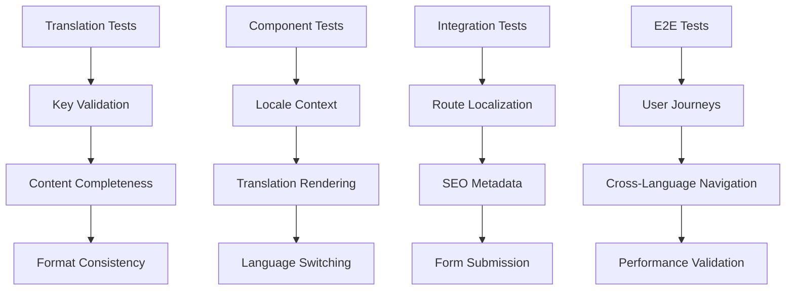

### Translation Validation

Automated validation ensures translation quality:

```typescript
// Translation validation suite
const validateTranslations = () => {
  const requiredKeys = [
    'buttons.readMore',
    'buttons.bookNow',
    'labels.duration',
    'labels.difficulty'
  ]
  
  for (const locale of locales) {
    const translations = loadTranslations(locale)
    
    for (const key of requiredKeys) {
      if (!getNestedValue(translations, key)) {
        throw new Error(`Missing translation key: ${key} for locale: ${locale}`)
      }
    }
  }
}
```

## Implementation Roadmap

### Phase 1: Foundation (Week 1-2)
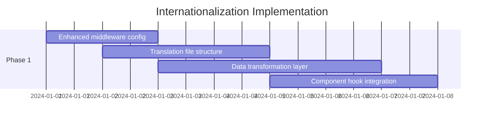

### Phase 2: Content Translation (Week 3-4)
- Adventure data transformation to bilingual structure
- UI component translation integration
- Form localization implementation
- Search functionality enhancement

### Phase 3: SEO and Polish (Week 5-6)
- Multilingual SEO implementation
- Performance optimization
- Testing framework setup
- User experience refinement

## Migration and Deployment

### Backward Compatibility Strategy

Seamless migration maintains existing functionality:

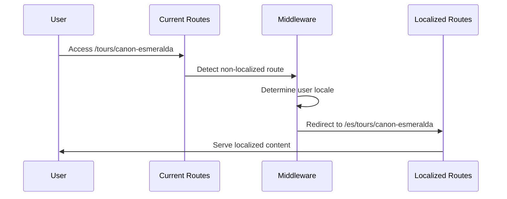

### Deployment Strategy

Gradual rollout ensures stability:

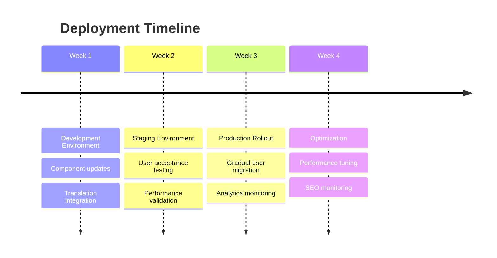

### Risk Mitigation

Comprehensive risk management ensures smooth deployment:

- Feature flags for gradual feature rollout
- Comprehensive rollback procedures
- Performance monitoring and alerting
- User feedback collection and analysis
- SEO impact monitoring and optimization

This internationalization implementation provides a robust foundation for bilingual content delivery while maintaining the high-quality user experience and performance characteristics of the La Vieja Adventures platform.