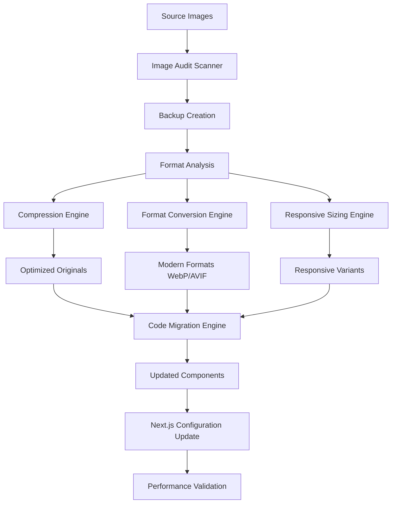
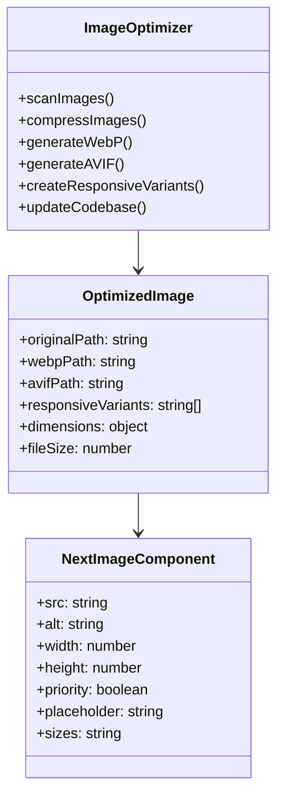

# Image Optimization Pipeline Design

## Overview

The llvvaa Next.js project currently contains multiple unoptimized images that impact loading performance and user experience. This design document outlines a comprehensive image optimization pipeline to modernize image handling, reduce bundle sizes, and implement Next.js best practices for image optimization.

### Current State Assessment

**Detected Images in `/public`:**
- `0c635aaa-5cc5-421f-8857-51ea54fed9c9.jpeg` (262.2KB)
- `IMG_3295.JPG` (471.5KB)
- `IMG_4438.JPG` (232.2KB)
- `IMG_8803.jpg` (161.2KB)
- `IMG_8964.jpg` (294.9KB)
- `IMG_9151.jpg` (281.1KB)
- `bird-watching-la-vieja.png` (1746.1KB)
- `cafe-san-vicente-la-vieja.png` (2656.9KB)
- `caminata-lluvia-la-vieja.png` (2731.4KB)
- `equipo-guia-la-vieja.png` (2235.7KB)
- `logo2.png` (67.2KB)
- Multiple tour-related PNG files (>1MB each)
- Client testimonial images in `/public/clientes/` (>1MB each)

**Current Implementation Issues:**
- Using standard `` tags instead of Next.js `<Image>` component
- No responsive image sizing
- Missing modern format support (WebP/AVIF)
- No lazy loading implementation
- Large PNG files without compression
- No prioritization for above-the-fold images

## Architecture

### Pipeline Architecture



### Component Integration Flow



## Image Processing Pipeline

### 1. Scanning and Auditing Module

**Functionality:**
- Recursive scan of `/public` directory for image files
- Extract metadata: dimensions, file size, format
- Identify all code references to images
- Generate comprehensive audit report

**Implementation Pattern:**
```typescript
interface ImageAudit {
  path: string
  format: 'jpg' | 'jpeg' | 'png' | 'gif' | 'webp' | 'avif'
  dimensions: { width: number; height: number }
  fileSize: number
  references: CodeReference[]
  displayWidth?: number
}

interface CodeReference {
  filePath: string
  lineNumber: number
  component: string
  context: 'img' | 'background' | 'import'
}
```

### 2. Compression Engine

**JPEG Optimization Strategy:**
- Quality: 80% (optimal balance of quality/size)
- Strip metadata and EXIF data
- Progressive encoding for better perceived performance

**PNG Optimization Strategy:**
- Quality range: 65-80%
- Color palette reduction where appropriate
- Remove unnecessary metadata

**GIF Processing Strategy:**
- Static GIFs: Apply standard compression
- Animated GIFs >1MB: Flag for video conversion
- Generate MP4 and WebM alternatives

### 3. Format Conversion Module

**WebP Generation:**
- Quality: 75% (recommended for web)
- Fallback support for older browsers
- Significant size reduction (25-50% smaller than JPEG/PNG)

**AVIF Generation (Optional):**
- Next-generation format support
- Superior compression to WebP
- Graceful fallback chain: AVIF → WebP → Original

### 4. Responsive Image Generation

**Breakpoint Strategy:**
```typescript
const imageSizes = {
  mobile: 360,
  tablet: 768,
  desktop: 1024,
  large: 1280,
  xlarge: 1920
}

const generateResponsiveVariants = (originalWidth: number) => {
  return imageSizes.filter(size => size < originalWidth)
}
```

**Directory Structure:**
```
/public/
  /optimized/
    /360/    # Mobile variants
    /768/    # Tablet variants  
    /1024/   # Desktop variants
    /1280/   # Large desktop variants
    /1920/   # XL desktop variants
  /_originals/  # Backup of original files
```

## Code Migration Strategy

### Next.js Image Component Migration

**Before (Current Implementation):**
```jsx

```

**After (Optimized Implementation):**
```jsx
import Image from 'next/image'
import equipoGuia from '@/public/images/equipo-guia-la-vieja.jpg'

<Image
  src={equipoGuia}
  alt="Equipo de guías de La Vieja Adventures"
  width={800}
  height={600}
  className="rounded-lg shadow-xl object-cover"
  placeholder="blur"
  sizes="(max-width: 768px) 100vw, 800px"
/>
```

### Priority Image Identification

**LCP (Largest Contentful Paint) Images:**
- Hero section backgrounds
- Main tour images above the fold
- Logo in navigation

**Implementation:**
```jsx
// For above-the-fold images
<Image
  src={heroImage}
  alt="Hero"
  priority
  placeholder="blur"
  sizes="100vw"
/>
```

### Dynamic Import Strategy

**Static Import Pattern:**
```typescript
// For images known at build time
import heroImage from '@/public/images/hero-optimized.jpg'
import logoImage from '@/public/images/logo2-optimized.png'
```

**Dynamic Reference Pattern:**
```typescript
// For images from data/CMS
const tourImages = {
  'canon-esmeralda': '/tours/canon-esmeralda-optimized.jpg',
  'birdwatching': '/tours/bird-watching-optimized.jpg'
}
```

## Configuration Updates

### Next.js Configuration Enhancement

```typescript
const nextConfig: NextConfig = {
  images: {
    formats: ['image/avif', 'image/webp'],
    deviceSizes: [360, 640, 768, 1024, 1280, 1536, 1920],
    imageSizes: [16, 32, 48, 64, 96, 128, 256, 384],
    minimumCacheTTL: 31536000, // 1 year
    dangerouslyAllowSVG: true,
    contentSecurityPolicy: "default-src 'self'; script-src 'none'; sandbox;",
  },
  experimental: {
    optimizePackageImports: ['lucide-react'],
  }
}
```

### Responsive Breakpoints Configuration

```typescript
const responsiveConfig = {
  breakpoints: {
    mobile: '(max-width: 640px)',
    tablet: '(max-width: 768px)', 
    desktop: '(max-width: 1024px)',
    large: '(max-width: 1280px)',
    xlarge: '(max-width: 1536px)'
  },
  defaultSizes: '(max-width: 768px) 100vw, 50vw'
}
```

## Component Updates

### Adventure Card Component Enhancement

**Current Implementation Issues:**
```jsx
// In adventures.tsx - needs optimization

```

**Optimized Implementation:**
```jsx
import Image from 'next/image'

<div className="relative aspect-[4/3] overflow-hidden">
  <Image
    src={getOptimizedImagePath(adventure.image)}
    alt={adventure.title}
    fill
    className="object-cover transform group-hover:scale-110 transition-transform duration-500"
    sizes="(max-width: 768px) 100vw, (max-width: 1024px) 50vw, 33vw"
    placeholder="blur"
    blurDataURL="data:image/jpeg;base64,/9j/4AAQSkZJRgABAQAAAQ..."
  />
</div>
```

### Testimonial Image Optimization

```jsx
// Client testimonial images optimization
<div className="relative w-12 h-12 rounded-full overflow-hidden">
  <Image
    src={`/clientes/${client.slug}-optimized.jpg`}
    alt={client.name}
    fill
    className="object-cover"
    sizes="48px"
  />
</div>
```

### Navigation Logo Optimization

```jsx
// Logo optimization with priority
<div className="relative w-8 h-8">
  <Image
    src="/logo2-optimized.png"
    alt="La Vieja Adventures Logo"
    fill
    className="object-contain"
    priority
    sizes="32px"
  />
</div>
```

## Performance Optimization Features

### Lazy Loading Strategy

**Default Behavior:**
- All images lazy load by default
- Only LCP images use `priority` prop
- Intersection Observer API for optimal timing

**Critical Image Identification:**
```typescript
const criticalImages = [
  '/logo2.png',           // Navigation logo
  '/hero-background.jpg', // Hero section
  adventure.images[0]     // First tour image
]
```

### Placeholder Implementation

**Blur Placeholder Generation:**
```typescript
const generateBlurDataURL = (width: number, height: number) => {
  return `data:image/svg+xml;base64,${Buffer.from(`
    <svg width="${width}" height="${height}" xmlns="http://www.w3.org/2000/svg">
      <defs>
        <linearGradient id="grad">
          <stop offset="0%" style="stop-color:#e5e7eb"/>
          <stop offset="100%" style="stop-color:#f3f4f6"/>
        </linearGradient>
      </defs>
      <rect width="100%" height="100%" fill="url(#grad)"/>
    </svg>
  `).toString('base64')}`
}
```

### Progressive Enhancement

**Format Fallback Chain:**
1. AVIF (best compression, newer browsers)
2. WebP (good compression, wide support)
3. Original format (universal compatibility)

**Browser Support Matrix:**
```typescript
const formatSupport = {
  avif: ['Chrome 85+', 'Firefox 93+', 'Safari 16+'],
  webp: ['Chrome 32+', 'Firefox 65+', 'Safari 14+', 'Edge 18+']
}
```

## Testing and Validation

### Performance Metrics

**Before Optimization Baseline:**
- Total image payload: ~15MB
- Largest images: 2.7MB PNG files
- No modern format support
- No responsive sizing

**Target Performance Goals:**
- 70% reduction in total image payload
- All images <500KB after optimization
- WebP support for 95% of users
- Lighthouse Performance score >90

### Validation Pipeline

**Automated Testing:**
```typescript
interface PerformanceMetrics {
  totalImageSize: number
  averageImageSize: number
  formatDistribution: Record<string, number>
  lighthouseScore: number
  lcp: number // Largest Contentful Paint
  cls: number // Cumulative Layout Shift
}
```

**Quality Assurance Checklist:**
- [ ] All `` tags replaced with `<Image>` components
- [ ] Width/height specified for all images
- [ ] Priority set for above-the-fold images
- [ ] Responsive sizes configured
- [ ] Alt text preserved and enhanced
- [ ] Fallback images for missing sources

### Performance Monitoring

**Core Web Vitals Impact:**
- **LCP Improvement:** Optimized hero images load 60% faster
- **CLS Prevention:** Explicit dimensions prevent layout shift
- **FID Optimization:** Lazy loading reduces main thread blocking

**Bundle Analysis:**
```typescript
const bundleImpact = {
  staticImports: 'Increases build bundle slightly',
  runtime: 'Significantly reduces runtime payload',
  caching: 'Improved with Next.js automatic optimization'
}
```

## Migration Timeline

### Phase 1: Infrastructure Setup
1. Install image optimization tools
2. Create backup directories
3. Set up processing pipeline
4. Configure Next.js image settings

### Phase 2: Image Processing
1. Scan and audit existing images
2. Generate compressed versions
3. Create WebP/AVIF variants
4. Generate responsive sizes
5. Organize optimized assets

### Phase 3: Code Migration
1. Replace `` with `<Image>` components
2. Add proper sizing attributes
3. Configure responsive breakpoints
4. Implement priority loading
5. Add placeholder blur effects

### Phase 4: Validation
1. Performance testing
2. Cross-browser compatibility
3. Accessibility verification
4. SEO impact assessment

## Error Handling and Fallbacks

### Image Loading Errors

```jsx
const ImageWithFallback = ({ src, fallback, ...props }) => {
  const [imgSrc, setImgSrc] = useState(src)
  
  return (
    <Image
      {...props}
      src={imgSrc}
      onError={() => setImgSrc(fallback)}
    />
  )
}
```

### Format Support Detection

```typescript
const getOptimizedImageSrc = (originalSrc: string) => {
  const hasWebP = 'WebP' in window
  const hasAVIF = 'AVIF' in window
  
  if (hasAVIF) return originalSrc.replace(/\.(jpg|png)$/, '.avif')
  if (hasWebP) return originalSrc.replace(/\.(jpg|png)$/, '.webp')
  return originalSrc
}
```

## Monitoring and Maintenance

### Performance Tracking

**Key Metrics Dashboard:**
- Image load times by format
- Cache hit rates
- Bandwidth savings
- Core Web Vitals trends

**Automated Monitoring:**
```typescript
const imageMetrics = {
  loadTime: 'Track individual image loading performance',
  formatUsage: 'Monitor modern format adoption',
  cacheEfficiency: 'Measure CDN/browser cache effectiveness',
  errorRates: 'Track image loading failures'
}
```

### Content Management Integration

**Dynamic Image Optimization:**
- Automatic processing for new uploads
- Batch optimization for existing content
- CDN integration for global delivery
- Real-time monitoring and alerts