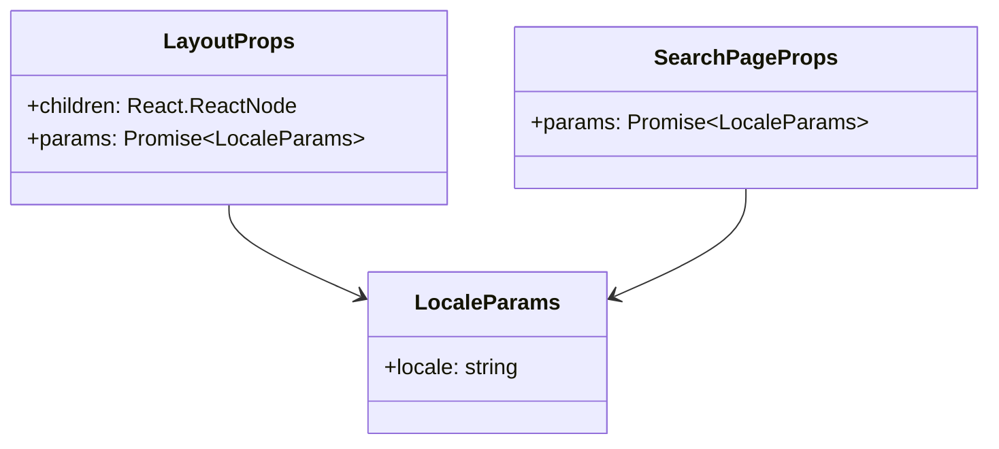
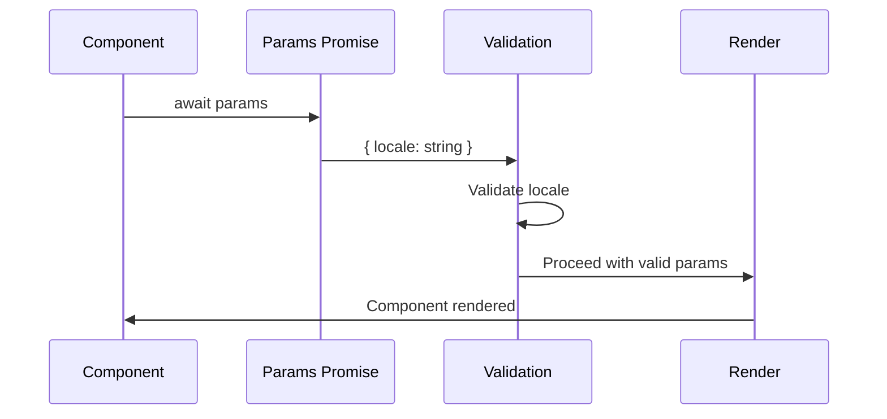
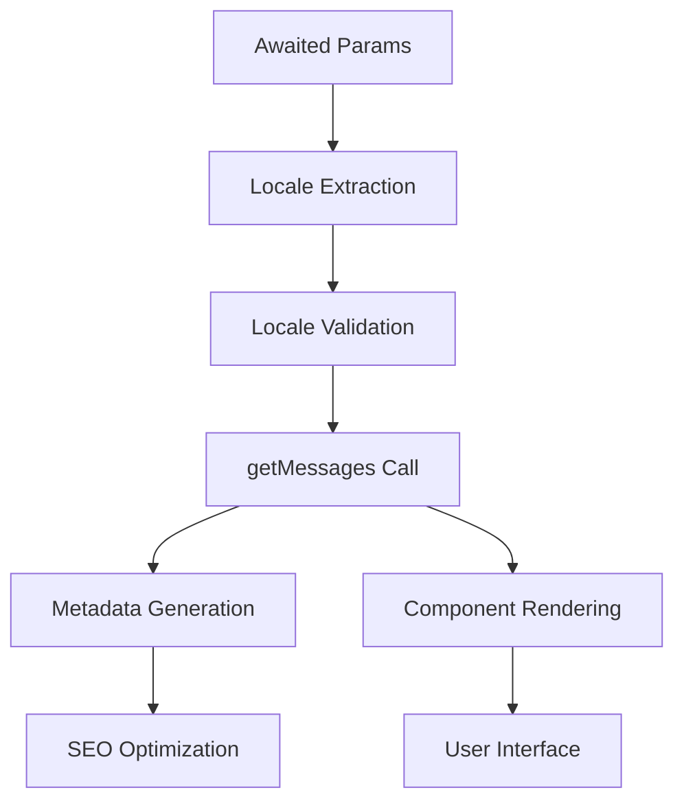
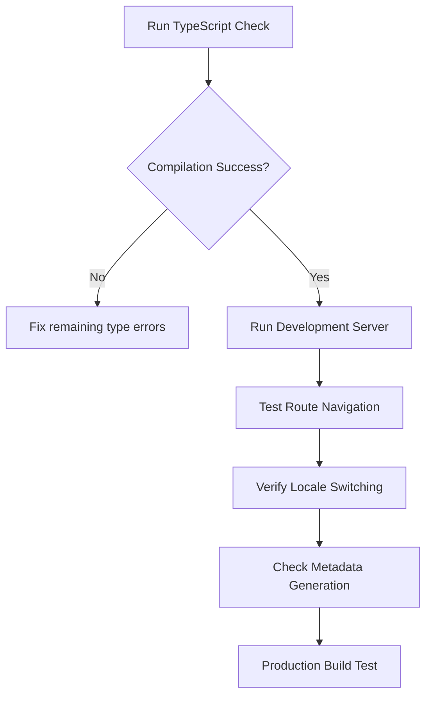

# Layout Props Fix for Next.js 15 Breaking Change

## Overview

This design document addresses the TypeScript compilation error in Next.js 15 where the `params` property in layout components must return a Promise rather than a synchronous object. The error occurs because Next.js 15 introduced breaking changes to the App Router API, requiring `params` to be awaited in layout and page components.

**Error Details:**
```
Type 'LayoutProps' does not satisfy the constraint 'import("C:/Users/aroja/Documents/GitHub/llvvaa/.next/types/app/[locale]/layout").LayoutProps'.
Types of property 'params' are incompatible.
Type '{ locale: string; }' is missing the following properties from type 'Promise<any>': then, catch, finally, [Symbol.toStringTag]
```

## Architecture

### Current Implementation Issues

The current `LayoutProps` interface in `app/[locale]/layout.tsx` defines params as a synchronous object:

```mermaid
graph TD
    A[Current LayoutProps] --> B[params: { locale: string }]
    C[Next.js 15 Requirement] --> D[params: Promise<{ locale: string }>]
    B --> E[Type Error]
    D --> F[Compilation Success]
```

### Breaking Change Analysis

Next.js 15 modified the App Router to make route parameters asynchronous to support:
- Dynamic route segment validation
- Async parameter processing
- Server-side rendering optimizations
- Enhanced type safety

### Affected Components

1. **Layout Component**: `app/[locale]/layout.tsx`
   - `generateMetadata` function
   - Main layout component function
   
2. **Search Page**: `app/[locale]/search/page.tsx`
   - Uses similar params pattern
   - May require similar fixes

## Component Architecture

### Updated Type Definitions



### Async Parameter Handling Pattern



## API Integration Layer

### Metadata Generation Flow

```mermaid
flowchart TD
    A[generateMetadata called] --> B[await params]
    B --> C[Extract locale]
    C --> D[Validate locale in locales array]
    D --> E{Valid locale?}
    E -->|No| F[notFound()]
    E -->|Yes| G[getMessages with locale]
    G --> H[Build metadata object]
    H --> I[Return Metadata]
```

### Layout Component Flow

```mermaid
flowchart TD
    A[LocaleLayout called] --> B[await params]
    B --> C[Extract locale]
    C --> D[Validate locale]
    D --> E{Valid locale?}
    E -->|No| F[notFound()]
    E -->|Yes| G[getMessages with locale]
    G --> H[Render HTML with NextIntlClientProvider]
```

## Data Models & Type Safety

### Updated Interface Definitions

```typescript
// Updated LayoutProps interface
type LayoutProps = {
  children: React.ReactNode;
  params: Promise<{ locale: string }>;
};

// Updated SearchPageProps interface  
type SearchPageProps = {
  params: Promise<{ locale: string }>;
};
```

### Parameter Destructuring Pattern

```typescript
// Before (Next.js 14 and earlier)
export async function generateMetadata({ params }: LayoutProps) {
  const { locale } = params; // Direct access
}

// After (Next.js 15)
export async function generateMetadata({ params }: LayoutProps) {
  const { locale } = await params; // Await required
}
```

## Business Logic Layer

### Locale Validation Logic

The locale validation pattern remains the same but operates on awaited parameters:

1. **Parameter Resolution**: Await the params Promise
2. **Locale Extraction**: Destructure locale from resolved params
3. **Validation Check**: Verify locale exists in allowed locales array
4. **Error Handling**: Call `notFound()` for invalid locales
5. **Processing**: Continue with valid locale for message loading

### Internationalization Integration



## Testing Strategy

### Type Safety Validation

1. **Compilation Testing**: Ensure TypeScript compilation succeeds
2. **Runtime Testing**: Verify params are properly awaited
3. **Locale Testing**: Test with valid and invalid locale values
4. **Metadata Testing**: Verify metadata generation with async params

### Test Cases

| Test Case | Input | Expected Behavior |
|-----------|-------|------------------|
| Valid Locale (es) | `{ locale: "es" }` | Successful rendering with Spanish messages |
| Valid Locale (en) | `{ locale: "en" }` | Successful rendering with English messages |
| Invalid Locale | `{ locale: "fr" }` | `notFound()` called |
| Metadata Generation | Valid locale | Correct metadata with locale-specific content |

### Migration Verification



## Error Handling

### Graceful Degradation

1. **Invalid Locales**: Use `notFound()` to show 404 page
2. **Missing Messages**: Provide fallback content
3. **Async Errors**: Implement proper error boundaries

### Development Experience

```typescript
// Error prevention pattern
try {
  const { locale } = await params;
  // Process with locale
} catch (error) {
  console.error('Failed to resolve params:', error);
  notFound();
}
```