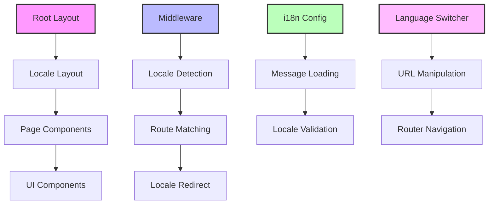

# Locale Debugging and Fix Analysis

## Overview

This document analyzes the internationalization (i18n) implementation in the llvvaa Next.js application and identifies potential issues that could cause locale functionality to malfunction. The application uses `next-intl` for internationalization with Spanish (es) as the default locale and English (en) as the secondary locale.

## Architecture Analysis

### Current Implementation Structure



### Configuration Components

| Component | Location | Purpose | Status |
|-----------|----------|---------|---------|
| Middleware | `middleware.ts` | Route matching and locale detection | ✅ Configured |
| i18n Config | `lib/i18n.ts` | Message loading and locale validation | ✅ Configured |
| Locale Layout | `app/[locale]/layout.tsx` | Locale-specific layout wrapper | ✅ Configured |
| Root Layout | `app/layout.tsx` | Base HTML structure | ✅ Configured |
| Language Switcher | `app/components/language-switcher.tsx` | User locale switching | ✅ Implemented |

## Potential Issues Identified

### 1. Middleware Route Matching Conflicts

**Issue**: The middleware matcher configuration may have overlapping patterns that could cause routing conflicts.

```typescript
// Current matcher configuration
matcher: [
  '/',
  '/(es|en)/:path*',
  '/((?!_next|_vercel|.*\\..*).*)' 
]
```

**Problems**:
- Pattern overlap between `/` and `/((?!_next|_vercel|.*\\..*).*)` 
- Missing specific exclusions for API routes
- Potential interference with static assets

### 2. Layout Structure Hierarchy

**Issue**: Dual layout structure could cause rendering conflicts.

```mermaid
graph TD
    A[app/layout.tsx] --> B[app/[locale]/layout.tsx]
    B --> C[Pages]
    
    A1[Font Configuration] --> A
    B1[NextIntlClientProvider] --> B
    B2[Metadata Generation] --> B
    B3[Locale Validation] --> B
    
    style A fill:#fbb,stroke:#333,stroke-width:2px
    style B fill:#bbf,stroke:#333,stroke-width:2px
```

**Problems**:
- Root layout includes minimal HTML structure without locale context
- Potential hydration mismatches between server and client
- Missing error boundaries for locale failures

### 3. Language Switcher Path Resolution

**Issue**: Complex path manipulation logic in language switcher could generate incorrect URLs.

```typescript
// Current path resolution logic
const segments = pathname.split('/').filter(Boolean)
let newPath: string

if (segments.length > 0 && locales.includes(segments[0] as any)) {
  segments[0] = newLocale
  newPath = `/${segments.join('/')}`
} else {
  newPath = `/${newLocale}${pathname.startsWith('/') ? pathname : `/${pathname}`}`
}
```

**Problems**:
- Edge cases with nested routes not handled properly
- Missing validation for dynamic route parameters
- Potential double-slash issues in URL construction

### 4. Message Loading and Fallbacks

**Issue**: Limited error handling for missing translations and fallback mechanisms.

```typescript
// Current message loading
messages: (await import(`../messages/${locale}.json`)).default
```

**Problems**:
- No fallback for missing message files
- Missing nested key fallback strategies
- Limited error handling for malformed JSON

## Root Cause Analysis

### High Priority Issues

1. **Middleware Configuration**: Overly broad matching patterns causing conflicts
2. **Route Resolution**: Inconsistent URL path generation in language switcher
3. **Error Handling**: Missing fallbacks for locale-related failures

### Medium Priority Issues

1. **Layout Hierarchy**: Potential hydration mismatches
2. **Static Asset Handling**: Missing exclusions in middleware
3. **Dynamic Route Support**: Limited support for parameterized routes

### Low Priority Issues

1. **Performance**: Redundant locale validation checks
2. **SEO**: Missing structured data for locale variants
3. **Accessibility**: Limited ARIA support in language switcher

## Solution Strategies

### 1. Middleware Optimization

```typescript
// Improved matcher configuration
export const config = {
  matcher: [
    '/((?!api|_next/static|_next/image|_vercel|favicon.ico|sitemap.xml|robots.txt|.*\\.).*)',
    '/'
  ]
}
```

### 2. Enhanced Language Switcher

```typescript
// Improved path resolution with validation
const constructLocalePath = (newLocale: string, currentPath: string) => {
  const segments = currentPath.split('/').filter(Boolean)
  
  // Handle root path
  if (segments.length === 0) {
    return `/${newLocale}`
  }
  
  // Check if first segment is a locale
  if (locales.includes(segments[0] as any)) {
    segments[0] = newLocale
  } else {
    segments.unshift(newLocale)
  }
  
  return `/${segments.join('/')}`
}
```

### 3. Robust Error Handling

```typescript
// Enhanced message loading with fallbacks
try {
  return {
    locale: locale as string,
    messages: (await import(`../messages/${locale}.json`)).default
  }
} catch (error) {
  // Fallback to default locale
  console.warn(`Messages for ${locale} not found, falling back to ${defaultLocale}`)
  return {
    locale: defaultLocale,
    messages: (await import(`../messages/${defaultLocale}.json`)).default
  }
}
```

## Testing Strategy

### Unit Tests

| Component | Test Scenarios | Priority |
|-----------|---------------|----------|
| Middleware | Route matching, locale detection | High |
| Language Switcher | Path construction, edge cases | High |
| i18n Config | Message loading, fallbacks | Medium |
| Layout Components | Rendering, hydration | Medium |

### Integration Tests

1. **Locale Switching Flow**: Complete user journey from locale selection to page rendering
2. **URL Structure Validation**: Ensure consistent URL patterns across all routes
3. **Message Resolution**: Verify translation loading and fallback mechanisms
4. **Dynamic Route Handling**: Test locale switching with parameterized routes

### E2E Tests

1. **Browser Navigation**: Test locale persistence across page navigation
2. **SEO Validation**: Verify correct meta tags and structured data
3. **Accessibility**: Test screen reader compatibility and keyboard navigation
4. **Performance**: Measure locale switching response times

## Implementation Priority

### Phase 1: Critical Fixes
1. Update middleware matcher configuration
2. Fix language switcher path resolution logic
3. Add error handling for message loading

### Phase 2: Enhancements
1. Improve layout hierarchy and hydration
2. Add comprehensive fallback mechanisms
3. Optimize performance for locale operations

### Phase 3: Advanced Features
1. Implement locale-specific SEO optimization
2. Add accessibility improvements
3. Create comprehensive test coverage

## Validation Checklist

- [ ] Middleware routes correctly handle all path patterns
- [ ] Language switcher generates valid URLs for all scenarios
- [ ] Message loading includes proper fallback mechanisms
- [ ] Layout components render consistently across locales
- [ ] Dynamic routes maintain locale context
- [ ] Error boundaries handle locale-related failures
- [ ] Performance metrics meet acceptable thresholds
- [ ] Accessibility standards are maintained
- [ ] SEO optimization is implemented for all locales