# Multi-Language Support Design for La Vieja Adventures

## Overview

This design outlines the implementation of internationalization (i18n) for the La Vieja Adventures tourism platform, enabling support for English and Spanish languages while maintaining the existing user experience and performance characteristics.

The solution leverages Next.js 15 App Router's built-in i18n capabilities combined with next-intl for comprehensive translation management, ensuring seamless language switching across all content types including static data, UI components, and metadata.

## Technology Stack Integration

### Selected i18n Libraries
- **next-intl**: Primary internationalization library optimized for Next.js App Router
- **@formatjs/intl-localematcher**: Enhanced locale detection and matching
- **intl-messageformat**: Advanced message formatting with pluralization

### Architecture Integration Points
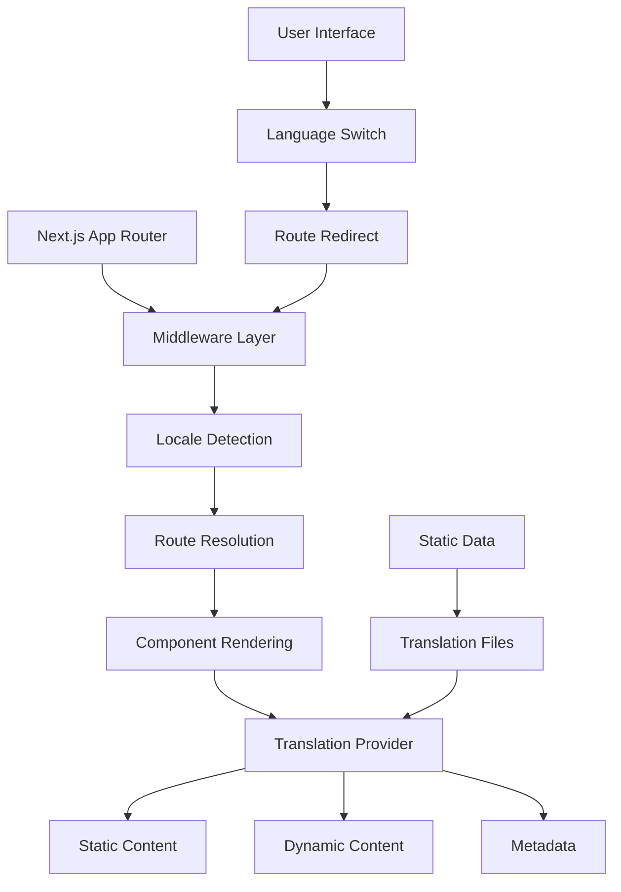

## Routing & Locale Handling

### URL Structure Pattern
```
Current: /tours/canon-esmeralda
Spanish: /es/tours/canon-esmeralda  
English: /en/tours/canon-esmeralda

Current: /search
Spanish: /es/search
English: /en/search
```

### Middleware Configuration
The middleware handles automatic locale detection and routing without breaking existing functionality:

```typescript
// middleware.ts implementation approach
- Detect user's preferred language from Accept-Language header
- Check for existing locale cookies
- Redirect to appropriate localized route
- Maintain current route structure with locale prefix
```

### Dynamic Route Handling
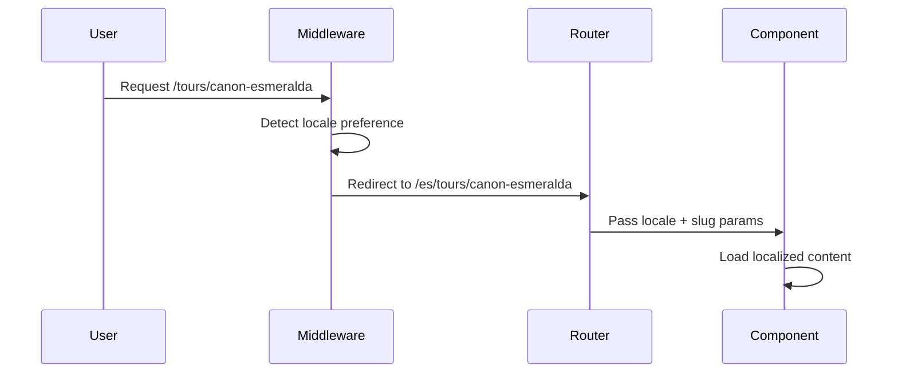

## Component Architecture Updates

### Layout Component Modifications
The root layout requires updates to support dynamic locale handling:

```tsx
// Updated layout structure approach
RootLayout {
  - Accept locale parameter from middleware
  - Set HTML lang attribute dynamically
  - Load locale-specific metadata
  - Provide translation context to children
}
```

### Navigation Component Enhancement
The navigation component needs locale-aware routing:

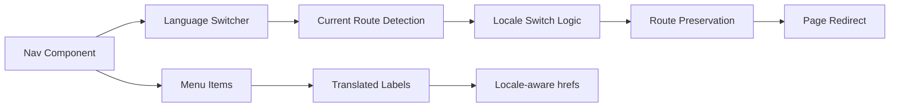

### Translation Hook Integration
Components will use translation hooks for dynamic content:

```tsx
// Component translation pattern
const ComponentExample = () => {
  const t = useTranslations('navigation')
  return (
    <nav>
      <a href="/adventures">{t('adventures')}</a>
      <a href="/services">{t('services')}</a>
    </nav>
  )
}
```

## Data Model Translation Strategy

### Static Content Structure
Transform the existing static data structure to support multiple languages:

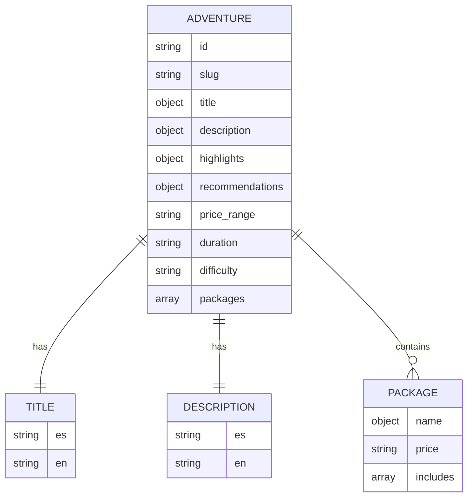

### Translation File Organization
```
messages/
├── es/
│   ├── common.json          # Shared UI elements
│   ├── navigation.json      # Menu and navigation
│   ├── adventures.json      # Adventure-specific content
│   ├── contact.json         # Contact form and CTA
│   └── metadata.json        # SEO and meta tags
└── en/
    ├── common.json
    ├── navigation.json
    ├── adventures.json
    ├── contact.json
    └── metadata.json
```

### Dynamic Content Translation
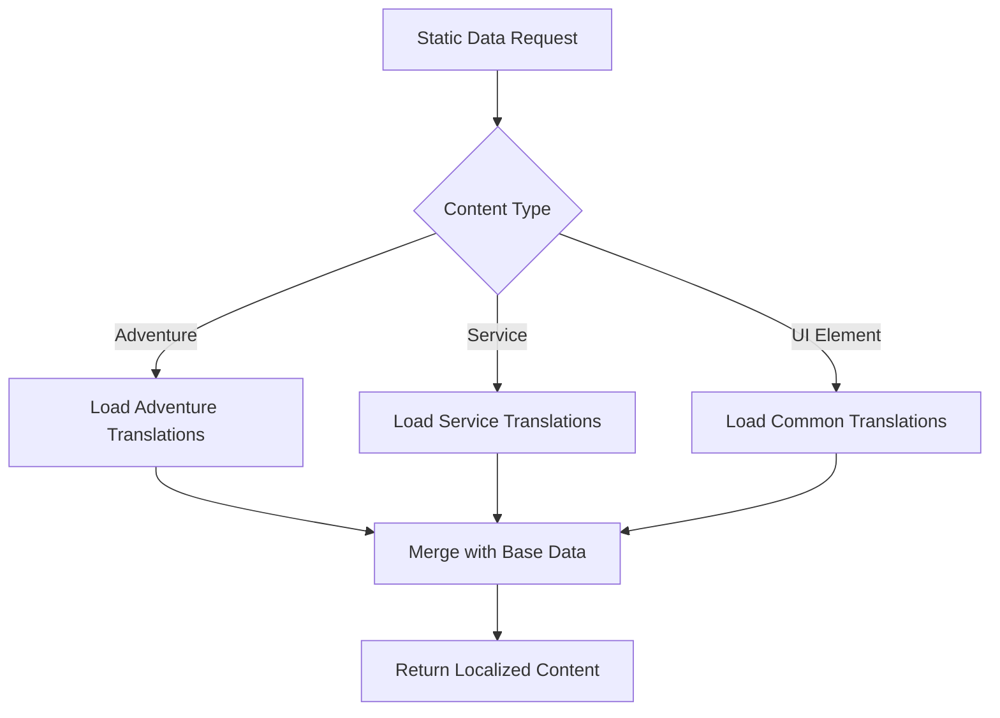

## API Integration & Forms

### Contact Form Localization
The EmailJS integration requires language-aware form handling:

```tsx
// Form translation approach
ContactForm {
  - Validate input labels in current locale
  - Submit form data with language preference
  - Show success/error messages in user language
  - Maintain EmailJS template structure
}
```

### Form Validation Messages
```json
{
  "validation": {
    "required": "Este campo es obligatorio",
    "email": "Ingresa un email válido",
    "phone": "Número de teléfono inválido"
  }
}
```

### Search Functionality Enhancement
The search component needs multilingual content matching:

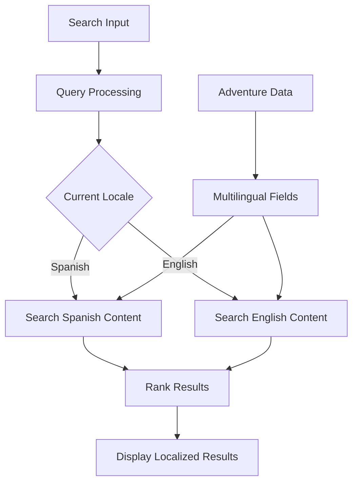

## SEO & Metadata Management

### Multilingual SEO Strategy
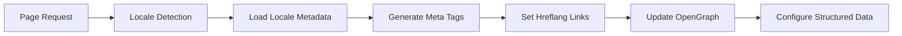

### Metadata Configuration Pattern
```tsx
// Locale-aware metadata generation
generateMetadata({ params: { locale, slug } }) {
  return {
    title: t('metadata.title'),
    description: t('metadata.description'),
    alternates: {
      languages: {
        'es-CR': `/es/${slug}`,
        'en-US': `/en/${slug}`,
      }
    },
    openGraph: {
      locale: locale,
      alternateLocale: locale === 'es' ? 'en' : 'es'
    }
  }
}
```

### URL Structure for SEO
```
Canonical URLs:
- Spanish (default): https://laviejaadventures.com/es/tours/canon-esmeralda
- English: https://laviejaadventures.com/en/tours/canon-esmeralda

Hreflang Implementation:
<link rel="alternate" hreflang="es-CR" href="/es/tours/canon-esmeralda" />
<link rel="alternate" hreflang="en-US" href="/en/tours/canon-esmeralda" />
<link rel="alternate" hreflang="x-default" href="/es/tours/canon-esmeralda" />
```

## User Interface Adaptations

### Language Switcher Component
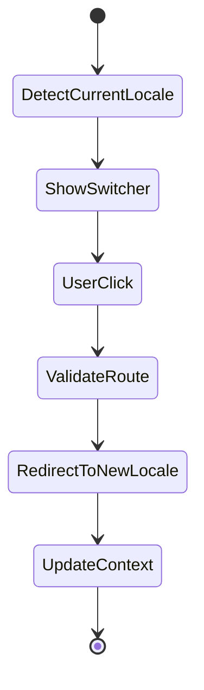

### Responsive Design Considerations
- Spanish text typically 20-25% longer than English
- Adjust button sizes and navigation spacing
- Maintain glassmorphism effects across languages
- Preserve mobile menu functionality

### Animation and Transition Preservation
```tsx
// Language switch animation approach
LanguageSwitcher {
  - Maintain current page animations during transition
  - Preserve scroll position after language change
  - Handle loading states gracefully
  - Keep framer-motion animations intact
}
```

## Implementation Phases

### Phase 1: Foundation Setup
```mermaid
gantt
    title Multi-language Implementation Timeline
    dateFormat X
    axisFormat %d
    
    section Phase 1
    Install i18n dependencies     :milestone, m1, 0, 1d
    Configure middleware          :a1, 1, 3
    Setup translation files       :a2, 2, 4
    Update routing structure      :a3, 3, 5
    
    section Phase 2  
    Translate static content      :b1, 5, 8
    Update components            :b2, 6, 9
    Implement language switcher   :b3, 7, 9
    
    section Phase 3
    SEO optimization             :c1, 9, 11
    Testing and refinement       :c2, 10, 12
    Performance optimization     :c3, 11, 12
```

### Phase 2: Content Translation
- Convert static data to multilingual format
- Translate UI components and navigation
- Implement form localization
- Update search functionality

### Phase 3: SEO & Polish
- Configure multilingual SEO
- Optimize performance
- Test user experience flows
- Implement analytics tracking

## Testing Strategy

### Automated Testing Approach
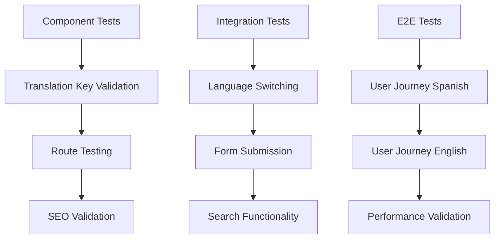

### Manual Testing Checklist
- Language switching preserves current page
- All static content displays correctly
- Forms validate in correct language
- Search works across languages
- Mobile experience maintains quality
- SEO tags generate properly

## Performance Considerations

### Bundle Optimization
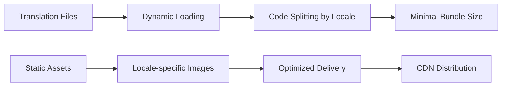

### Caching Strategy
- Browser cache for translation files
- Server-side locale detection caching
- Static generation for both languages
- Incremental Static Regeneration (ISR) support

### Loading Performance
- Lazy load translation resources
- Preload critical language data
- Optimize font loading for both languages
- Maintain Turbopack development speed

## Migration Strategy

### Backward Compatibility
- Maintain existing URLs with redirects
- Preserve current user bookmarks  
- Implement graceful fallbacks
- Monitor analytics during transition

### Rollout Plan
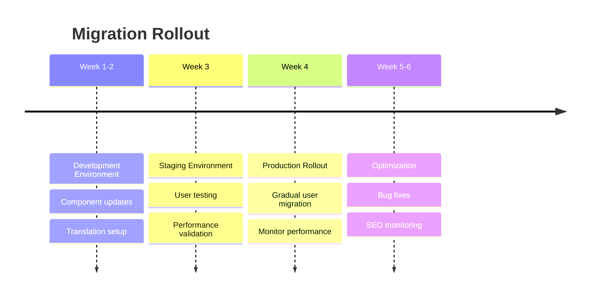

### Risk Mitigation
- Feature flags for gradual rollout
- Rollback plan for critical issues
- Performance monitoring alerts
- User feedback collection system
### Selected i18n Libraries
- **next-intl**: Primary internationalization library optimized for Next.js App Router
- **@formatjs/intl-localematcher**: Enhanced locale detection and matching
- **intl-messageformat**: Advanced message formatting with pluralization

### Architecture Integration Points


## Routing & Locale Handling

### URL Structure Pattern
```
Current: /tours/canon-esmeralda
Spanish: /es/tours/canon-esmeralda  
English: /en/tours/canon-esmeralda

Current: /search
Spanish: /es/search
English: /en/search
```

### Middleware Configuration
The middleware handles automatic locale detection and routing without breaking existing functionality:

```typescript
// middleware.ts implementation approach
- Detect user's preferred language from Accept-Language header
- Check for existing locale cookies
- Redirect to appropriate localized route
- Maintain current route structure with locale prefix
```

### Dynamic Route Handling


## Component Architecture Updates

### Layout Component Modifications
The root layout requires updates to support dynamic locale handling:

```tsx
// Updated layout structure approach
RootLayout {
  - Accept locale parameter from middleware
  - Set HTML lang attribute dynamically
  - Load locale-specific metadata
  - Provide translation context to children
}
```

### Navigation Component Enhancement
The navigation component needs locale-aware routing:


### Translation Hook Integration
Components will use translation hooks for dynamic content:

```tsx
// Component translation pattern
const ComponentExample = () => {
  const t = useTranslations('navigation')
  return (
    <nav>
      <a href="/adventures">{t('adventures')}</a>
      <a href="/services">{t('services')}</a>
    </nav>
  )
}
```

## Data Model Translation Strategy

### Static Content Structure
Transform the existing static data structure to support multiple languages:


### Translation File Organization
```
messages/
├── es/
│   ├── common.json          # Shared UI elements
│   ├── navigation.json      # Menu and navigation
│   ├── adventures.json      # Adventure-specific content
│   ├── contact.json         # Contact form and CTA
│   └── metadata.json        # SEO and meta tags
└── en/
    ├── common.json
    ├── navigation.json
    ├── adventures.json
    ├── contact.json
    └── metadata.json
```

### Dynamic Content Translation


## API Integration & Forms

### Contact Form Localization
The EmailJS integration requires language-aware form handling:

```tsx
// Form translation approach
ContactForm {
  - Validate input labels in current locale
  - Submit form data with language preference
  - Show success/error messages in user language
  - Maintain EmailJS template structure
}
```

### Form Validation Messages
```json
{
  "validation": {
    "required": "Este campo es obligatorio",
    "email": "Ingresa un email válido",
    "phone": "Número de teléfono inválido"
  }
}
```

### Search Functionality Enhancement
The search component needs multilingual content matching:


## SEO & Metadata Management

### Multilingual SEO Strategy


### Metadata Configuration Pattern
```tsx
// Locale-aware metadata generation
generateMetadata({ params: { locale, slug } }) {
  return {
    title: t('metadata.title'),
    description: t('metadata.description'),
    alternates: {
      languages: {
        'es-CR': `/es/${slug}`,
        'en-US': `/en/${slug}`,
      }
    },
    openGraph: {
      locale: locale,
      alternateLocale: locale === 'es' ? 'en' : 'es'
    }
  }
}
```

### URL Structure for SEO
```
Canonical URLs:
- Spanish (default): https://laviejaadventures.com/es/tours/canon-esmeralda
- English: https://laviejaadventures.com/en/tours/canon-esmeralda

Hreflang Implementation:
<link rel="alternate" hreflang="es-CR" href="/es/tours/canon-esmeralda" />
<link rel="alternate" hreflang="en-US" href="/en/tours/canon-esmeralda" />
<link rel="alternate" hreflang="x-default" href="/es/tours/canon-esmeralda" />
```

## User Interface Adaptations

### Language Switcher Component


### Responsive Design Considerations
- Spanish text typically 20-25% longer than English
- Adjust button sizes and navigation spacing
- Maintain glassmorphism effects across languages
- Preserve mobile menu functionality

### Animation and Transition Preservation
```tsx
// Language switch animation approach
LanguageSwitcher {
  - Maintain current page animations during transition
  - Preserve scroll position after language change
  - Handle loading states gracefully
  - Keep framer-motion animations intact
}
```

## Implementation Phases

### Phase 1: Foundation Setup
```mermaid
gantt
    title Multi-language Implementation Timeline
    dateFormat X
    axisFormat %d
    
    section Phase 1
    Install i18n dependencies     :milestone, m1, 0, 1d
    Configure middleware          :a1, 1, 3
    Setup translation files       :a2, 2, 4
    Update routing structure      :a3, 3, 5
    
    section Phase 2  
    Translate static content      :b1, 5, 8
    Update components            :b2, 6, 9
    Implement language switcher   :b3, 7, 9
    
    section Phase 3
    SEO optimization             :c1, 9, 11
    Testing and refinement       :c2, 10, 12
    Performance optimization     :c3, 11, 12
```

### Phase 2: Content Translation
- Convert static data to multilingual format
- Translate UI components and navigation
- Implement form localization
- Update search functionality

### Phase 3: SEO & Polish
- Configure multilingual SEO
- Optimize performance
- Test user experience flows
- Implement analytics tracking

## Testing Strategy

### Automated Testing Approach
```mermaid
flowchart TD
    A[Component Tests] --> B[Translation Key Validation]
    B --> C[Route Testing]
    C --> D[SEO Validation]
    
    E[Integration Tests] --> F[Language Switching]
    F --> G[Form Submission]
    G --> H[Search Functionality]
    
    I[E2E Tests] --> J[User Journey Spanish]
    J --> K[User Journey English]
    K --> L[Performance Validation]
```

### Manual Testing Checklist
- Language switching preserves current page
- All static content displays correctly
- Forms validate in correct language
- Search works across languages
- Mobile experience maintains quality
- SEO tags generate properly

## Performance Considerations

### Bundle Optimization
```mermaid
graph LR
    A[Translation Files] --> B[Dynamic Loading]
    B --> C[Code Splitting by Locale]
    C --> D[Minimal Bundle Size]
    
    E[Static Assets] --> F[Locale-specific Images]
    F --> G[Optimized Delivery]
    G --> H[CDN Distribution]
```

### Caching Strategy
- Browser cache for translation files
- Server-side locale detection caching
- Static generation for both languages
- Incremental Static Regeneration (ISR) support

### Loading Performance
- Lazy load translation resources
- Preload critical language data
- Optimize font loading for both languages
- Maintain Turbopack development speed

## Migration Strategy

### Backward Compatibility
- Maintain existing URLs with redirects
- Preserve current user bookmarks  
- Implement graceful fallbacks
- Monitor analytics during transition

### Rollout Plan
```mermaid
timeline
    title Migration Rollout
    
    Week 1-2  : Development Environment
              : Component updates
              : Translation setup
              
    Week 3    : Staging Environment  
              : User testing
              : Performance validation
              
    Week 4    : Production Rollout
              : Gradual user migration
              : Monitor performance
              
    Week 5-6  : Optimization
              : Bug fixes
              : SEO monitoring
```

### Risk Mitigation
- Feature flags for gradual rollout
- Rollback plan for critical issues
- Performance monitoring alerts
- User feedback collection system


