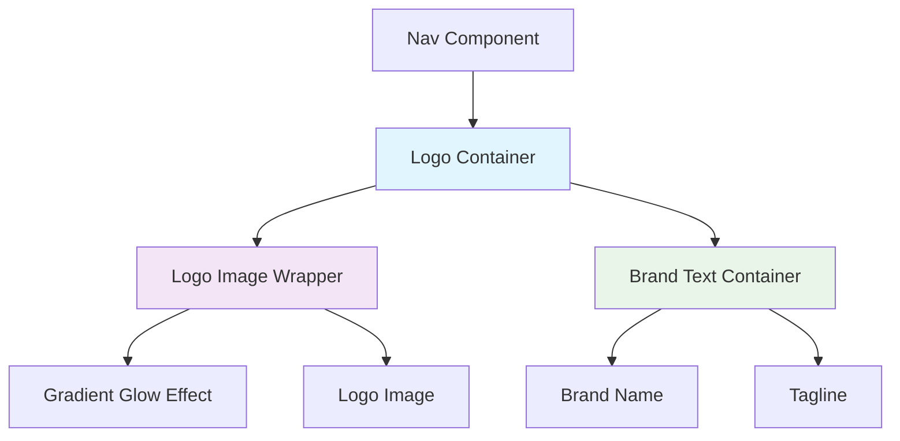
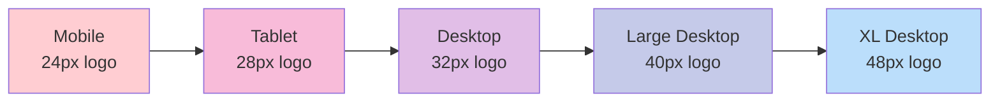
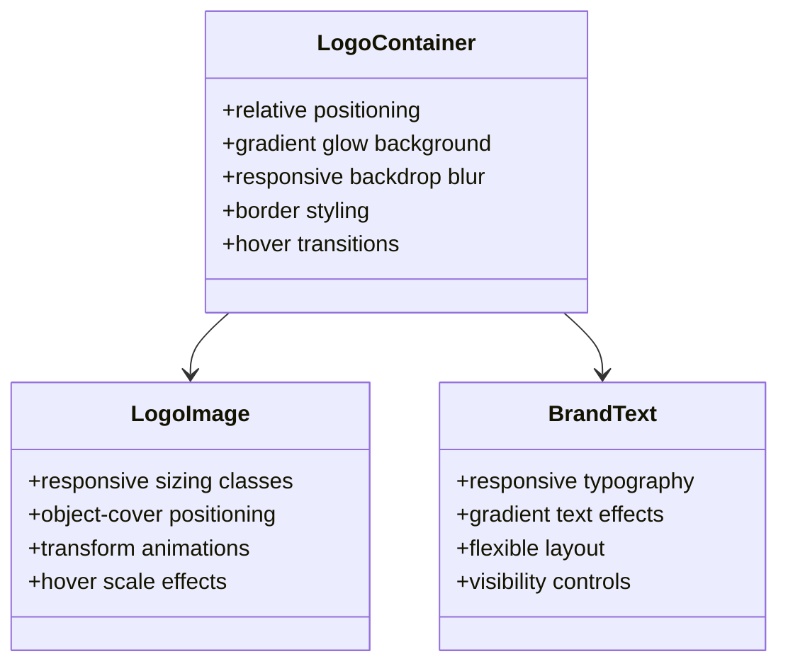

# Navbar Logo Desktop Optimization Design

## Overview

The navbar logo currently displays well on mobile devices but presents visual issues on desktop screens. This design addresses the responsive sizing, positioning, and visual hierarchy concerns to ensure optimal logo presentation across all device sizes while maintaining the existing glassmorphism design aesthetic.

## Current Implementation Analysis

### Logo Structure
The logo component consists of:
- **Container**: Glassmorphism container with backdrop blur and gradient glow effects
- **Image**: Next.js optimized image with hover animations 
- **Brand Text**: Two-line layout with main brand name and tagline
- **Responsive Classes**: Different sizing for mobile (`w-6 h-6 sm:w-7 sm:h-7`) and desktop (`lg:w-8 lg:h-8`)

### Current Issues Identified
1. **Size Inconsistency**: Logo appears too small on larger desktop screens
2. **Visual Hierarchy**: Brand text dominates the logo image on desktop
3. **Spacing Problems**: Inadequate spacing between logo elements on wide screens
4. **Proportion Mismatch**: Logo container doesn't scale proportionally with navbar height changes

## Architecture

### Component Structure



### Responsive Breakpoint Strategy

The logo optimization will use a tiered approach across breakpoints:

| Breakpoint | Logo Size | Container Padding | Text Size | Spacing |
|------------|-----------|-------------------|-----------|---------|
| Mobile (< 640px) | 24px (w-6 h-6) | p-1.5 | text-sm | space-x-2 |
| Small (640px-768px) | 28px (w-7 h-7) | p-1.5 | text-lg | space-x-2 |
| Medium (768px-1024px) | 32px (w-8 h-8) | p-2 | text-xl | space-x-3 |
| Large (1024px-1280px) | 40px (w-10 h-10) | p-2.5 | text-2xl | space-x-4 |
| XL (1280px+) | 48px (w-12 h-12) | p-3 | text-3xl | space-x-4 |

## Logo Component Redesign

### Enhanced Responsive Sizing



### Visual Hierarchy Improvements

#### Logo Container Enhancements
- **Progressive Scaling**: Logo size increases more dramatically on larger screens
- **Enhanced Glow Effect**: Stronger gradient glow on desktop to improve visual prominence
- **Improved Border Styling**: Thicker borders on larger screens for better definition
- **Container Proportions**: Adaptive padding that scales with logo size

#### Brand Text Optimization
- **Balanced Typography**: Adjusted text scaling to complement rather than overpower logo
- **Improved Spacing**: Increased horizontal spacing on desktop for better visual separation
- **Tagline Visibility**: Enhanced tagline display logic for optimal screen usage

### Animation and Interaction Refinements

#### Hover Effects
- **Scale Animation**: Enhanced scale transform on hover (1.15x on desktop vs 1.10x current)
- **Glow Intensity**: Increased glow opacity and blur radius on desktop hover states
- **Transition Timing**: Optimized animation duration for desktop interactions

#### Visual Feedback
- **Border Transitions**: Smooth color transitions on hover with stronger accent colors
- **Background Effects**: Enhanced glassmorphism backdrop blur for desktop clarity

## Implementation Strategy

### CSS Class Structure



### Responsive Class Updates

#### Logo Image Classes
```
Current: "w-6 h-6 sm:w-7 sm:h-7 lg:w-8 lg:h-8"
Enhanced: "w-6 h-6 sm:w-7 sm:h-7 md:w-8 md:h-8 lg:w-10 lg:h-10 xl:w-12 xl:h-12"
```

#### Container Padding Classes
```
Current: "p-1.5 lg:p-2"
Enhanced: "p-1.5 sm:p-2 md:p-2 lg:p-2.5 xl:p-3"
```

#### Brand Text Classes
```
Current: "text-sm sm:text-lg lg:text-2xl"
Enhanced: "text-sm sm:text-lg md:text-xl lg:text-2xl xl:text-3xl"
```

#### Spacing Classes
```
Current: "space-x-2 lg:space-x-3"
Enhanced: "space-x-2 sm:space-x-2 md:space-x-3 lg:space-x-4 xl:space-x-4"
```

### Glow Effect Enhancements

#### Desktop-Optimized Gradient Styling
- **Base State**: Increased opacity and blur radius for desktop visibility
- **Hover State**: Enhanced glow effect with stronger color saturation
- **Transition Smoothness**: Optimized timing functions for desktop interactions

#### Border Styling Improvements
- **Progressive Thickness**: Thicker borders on larger screens
- **Enhanced Contrast**: Stronger border colors for desktop clarity
- **Hover Animations**: Smooth color transitions with accent highlighting

## Visual Design Specifications

### Color Palette Adjustments

| State | Current | Enhanced Desktop |
|-------|---------|------------------|
| Base Glow | `opacity-20` | `opacity-25 lg:opacity-30` |
| Hover Glow | `opacity-40` | `opacity-50 lg:opacity-60` |
| Border Base | `border-white/30` | `border-white/30 lg:border-white/40` |
| Border Hover | `border-cyan-400/50` | `border-cyan-400/60 lg:border-cyan-400/70` |

### Typography Hierarchy

#### Brand Name Styling
- **Font Weight**: Maintains `font-black` for strong brand presence
- **Gradient Enhancement**: Enhanced gradient stops for better desktop visibility
- **Line Height**: Optimized for desktop readability

#### Tagline Optimization
- **Visibility Logic**: Enhanced display rules for optimal screen utilization
- **Color Adjustment**: Improved contrast for desktop viewing
- **Size Scaling**: Proportional scaling with brand name

## Testing Strategy

### Visual Regression Testing

#### Breakpoint Validation
- **Mobile (320px-640px)**: Verify existing mobile appearance is preserved
- **Tablet (640px-1024px)**: Validate smooth scaling transitions
- **Desktop (1024px-1440px)**: Confirm enhanced logo prominence
- **Large Desktop (1440px+)**: Verify optimal visual hierarchy

#### Cross-Browser Compatibility
- **Chrome/Edge**: Primary testing environment
- **Firefox**: Alternative rendering validation
- **Safari**: WebKit-specific testing
- **Mobile Browsers**: Touch interaction verification

### Performance Considerations

#### Image Optimization
- **Next.js Image Component**: Leverages existing optimization
- **Responsive Loading**: Maintains efficient loading patterns
- **Cache Efficiency**: No impact on existing caching strategies

#### Animation Performance
- **GPU Acceleration**: Transform-based animations for smooth performance
- **Reduced Motion**: Respect user accessibility preferences
- **Battery Optimization**: Efficient animation timing and easing

## Accessibility Enhancements

### Screen Reader Optimization
- **Alt Text**: Descriptive logo alt text for screen readers
- **Semantic Structure**: Proper heading hierarchy for brand elements
- **Focus Management**: Clear focus indicators for keyboard navigation

### Visual Accessibility
- **Color Contrast**: Enhanced contrast ratios for logo visibility
- **Motion Sensitivity**: Respectful animation implementation
- **Scaling Support**: Compatible with browser zoom functionality

## Performance Impact Analysis

### Bundle Size
- **No New Dependencies**: Utilizes existing Tailwind classes
- **CSS Optimization**: Leverages Tailwind's purging for minimal impact
- **Asset Loading**: No additional image assets required

### Runtime Performance
- **Animation Efficiency**: CSS transform-based animations
- **Responsive Logic**: Client-side media query handling
- **Memory Usage**: Minimal impact on component memory footprint

## Migration Considerations

### Backward Compatibility
- **Mobile Experience**: Zero impact on existing mobile functionality
- **Existing Animations**: Enhanced rather than replaced
- **Theme Integration**: Compatible with existing theme system

### Implementation Phases
1. **CSS Class Updates**: Update responsive sizing classes
2. **Glow Effect Enhancement**: Improve gradient and border styling
3. **Typography Refinement**: Adjust brand text scaling
4. **Animation Polish**: Fine-tune hover and transition effects
5. **Testing Validation**: Comprehensive cross-device testing

### Rollback Strategy
- **Modular Changes**: Each enhancement can be independently reverted
- **CSS-Only Modifications**: No JavaScript logic changes required
- **Quick Restoration**: Original classes can be quickly restored if needed