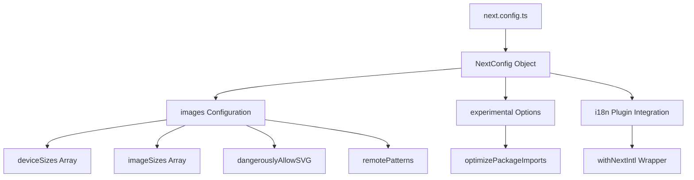

# Next.js Configuration Fix Design

## Overview

This document outlines the fix for the Next.js 15 configuration error related to the unrecognized 'quality' key in the images configuration within `next.config.ts`.

**Error Details:**
- **Error Message**: `Invalid next.config.ts options detected: Unrecognized key(s) in object: 'quality' at "images"`
- **Impact**: Development server fails to restart after configuration changes
- **Root Cause**: Next.js 15 has changed the allowed configuration options for the images object

## Problem Analysis

### Current Configuration Issue
The current `next.config.ts` file includes image configuration options that are not recognized by Next.js 15:

```typescript
images: {
  formats: ['image/avif', 'image/webp'],
  deviceSizes: [360, 640, 768, 1024, 1280, 1536, 1920],
  imageSizes: [16, 32, 48, 64, 96, 128, 256, 384],
  minimumCacheTTL: 31536000,
  dangerouslyAllowSVG: true,
  contentSecurityPolicy: "default-src 'self'; script-src 'none'; sandbox;",
}
```

### Next.js 15 Images Configuration Changes
According to Next.js 15 documentation, the images configuration has been updated with specific allowed properties:
- `remotePatterns` - For external image domains
- `unoptimized` - To disable image optimization
- `loader` - Custom image loader
- `loaderFile` - Path to custom loader file
- `domains` - (deprecated in favor of remotePatterns)
- `deviceSizes` - Array of device sizes
- `imageSizes` - Array of image sizes
- `path` - URL path prefix for images
- `dangerouslyAllowSVG` - Allow SVG images

**Removed/Changed Properties:**
- `quality` - No longer a top-level images config property
- `formats` - Not directly configurable at top level
- `minimumCacheTTL` - Configuration approach changed
- `contentSecurityPolicy` - May need different approach

## Solution Architecture

### Configuration Structure Update


### Updated Configuration Strategy
1. **Remove Invalid Properties**: Remove `quality`, `formats`, `minimumCacheTTL`, and `contentSecurityPolicy` from images config
2. **Maintain Valid Properties**: Keep `deviceSizes`, `imageSizes`, and `dangerouslyAllowSVG`
3. **Add Modern Alternatives**: Use `remotePatterns` for external image sources if needed
4. **Preserve Existing Features**: Maintain optimization and i18n integration

## Implementation Plan

### Configuration File Changes

#### Updated next.config.ts Structure
```typescript
import type { NextConfig } from "next";
import createNextIntlPlugin from 'next-intl/plugin';

const withNextIntl = createNextIntlPlugin('./lib/i18n.ts');

const nextConfig: NextConfig = {
  images: {
    // Device sizes for responsive images (valid)
    deviceSizes: [360, 640, 768, 1024, 1280, 1536, 1920],
    
    // Image sizes for responsive breakpoints (valid)
    imageSizes: [16, 32, 48, 64, 96, 128, 256, 384],
    
    // Allow SVG images for icons (valid)
    dangerouslyAllowSVG: true,
    
    // Add remote patterns if external images are needed
    remotePatterns: [
      // Add external domains here if needed
    ],
  },
  
  // Optimize package imports for better tree shaking
  experimental: {
    optimizePackageImports: ['lucide-react'],
  },
};

export default withNextIntl(nextConfig);
```

### Alternative Quality Configuration
Since `quality` is no longer a top-level config, image quality can be controlled:
1. **Per Image Component**: Use the `quality` prop directly on `<Image>` components
2. **Global Loader**: Implement a custom loader if consistent quality settings are needed

### Modern Format Support
Modern image formats (AVIF, WebP) are enabled by default in Next.js 15, so explicit configuration is not required.

## Testing Strategy

### Configuration Validation
1. **Syntax Check**: Verify TypeScript compilation passes
2. **Server Start**: Ensure development server starts without errors
3. **Image Loading**: Test image optimization still works correctly
4. **Build Process**: Verify production build succeeds

### Image Optimization Testing
```typescript
// Test scenarios:
// 1. Local images with Next.js Image component
// 2. SVG icon loading
// 3. Responsive image breakpoints
// 4. Modern format delivery (automatic)
```

## Migration Impact

### Preserved Functionality
- ✅ Responsive image breakpoints via `deviceSizes` and `imageSizes`
- ✅ SVG support via `dangerouslyAllowSVG`
- ✅ Package import optimization
- ✅ i18n integration via `withNextIntl`

### Removed Features (with alternatives)
- ❌ Global `quality` setting → Use per-component `quality` prop
- ❌ Explicit `formats` configuration → Automatic modern format support
- ❌ `minimumCacheTTL` → Next.js handles caching automatically
- ❌ Image-level `contentSecurityPolicy` → Use global CSP headers

### Component Usage Recommendations
```typescript
// For high-quality hero images
<Image 
  src="/hero-image.jpg" 
  quality={95} 
  priority 
  alt="Hero image" 
/>

// For general content images
<Image 
  src="/content-image.jpg" 
  quality={80} 
  alt="Content image" 
/>
```

## Validation Checklist

- [ ] Remove invalid `quality`, `formats`, `minimumCacheTTL`, and `contentSecurityPolicy` properties
- [ ] Verify `deviceSizes` and `imageSizes` arrays are preserved
- [ ] Confirm `dangerouslyAllowSVG` setting is maintained
- [ ] Test development server starts without configuration errors
- [ ] Validate image optimization continues to work
- [ ] Verify production build completes successfully
- [ ] Check that modern image formats are still delivered automatically