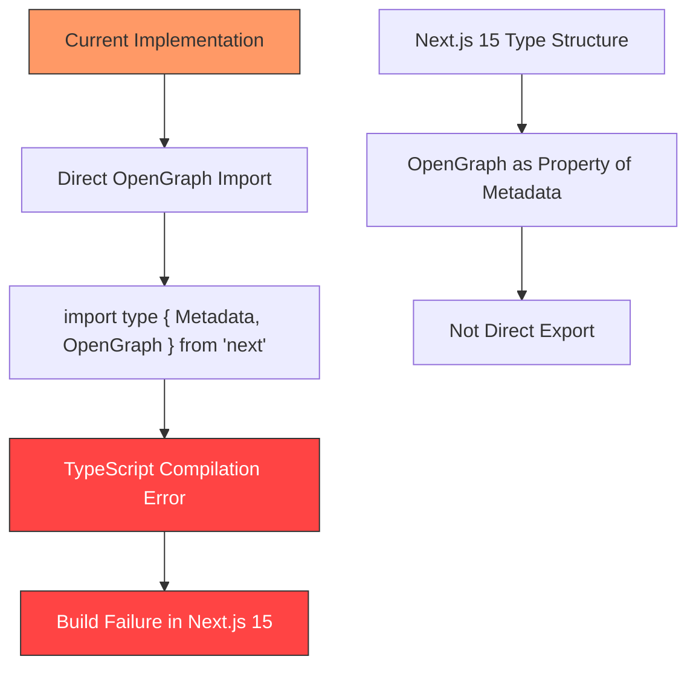
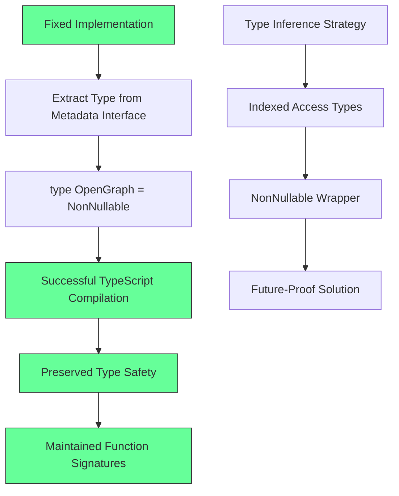
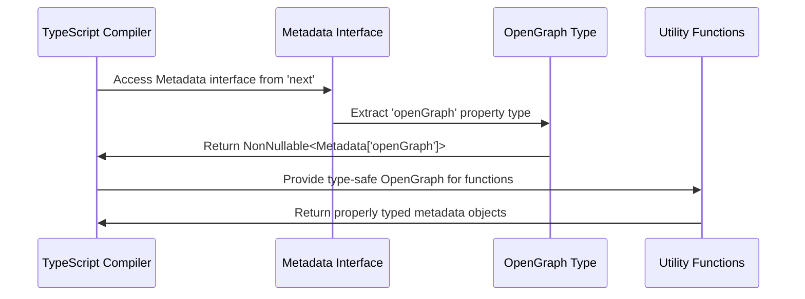
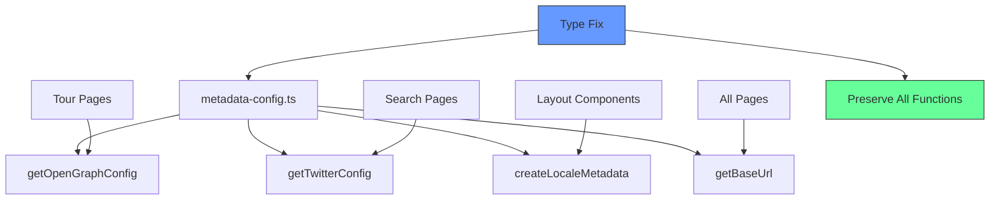
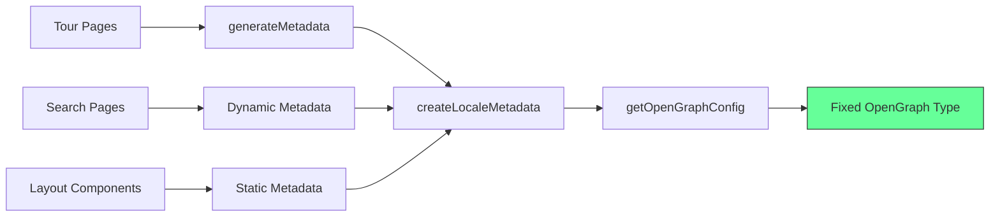
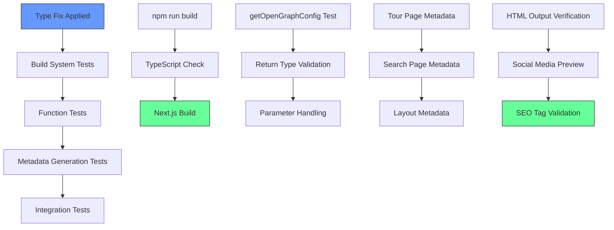
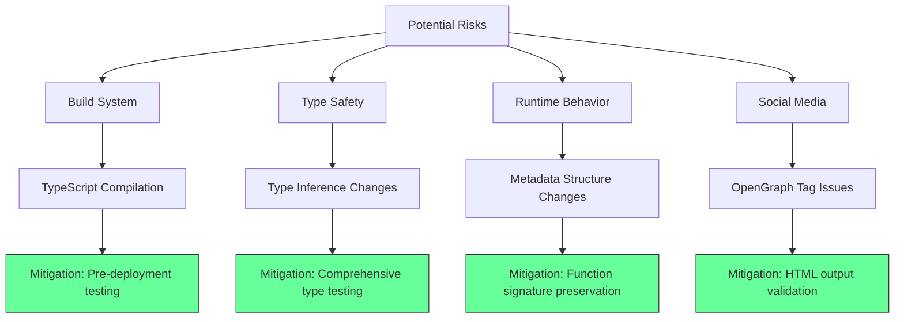

# Next.js 15 Metadata Type Import Fix Design

## Overview

This design addresses a critical TypeScript compilation error in `lib/metadata-config.ts` where the `OpenGraph` type is being imported directly from the 'next' package. In Next.js 15.3.3, the type export structure has changed, causing build failures with the error:

```
Type error: Module '"next"' has no exported member 'OpenGraph'. Did you mean to use 'import OpenGraph from "next"' instead?
```

The solution involves extracting the `OpenGraph` type from the `Metadata` interface using TypeScript's indexed access types, ensuring compatibility with Next.js 15's updated type system while maintaining all existing functionality.

## Technology Stack & Dependencies

**Current Environment:**
- Next.js: 15.3.3
- React: 19.0.0
- TypeScript: ^5
- next-intl: ^4.3.5 (internationalization)
- Node.js: Compatible with version 18+

**Affected Dependencies:**
- All metadata generation functions in the application
- Tour pages with dynamic metadata
- Search pages with locale-specific metadata
- Layout components using centralized metadata configuration

## Architecture

### Problem Analysis



### Solution Architecture



### Type Resolution Flow



## Component Architecture

### File Structure Impact

```
lib/
├── metadata-config.ts         # Primary fix target
│   ├── Type Import Fix        # Remove direct OpenGraph import
│   ├── Type Extraction        # Use indexed access types
│   └── Function Preservation  # Maintain all existing functions
├── i18n.ts                   # Uses metadata utilities (no changes)
└── types/
    └── session.ts            # No impact on session types
```

### Function Dependencies



## Data Models & Type System

### Current Type Structure (Broken)

```typescript
// ❌ This fails in Next.js 15
import type { Metadata, OpenGraph } from 'next';

export const getOpenGraphConfig = (
  locale: string,
  title: string,
  description: string,
  customUrl?: string
): OpenGraph => {
  // Function implementation
}
```

### Fixed Type Structure

```typescript
// ✅ Next.js 15 compatible approach
import type { Metadata } from 'next';

// Extract OpenGraph type from Metadata interface for Next.js 15 compatibility
type OpenGraph = NonNullable<Metadata['openGraph']>

export const getOpenGraphConfig = (
  locale: string,
  title: string,
  description: string,
  customUrl?: string
): OpenGraph => {
  // Function implementation (unchanged)
}
```

### Type Safety Guarantees

| Aspect | Current (Broken) | Fixed Implementation |
|--------|-----------------|---------------------|
| Type Import | Direct from 'next' | Extracted from Metadata |
| Null Safety | Implicit | Explicit with NonNullable |
| Future Compatibility | Fragile | Robust |
| Function Signatures | Preserved | Preserved |
| Runtime Behavior | Unchanged | Unchanged |

## API Integration Layer

### Metadata Generation Functions

**Core Function Signatures (Preserved):**

```typescript
// Base URL utilities (no changes required)
export const getBaseUrl = (): string
export const getMetadataBase = (): URL

// OpenGraph configuration (type-fixed)
export const getOpenGraphConfig = (
  locale: string,
  title: string,
  description: string,
  customUrl?: string
): OpenGraph

// Twitter configuration (no changes)
export const getTwitterConfig = (
  title: string,
  description: string
): TwitterConfig

// Complete metadata creation (no changes)
export const createLocaleMetadata = (
  locale: string,
  title?: string,
  description?: string,
  customUrl?: string,
  keywords?: string[]
): Metadata
```

### Integration Points



## Testing Strategy

### Compilation Testing

```typescript
// Test 1: TypeScript compilation
npm run build
// Expected: No type errors

// Test 2: Development server
npm run dev
// Expected: Server starts without type errors

// Test 3: Type checking
npx tsc --noEmit
// Expected: Clean compilation
```

### Functional Testing



### Validation Checklist

**Build Validation:**
- [ ] TypeScript compilation passes
- [ ] Next.js build completes successfully
- [ ] Development server starts without errors
- [ ] No runtime errors in browser console

**Metadata Validation:**
- [ ] OpenGraph tags render correctly in HTML
- [ ] Twitter Card metadata appears in page source
- [ ] Social media previews work (Facebook, Twitter, LinkedIn)
- [ ] Locale-specific metadata generates properly

**Function Validation:**
- [ ] `getOpenGraphConfig()` returns correct structure
- [ ] `createLocaleMetadata()` includes OpenGraph data
- [ ] All existing function signatures work unchanged
- [ ] Type inference works in development environment

## Routing & Navigation

### Impact on Page Metadata

```typescript
// Tour pages: app/[locale]/tours/[slug]/page.tsx
export async function generateMetadata(
  { params }: { params: Promise<{ locale: string; slug: string }> }
): Promise<Metadata> {
  const { locale, slug } = await params;
  
  // Uses fixed metadata-config functions (no changes needed)
  return createLocaleMetadata(
    locale,
    `Tour: ${slug}`,
    `Discover amazing adventures in ${slug}`,
    `/tours/${slug}`
  );
}

// Search pages: app/[locale]/search/page.tsx
export async function generateMetadata(
  { params }: { params: Promise<{ locale: string }> }
): Promise<Metadata> {
  const { locale } = await params;
  
  // Uses fixed metadata-config functions (no changes needed)
  return createLocaleMetadata(
    locale,
    "Search Adventures",
    "Find your perfect adventure in Costa Rica"
  );
}
```

### URL and SEO Impact

The fix preserves all SEO and social media functionality:

- **OpenGraph URLs**: Absolute URLs continue to work correctly
- **Social Sharing**: Facebook, Twitter, LinkedIn previews unchanged
- **Internationalization**: Locale-specific metadata preserved
- **Search Engines**: Meta tags structure remains identical

## Implementation Details

### Exact Code Changes Required

**File:** `lib/metadata-config.ts`
**Lines:** 8-9

**Current (Broken) Code:**
```typescript
import type { Metadata, OpenGraph } from 'next';
```

**Fixed Code:**
```typescript
import type { Metadata } from 'next';

// Extract OpenGraph type from Metadata interface for Next.js 15 compatibility
type OpenGraph = NonNullable<Metadata['openGraph']>
```

### Why This Solution Works

1. **Type Extraction**: Uses TypeScript's indexed access to get the exact OpenGraph type from Metadata
2. **NonNullable Wrapper**: Ensures the type excludes undefined, matching the original behavior
3. **No Runtime Changes**: Only affects compile-time type checking
4. **Future-Proof**: Less likely to break with Next.js updates since it derives from the core Metadata type

### Alternative Approaches Considered

| Approach | Pros | Cons | Decision |
|----------|------|------|----------|
| Direct type definition | Simple | Manual maintenance | Rejected |
| Optional chaining | Safe | Changes function signatures | Rejected |
| Type assertion | Quick fix | Unsafe | Rejected |
| **Indexed access with NonNullable** | **Type-safe, future-proof** | **None** | **Selected** |

## Risk Assessment

### Low-Risk Change Classification

**Why This Is Low Risk:**
- **Type-only modification**: No runtime behavior changes
- **Backward compatible**: All existing function signatures preserved
- **Isolated scope**: Only affects metadata configuration utilities
- **Reversible**: Can be easily reverted if issues arise

### Potential Issues and Mitigation



### Rollback Plan

If issues occur after deployment:

1. **Immediate Rollback**: Revert the import change
2. **Alternative Fix**: Use explicit type definition as temporary measure
3. **Investigation**: Review Next.js 15 documentation for official solution
4. **Re-implementation**: Apply updated fix based on findings

## Performance Impact

### Build Time Impact

- **TypeScript Compilation**: Negligible impact on compile time
- **Bundle Size**: No change to JavaScript output
- **Runtime Performance**: Zero impact on application performance

### Development Experience

- **IDE Support**: Full TypeScript IntelliSense preserved
- **Error Messages**: Clearer type errors during development
- **Hot Reload**: No impact on development server performance