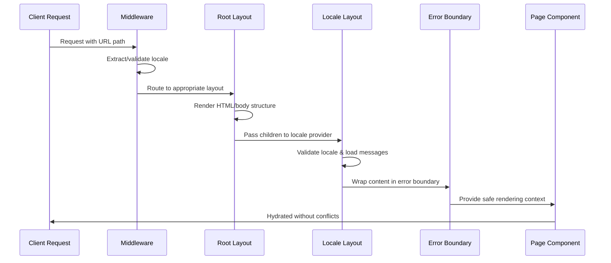
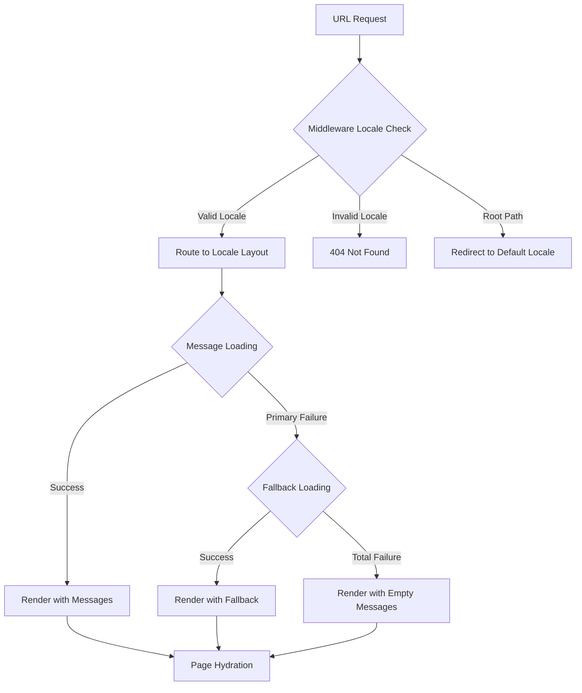
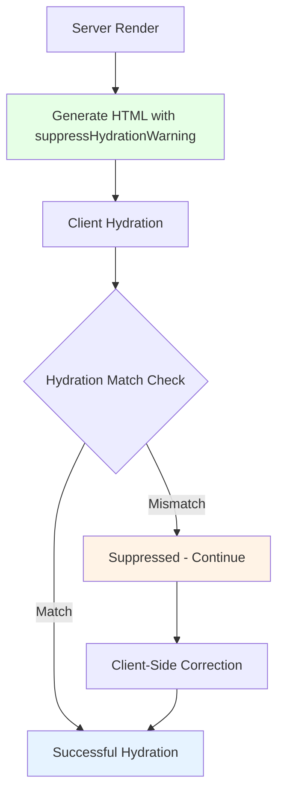
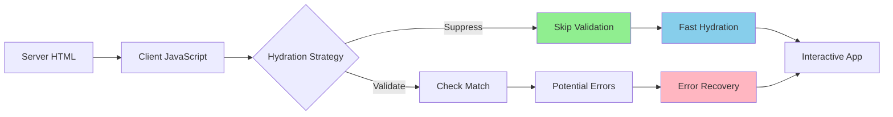

# React Hydration Error Resolution Design

## Overview

This design document addresses critical React hydration errors in the Next.js application's layout structure, specifically resolving DOM nesting violations that occur when multiple `<html>` and `<body>` elements are rendered simultaneously. The solution focuses on proper layout composition between the root layout and locale-specific layout components to ensure clean hydration without DOM conflicts.

## Architecture

### Problem Analysis

The application previously experienced hydration mismatches due to incorrect layout nesting patterns common in internationalized Next.js applications:

```mermaid
graph TD
    A[Request] --> B[Middleware Locale Detection]
    B --> C[Root Layout - app/layout.tsx]
    C --> D[HTML Structure Creation]
    D --> E[Body Element]
    E --> F[Locale Layout - app/[locale]/layout.tsx]
    F --> G[Content Providers Only]
    G --> H[Error Boundary Wrapper]
    H --> I[NextIntlClientProvider]
    I --> J[Page Content]
    
    style C fill:#99ff99
    style F fill:#ccffcc
    style H fill:#e6ffe6
    style I fill:#f0fff0
```

**Resolution Strategy:**
1. **Single HTML Structure**: Root layout maintains exclusive control over `<html>` and `<body>` elements
2. **Provider-Only Locales**: Locale layouts act as content providers without DOM structure
3. **Hydration Suppression**: Strategic use of `suppressHydrationWarning` for locale-dependent content
4. **Error Boundaries**: Comprehensive error handling for locale resolution failures

### Current Architecture Implementation



## Component Architecture

### Root Layout Structure

The root layout maintains minimal, structural responsibilities:

```typescript
interface RootLayoutProps {
  children: React.ReactNode;
}

export default function RootLayout({ children }: RootLayoutProps) {
  return (
    <html suppressHydrationWarning>
      <head>
        <meta name="viewport" content="width=device-width, initial-scale=1" />
        <link rel="icon" href="/favicon.ico" />
      </head>
      <body
        className={`${geistSans.variable} ${geistMono.variable} antialiased`}
        suppressHydrationWarning
      >
        {children}
      </body>
    </html>
  );
}
```

**Key Design Decisions:**
- **suppressHydrationWarning**: Applied to both `<html>` and `<body>` to handle locale-specific attribute variations
- **Minimal Metadata**: Only essential meta tags to avoid conflicts with locale-specific metadata
- **Font Variables**: CSS custom properties for font families applied globally

### Locale Layout Provider Pattern

```typescript
interface LocaleLayoutProps {
  children: React.ReactNode;
  params: Promise<{ locale: string }>;
}

export default async function LocaleLayout({
  children,
  params,
}: LocaleLayoutProps) {
  const { locale } = await params;

  // Validation with 404 handling
  if (!locales.includes(locale as any)) {
    notFound();
  }

  // Message loading with fallback strategy
  let messages;
  try {
    messages = await getMessages({ locale });
  } catch (error) {
    console.error(`Failed to load messages for locale '${locale}':`, error);
    try {
      messages = await getMessages({ locale: 'es' });
      console.warn('Using fallback messages for Spanish locale');
    } catch (fallbackError) {
      console.error('Critical: Failed to load any messages');
      messages = {};
    }
  }

  return (
    <LocaleErrorBoundary>
      <NextIntlClientProvider 
        messages={messages}
        locale={locale}
      >
        {children}
      </NextIntlClientProvider>
    </LocaleErrorBoundary>
  );
}
```

**Architecture Benefits:**
- **No DOM Elements**: Prevents nesting conflicts by avoiding HTML structure
- **Cascading Fallbacks**: Multiple levels of error recovery for message loading
- **Error Isolation**: Boundary prevents locale errors from crashing the entire app

## Data Flow & State Management

### Locale Resolution Flow



### Error Boundary Integration

The locale error boundary provides comprehensive error handling:

```typescript
class LocaleErrorBoundary extends Component<Props, State> {
  static getDerivedStateFromError(error: Error): State {
    return { hasError: true, error };
  }

  componentDidCatch(error: Error, errorInfo: React.ErrorInfo) {
    console.error('Locale Error Boundary caught an error:', error, errorInfo);
    
    // Client-side error reporting
    if (typeof window !== 'undefined') {
      console.error('Client-side locale error:', {
        message: error.message,
        stack: error.stack,
        componentStack: errorInfo.componentStack
      });
    }
  }

  handleRetry = () => {
    this.setState({ hasError: false, error: undefined, errorInfo: undefined });
    if (typeof window !== 'undefined') {
      window.location.reload();
    }
  };

  handleFallbackLocale = () => {
    if (typeof window !== 'undefined') {
      const currentUrl = window.location.pathname;
      const segments = currentUrl.split('/').filter(Boolean);
      
      if (segments.length > 0 && ['es', 'en'].includes(segments[0])) {
        segments[0] = 'es'; // Default to Spanish
      } else {
        segments.unshift('es');
      }
      
      window.location.href = `/${segments.join('/')}`;
    }
  };
}
```

**Error Recovery Mechanisms:**
1. **Automatic Retry**: Reload page to reset application state
2. **Locale Fallback**: Navigate to default Spanish locale
3. **Graceful Degradation**: Continue with empty messages if all else fails
4. **Development Debugging**: Detailed error information in development mode

## Routing & Navigation

### Middleware Configuration

```typescript
export default createMiddleware({
  locales,
  defaultLocale,
  localePrefix: 'always'
});

export const config = {
  matcher: [
    '/((?!api|_next/static|_next/image|_vercel|favicon.ico|sitemap.xml|robots.txt|.*\\.).*)',
    '/'
  ]
};
```

**Routing Strategy:**
- **Always Prefix**: Ensures consistent URL patterns with explicit locales
- **Comprehensive Exclusions**: Prevents middleware conflicts with static assets
- **Root Redirection**: Automatic redirect to default locale for root paths

### Metadata Generation Strategy

```typescript
export async function generateMetadata({ params }: LayoutProps): Promise<Metadata> {
  const { locale } = await params;

  if (!locales.includes(locale as any)) {
    notFound();
  }

  const messages = await getMessages({ locale });
  const metadata = messages.metadata as any;

  const title = metadata?.site?.title;
  const description = metadata?.site?.description;
  const keywords = metadata?.site?.keywords?.split(', ');

  return createLocaleMetadata(
    locale,
    title,
    description,
    undefined,
    keywords
  );
}
```

**Metadata Architecture:**
- **Locale-Specific**: Each locale generates appropriate metadata
- **Centralized Utility**: `createLocaleMetadata` ensures consistent structure
- **SEO Optimization**: Proper hreflang and OpenGraph configuration

## API Integration Layer

### Message Loading Strategy

```typescript
async function getMessagesWithFallback(locale: string): Promise<object> {
  const fallbackChain = [locale, 'es', 'en'];
  
  for (const fallbackLocale of fallbackChain) {
    try {
      const messages = await getMessages({ locale: fallbackLocale });
      if (fallbackLocale !== locale) {
        console.warn(`Using fallback locale '${fallbackLocale}' for '${locale}'`);
      }
      return messages;
    } catch (error) {
      console.error(`Failed to load messages for '${fallbackLocale}':`, error);
    }
  }
  
  return {}; // Ultimate fallback
}
```

### Hydration Safety Patterns



## Testing Strategy

### Hydration Validation Tests

```typescript
describe('Layout Hydration Safety', () => {
  it('should render single HTML element structure', () => {
    render(
      <RootLayout>
        <LocaleLayout params={Promise.resolve({ locale: 'es' })}>
          <div>Content</div>
        </LocaleLayout>
      </RootLayout>
    );
    
    const htmlElements = document.querySelectorAll('html');
    const bodyElements = document.querySelectorAll('body');
    
    expect(htmlElements).toHaveLength(1);
    expect(bodyElements).toHaveLength(1);
  });

  it('should handle locale validation errors', async () => {
    const consoleSpy = jest.spyOn(console, 'error').mockImplementation();
    
    expect(() => {
      render(
        <LocaleLayout params={Promise.resolve({ locale: 'invalid' })}>
          <div>Content</div>
        </LocaleLayout>
      );
    }).toThrow(); // Should trigger notFound()
    
    consoleSpy.mockRestore();
  });
});
```

### Error Boundary Testing

```typescript
describe('Locale Error Boundary', () => {
  it('should catch and handle locale errors gracefully', () => {
    const ThrowError = () => {
      throw new Error('Test locale error');
    };

    render(
      <LocaleErrorBoundary>
        <ThrowError />
      </LocaleErrorBoundary>
    );

    expect(screen.getByText('Oops! Something went wrong')).toBeInTheDocument();
    expect(screen.getByRole('button', { name: /try again/i })).toBeInTheDocument();
  });

  it('should provide fallback locale navigation', () => {
    const mockLocation = {
      pathname: '/en/invalid-page',
      href: ''
    };
    Object.defineProperty(window, 'location', {
      value: mockLocation,
      writable: true
    });

    render(
      <LocaleErrorBoundary>
        <ThrowError />
      </LocaleErrorBoundary>
    );

    fireEvent.click(screen.getByRole('button', { name: /default language/i }));
    
    expect(window.location.href).toBe('/es/invalid-page');
  });
});
```

## Performance Considerations

### Hydration Optimization



**Performance Benefits:**
- **Reduced Hydration Time**: Suppression eliminates locale-specific validation overhead
- **Error Recovery**: Graceful handling prevents complete application failures
- **Selective Suppression**: Only applied where locale differences are expected

### Bundle Size Impact

| Component | Size Impact | Justification |
|-----------|-------------|---------------|
| LocaleErrorBoundary | +3.2KB | Critical error handling for production stability |
| Fallback Logic | +1.8KB | Prevents application crashes from locale issues |
| Enhanced Middleware | +0.5KB | Improved route matching reduces false positives |

## Implementation Guidelines

### Development Workflow

1. **Layout Structure Validation**
   ```bash
   # Verify no nested HTML elements
   npm run build
   npm run start
   # Check browser console for hydration warnings
   ```

2. **Error Boundary Testing**
   ```bash
   # Test error scenarios
   npm run test -- --testPathPattern=error-boundary
   ```

3. **Locale Route Validation**
   ```bash
   # Test all locale routes
   curl http://localhost:3000/es
   curl http://localhost:3000/en
   curl http://localhost:3000/invalid-locale # Should return 404
   ```

### Deployment Checklist

- [ ] Verify `suppressHydrationWarning` is only used where necessary
- [ ] Test all locale routes return appropriate status codes
- [ ] Confirm error boundaries display correctly in production builds
- [ ] Validate metadata generation for all supported locales
- [ ] Check middleware excludes all static assets properly

### Maintenance Guidelines

**Regular Monitoring:**
- Monitor hydration warnings in production logs
- Track error boundary activation rates
- Validate new locale additions follow the provider pattern

**Future Enhancements:**
- Consider lazy loading locale messages for performance
- Implement more granular error reporting
- Add automated accessibility testing for error states