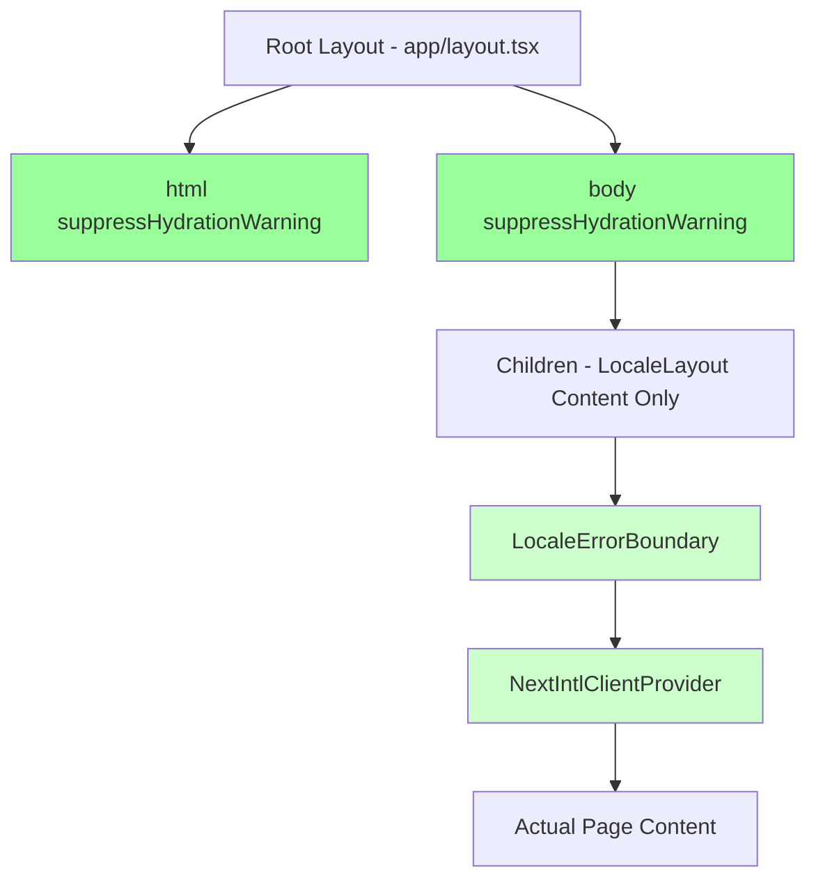
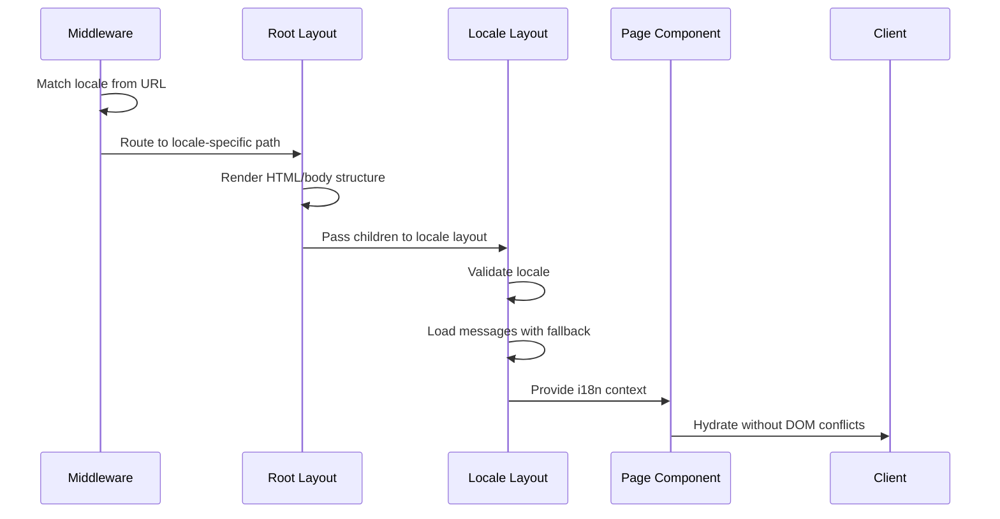
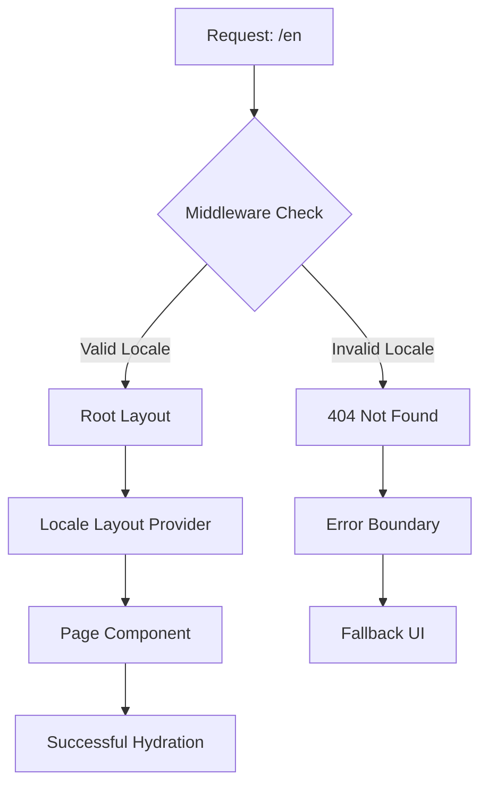

# React Hydration Error Resolution Design

## Overview

This design document addresses critical React hydration errors in the Next.js application's layout structure, specifically resolving DOM nesting violations that occur when multiple `<html>` and `<body>` elements are rendered simultaneously. The errors stem from improper layout composition between the root layout and locale-specific layout components.

## Architecture

### Current Problem Analysis

The application currently experiences hydration mismatches due to multiple overlapping layout components:

```mermaid
graph TD
    A[Root Layout - app/layout.tsx] --> B[html]
    A --> C[body]
    C --> D[Children - LocaleLayout]
    D --> E[LocaleLayout - app/[locale]/layout.tsx] 
    E --> F[html lang=locale] 
    E --> G[body]
    F --> H[NextIntlClientProvider]
    G --> H
    
    style B fill:#ff9999
    style F fill:#ff9999
    style C fill:#ffcc99
    style G fill:#ffcc99
```

**Key Issues:**
1. **Nested HTML Elements**: The locale layout renders `<html>` inside the root layout's `<body>`
2. **Duplicate Body Elements**: Multiple `<body>` elements cause DOM validation errors
3. **Hydration Mismatch**: Server-rendered HTML differs from client-side expectations
4. **404 Route Conflicts**: Middleware routing conflicts with layout mounting

### Proposed Architecture Solution



## Component Architecture

### Root Layout (app/layout.tsx) - Fixed Structure

```typescript
interface RootLayoutProps {
  children: React.ReactNode;
}

export default function RootLayout({ children }: RootLayoutProps) {
  return (
    <html suppressHydrationWarning>
      <head>
        <meta name="viewport" content="width=device-width, initial-scale=1" />
        <link rel="icon" href="/favicon.ico" />
      </head>
      <body 
        className={`${geistSans.variable} ${geistMono.variable} antialiased`}
        suppressHydrationWarning
      >
        {children}
      </body>
    </html>
  );
}
```

### Locale Layout (app/[locale]/layout.tsx) - Content Provider Only

```typescript
interface LocaleLayoutProps {
  children: React.ReactNode;
  params: Promise<{ locale: string }>;
}

export default async function LocaleLayout({
  children,
  params,
}: LocaleLayoutProps) {
  const { locale } = await params;
  
  if (!locales.includes(locale as any)) {
    notFound();
  }

  let messages;
  try {
    messages = await getMessages({ locale });
  } catch (error) {
    // Fallback logic
    messages = await getMessages({ locale: 'es' });
  }

  return (
    <LocaleErrorBoundary>
      <NextIntlClientProvider 
        messages={messages}
        locale={locale}
      >
        {children}
      </NextIntlClientProvider>
    </LocaleErrorBoundary>
  );
}
```

## Data Flow & State Management

### Locale Resolution Flow



### Error Boundary Integration

```typescript
interface LocaleErrorBoundaryState {
  hasError: boolean;
  error?: Error;
}

class LocaleErrorBoundary extends Component<
  PropsWithChildren<{}>,
  LocaleErrorBoundaryState
> {
  static getDerivedStateFromError(error: Error): LocaleErrorBoundaryState {
    return {
      hasError: true,
      error,
    };
  }

  componentDidCatch(error: Error, errorInfo: ErrorInfo) {
    console.error('Client-side locale error:', {
      message: error.message,
      stack: error.stack,
      componentStack: errorInfo.componentStack
    });
  }

  render() {
    if (this.state.hasError) {
      return (
        <div className="min-h-screen flex items-center justify-center">
          <div className="text-center p-8">
            <h2 className="text-2xl font-bold mb-4">
              Oops! Something went wrong with localization
            </h2>
            <button 
              onClick={() => window.location.reload()}
              className="px-4 py-2 bg-blue-500 text-white rounded"
            >
              Reload Page
            </button>
          </div>
        </div>
      );
    }

    return this.props.children;
  }
}
```

## Routing & Navigation

### Middleware Configuration Enhancement

```typescript
export default createMiddleware({
  locales,
  defaultLocale,
  localePrefix: 'always',
  localeDetection: true,
  alternateLinks: false // Prevent additional route conflicts
});

export const config = {
  matcher: [
    // Exclude static assets and API routes more precisely
    '/((?!api|_next/static|_next/image|_vercel|favicon\\.ico|sitemap\\.xml|robots\\.txt|.*\\.[^/]+).*)',
    '/'
  ]
};
```

### Route Resolution Strategy



## API Integration Layer

### Message Loading with Fallback Strategy

```typescript
async function getMessagesWithFallback(locale: string) {
  const fallbackChain = [locale, 'es', 'en'];
  
  for (const fallbackLocale of fallbackChain) {
    try {
      const messages = await getMessages({ locale: fallbackLocale });
      if (fallbackLocale !== locale) {
        console.warn(`Using fallback locale '${fallbackLocale}' for '${locale}'`);
      }
      return messages;
    } catch (error) {
      console.error(`Failed to load messages for '${fallbackLocale}':`, error);
    }
  }
  
  // Ultimate fallback
  return {};
}
```

### Metadata Generation Strategy

```typescript
export async function generateMetadata({ params }: LayoutProps): Promise<Metadata> {
  const { locale } = await params;
  
  if (!locales.includes(locale as any)) {
    notFound();
  }

  const messages = await getMessagesWithFallback(locale);
  const metadata = messages.metadata as any;

  return {
    title: metadata?.site?.title || "La Vieja Adventures",
    description: metadata?.site?.description || "Adventure Tourism in Costa Rica",
    openGraph: {
      locale: locale === "es" ? "es_CR" : "en_US",
      alternateLocale: locale === "es" ? "en_US" : "es_CR",
    },
    alternates: {
      languages: {
        "es-CR": "/es",
        "en-US": "/en",
      },
    },
  };
}
```

## Testing Strategy

### Hydration Error Detection

```typescript
// Test for hydration mismatches
describe('Layout Hydration', () => {
  it('should not render nested html elements', () => {
    render(<RootLayout><LocaleLayout>Content</LocaleLayout></RootLayout>);
    
    const htmlElements = document.querySelectorAll('html');
    expect(htmlElements).toHaveLength(1);
  });

  it('should not render nested body elements', () => {
    render(<RootLayout><LocaleLayout>Content</LocaleLayout></RootLayout>);
    
    const bodyElements = document.querySelectorAll('body');
    expect(bodyElements).toHaveLength(1);
  });

  it('should handle locale errors gracefully', () => {
    const consoleSpy = jest.spyOn(console, 'error').mockImplementation();
    
    render(<LocaleErrorBoundary><ThrowError /></LocaleErrorBoundary>);
    
    expect(consoleSpy).toHaveBeenCalledWith(
      expect.stringContaining('Client-side locale error')
    );
  });
});
```

### Route Resolution Testing

```typescript
describe('Route Resolution', () => {
  it('should resolve valid locale routes', async () => {
    const response = await fetch('/en');
    expect(response.status).toBe(200);
  });

  it('should handle invalid locales', async () => {
    const response = await fetch('/invalid-locale');
    expect(response.status).toBe(404);
  });

  it('should redirect root to default locale', async () => {
    const response = await fetch('/', { redirect: 'manual' });
    expect(response.status).toBe(307);
    expect(response.headers.get('location')).toBe('/es');
  });
});
```

## Implementation Steps

### Phase 1: Layout Structure Fix
1. **Remove HTML/body from locale layout**
   - Keep only content providers in `app/[locale]/layout.tsx`
   - Maintain `suppressHydrationWarning` in root layout
   - Ensure proper locale attribute handling

### Phase 2: Error Boundary Enhancement
1. **Strengthen error boundaries**
   - Add comprehensive error logging
   - Implement graceful fallback UI
   - Add recovery mechanisms

### Phase 3: Middleware Optimization
1. **Refine route matching**
   - Improve matcher patterns to reduce conflicts
   - Add locale detection enhancements
   - Optimize static asset exclusions

### Phase 4: Testing & Validation
1. **Comprehensive testing**
   - Add hydration-specific tests
   - Implement route resolution tests
   - Add error boundary coverage

## Performance Considerations

### Hydration Optimization
- Use `suppressHydrationWarning` strategically
- Minimize client-server mismatches
- Optimize initial bundle size

### Error Recovery
- Implement progressive fallbacks
- Cache successful message loads
- Provide immediate error feedback

### Route Performance
- Optimize middleware matching patterns
- Reduce unnecessary redirects
- Cache locale detection results