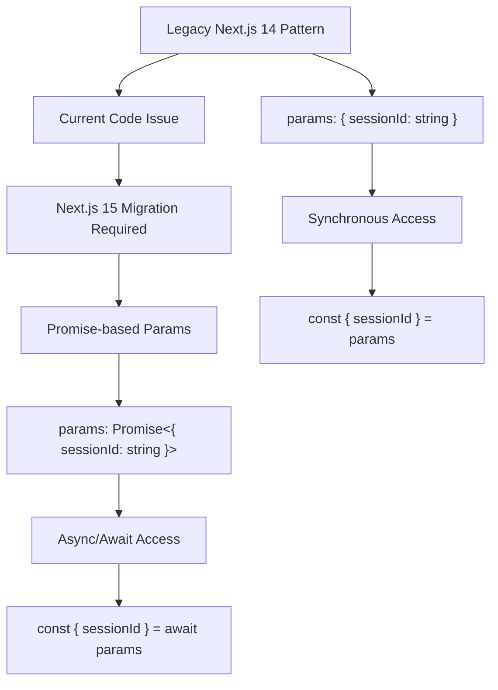
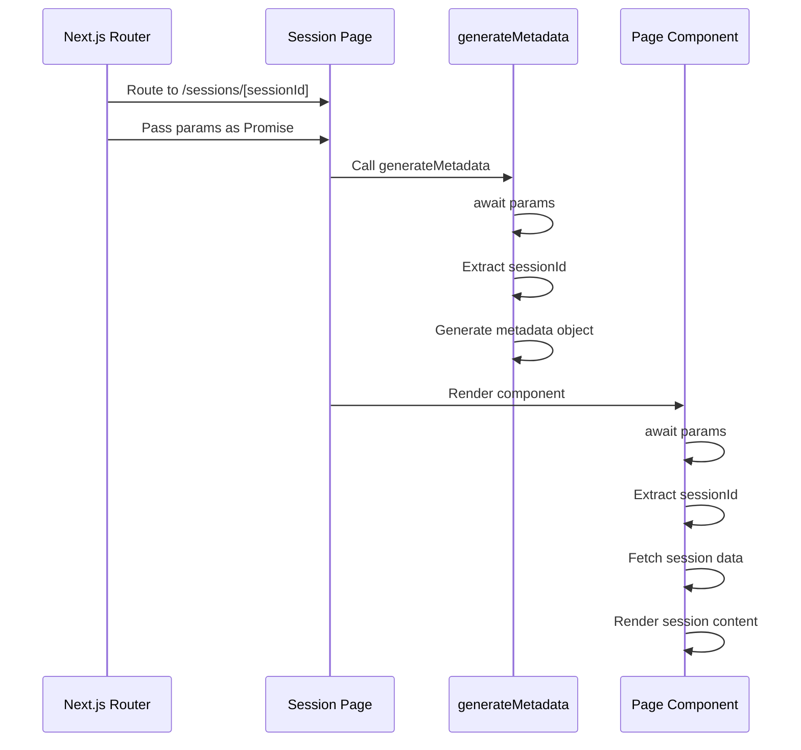

# Type Linting Fix: Next.js 15 App Router Params Promise Migration

## Overview

This document outlines the design for fixing TypeScript compilation errors related to the `params` property type constraint in Next.js 15 App Router. The error occurs because Next.js 15 introduced a breaking change where the `params` prop is now a Promise that must be awaited, but the current code treats it as a synchronous object.

## Architecture

### Problem Analysis

The error message indicates that `SessionDetailProps` does not satisfy the `PageProps` constraint:

```
Type 'SessionDetailProps' does not satisfy the constraint 'PageProps'.
Types of property 'params' are incompatible.
Type '{ sessionId: string; }' is missing the following properties from type 'Promise<any>': then, catch, finally, [Symbol.toStringTag]
```

This occurs because:
1. **Current Implementation**: `params` is typed as `{ sessionId: string }`
2. **Expected Type**: `params` should be `Promise<{ sessionId: string }>`
3. **Root Cause**: Next.js 15 App Router changed `params` from synchronous to asynchronous

### Type System Migration Pattern



## Component Architecture

### Current Implementation Issues

The sessions page currently uses the legacy synchronous pattern:

```typescript
interface SessionDetailProps {
  params: { sessionId: string }  // ❌ Legacy pattern
}

export async function generateMetadata({ params }: SessionDetailProps) {
  const { sessionId } = await params  // ❌ Trying to await non-Promise
}

export default async function SessionDetailPage({ params }: SessionDetailProps) {
  const { sessionId } = await params  // ❌ Trying to await non-Promise
}
```

### Target Implementation Pattern

Following the established pattern from other pages in the codebase:

```typescript
interface SessionDetailProps {
  params: Promise<{ sessionId: string }>  // ✅ Next.js 15 pattern
}

export async function generateMetadata({ params }: SessionDetailProps) {
  const { sessionId } = await params  // ✅ Properly awaiting Promise
}

export default async function SessionDetailPage({ params }: SessionDetailProps) {
  const { sessionId } = await params  // ✅ Properly awaiting Promise
}
```

## Data Flow Architecture

### Migration Strategy



### Type Safety Implementation

The migration ensures type safety through:

1. **Promise Type Definition**: Explicitly typing `params` as Promise
2. **Async Function Compatibility**: Both functions are already async
3. **Consistent Pattern**: Following established patterns from other pages
4. **Error Handling**: Maintaining existing error handling logic

## Testing Strategy

### Type Verification

```typescript
// Verify type compatibility
type ExpectedParams = Promise<{ sessionId: string }>;
type ActualParams = SessionDetailProps['params'];

// This should compile without errors after migration
const typeCheck: ExpectedParams = {} as ActualParams;
```

### Runtime Verification

The migration maintains existing runtime behavior:
- `generateMetadata` continues to extract `sessionId` and generate metadata
- Page component continues to fetch session data and render
- Error handling with `notFound()` remains unchanged
- All existing functionality preserved

### Integration Testing

Verify compatibility with:
- Next.js type checking (`next build`)
- TypeScript compilation (`tsc --noEmit`)
- Runtime page rendering
- Metadata generation
- Dynamic routing functionality

## Migration Implementation

### Step 1: Type Interface Update

```typescript
interface SessionDetailProps {
  params: Promise<{ sessionId: string }>
}
```

### Step 2: Function Implementation Verification

Both functions already use `await params`, so no code changes needed:

```typescript
export async function generateMetadata({ params }: SessionDetailProps) {
  const { sessionId } = await params  // Already correct
  // ... rest remains unchanged
}

export default async function SessionDetailPage({ params }: SessionDetailProps) {
  const { sessionId } = await params  // Already correct
  // ... rest remains unchanged
}
```

### Step 3: Validation

After type update:
1. Run `npm run build` to verify TypeScript compilation
2. Test page navigation to sessions
3. Verify metadata generation
4. Confirm error handling works

## Compatibility Considerations

### Next.js Version Alignment

This migration aligns with:
- **Next.js 15.3.3**: Current project version
- **App Router**: Using modern routing system
- **TypeScript**: Maintains strict type checking
- **Existing Patterns**: Consistent with tour pages and locale pages

### Performance Impact

- **Zero Runtime Impact**: Only type definition changes
- **Build Time**: Improved type checking
- **Developer Experience**: Better IntelliSense and error catching

### Future Maintenance

This migration:
- Follows Next.js best practices
- Ensures compatibility with future versions
- Maintains consistency across the codebase
- Provides clear migration pattern for similar issues