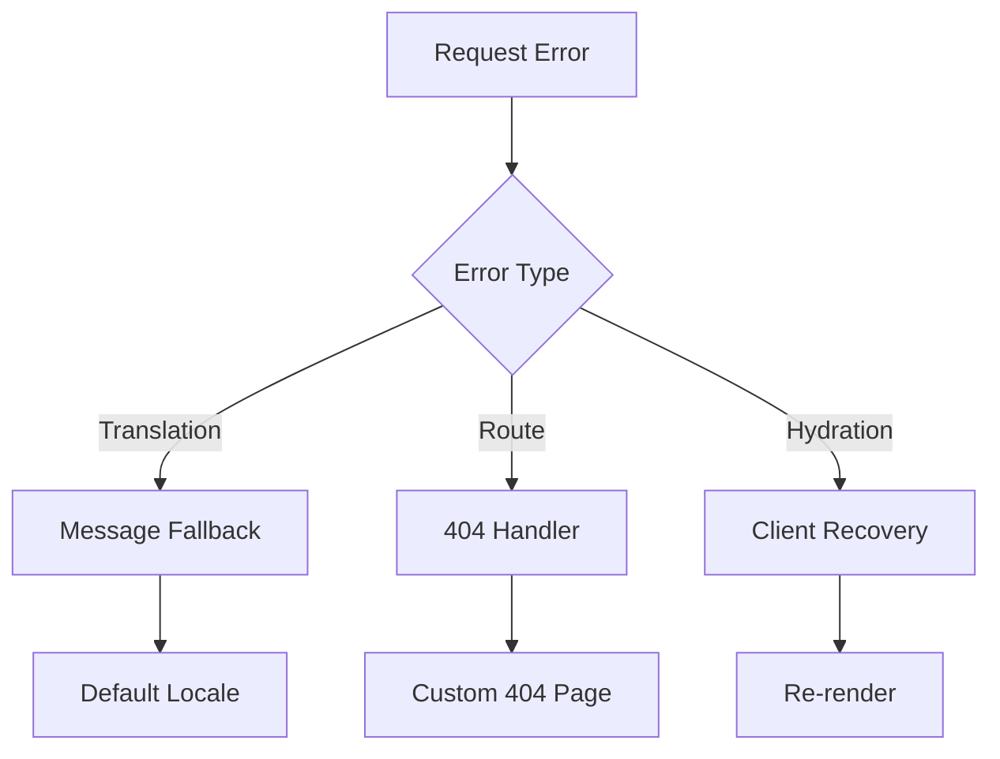
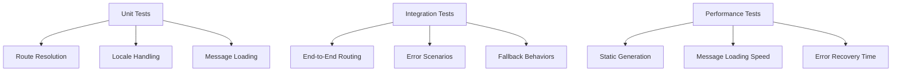

# Next.js HTTP 404 Error Resolution Design

## Overview

This document outlines a comprehensive solution for the `NEXT_HTTP_ERROR_FALLBACK;404` error occurring in the llvvaa multilingual Next.js application. The error indicates a routing issue in the internationalized application that uses `next-intl` middleware for locale-based routing.

## Architecture Analysis

### Current System Structure

The application follows Next.js App Router with internationalized routing:

```mermaid
graph TD
    A[Root /] --> B[middleware.ts]
    B --> C{Locale Detection}
    C --> D[/es/... Spanish Routes]
    C --> E[/en/... English Routes]
    D --> F[app/[locale]/layout.tsx]
    E --> F
    F --> G[Page Components]
    G --> H{Route Exists?}
    H --> I[Render Page]
    H --> J[404 Error - NEXT_HTTP_ERROR_FALLBACK]
```

### Root Cause Analysis

The `NEXT_HTTP_ERROR_FALLBACK;404` error occurs due to several potential routing conflicts:

1. **Middleware Matcher Configuration**: Over-broad middleware matching
2. **Locale Layout Issues**: Nested HTML elements or hydration conflicts
3. **Missing Route Handlers**: Dynamic routes not properly configured
4. **Static Generation Gaps**: Missing static paths for dynamic routes
5. **Message Loading Failures**: Translation files not loading correctly

## Component Architecture

### Error Handling Flow

```mermaid
flowchart TD
    A[Request] --> B[middleware.ts]
    B --> C{Valid Locale?}
    C -->|No| D[notFound()]
    C -->|Yes| E[app/[locale]/layout.tsx]
    E --> F{Messages Load?}
    F -->|No| G[LocaleErrorBoundary]
    F -->|Yes| H[Page Component]
    H --> I{Valid Route?}
    I -->|No| J[notFound()]
    I -->|Yes| K[Render Success]
    
    G --> L[Error UI]
    J --> M[404 Page]
    D --> M
```

### Critical Components

| Component | Responsibility | Error Points |
|-----------|---------------|--------------|
| `middleware.ts` | Locale routing & validation | Invalid locale detection |
| `app/[locale]/layout.tsx` | Message loading & providers | Translation failures |
| `LocaleErrorBoundary` | Error recovery | Hydration issues |
| Dynamic routes | Static generation | Missing paths |

## Issue Resolution Strategy

### 1. Middleware Configuration Refinement

**Problem**: Over-broad pattern matching causing conflicts

**Solution**: Optimize matcher patterns to exclude problematic routes

```typescript
// Enhanced matcher configuration
export const config = {
  matcher: [
    // Include all paths except specific exclusions
    '/((?!api|_next/static|_next/image|_vercel|favicon.ico|sitemap.xml|robots.txt|manifest.json|sw.js|workbox-.*\\.js).*)',
    // Root path redirection
    '/'
  ]
};
```

### 2. Locale Validation Enhancement

**Problem**: Edge cases in locale detection not handled

**Solution**: Robust locale validation with fallbacks

```typescript
// Enhanced locale validation
export default createMiddleware({
  locales: ['es', 'en'],
  defaultLocale: 'es',
  localePrefix: 'always',
  pathnames: {
    // Explicit pathname mapping for critical routes
    '/': '/',
    '/tours/[slug]': {
      es: '/tours/[slug]',
      en: '/tours/[slug]'
    }
  }
});
```

### 3. Static Generation Completeness

**Problem**: Missing static paths for dynamic routes

**Solution**: Comprehensive static path generation


### 4. Error Boundary Enhancement

**Problem**: Insufficient error recovery mechanisms

**Solution**: Multi-level error handling strategy



## Implementation Approach

### Phase 1: Middleware Optimization

1. **Pattern Refinement**: Update middleware matcher to exclude problematic paths
2. **Locale Validation**: Enhance locale detection with better error handling
3. **Debug Logging**: Add comprehensive logging for route resolution

### Phase 2: Static Generation Enhancement

1. **Path Generation**: Ensure all dynamic routes have complete static params
2. **Locale Coverage**: Verify all locales generate proper paths
3. **Fallback Strategy**: Implement ISR for missing paths

### Phase 3: Error Recovery Implementation

1. **Enhanced Boundaries**: Improve LocaleErrorBoundary coverage
2. **Graceful Degradation**: Better fallback mechanisms
3. **User Experience**: Improved error messaging and recovery

### Phase 4: Message Loading Optimization

1. **Lazy Loading**: Optimize translation file loading
2. **Cache Strategy**: Implement proper caching for messages
3. **Fallback Chain**: Multi-level translation fallbacks

## Error Prevention Mechanisms

### Route Validation Matrix

| Route Type | Validation Method | Fallback Strategy |
|------------|------------------|-------------------|
| Static | File existence | 404 page |
| Dynamic | Parameter validation | notFound() |
| Locale | Locale list check | Default locale |
| Messages | File availability | Fallback locale |

### Testing Strategy



## Quality Assurance

### Validation Checklist

- [ ] All static routes accessible in both locales
- [ ] Dynamic routes generate complete static params
- [ ] Middleware patterns exclude system routes
- [ ] Error boundaries handle all failure modes
- [ ] Translation loading has proper fallbacks
- [ ] 404 pages render correctly for invalid routes
- [ ] Locale switching preserves route context
- [ ] Search functionality works across locales

### Performance Monitoring

| Metric | Target | Monitoring |
|--------|--------|------------|
| Route Resolution | < 100ms | Server logs |
| Error Recovery | < 500ms | Client metrics |
| Static Generation | 100% coverage | Build analysis |
| Message Loading | < 200ms | Performance API |

## Risk Assessment

### High Priority Risks

1. **Incomplete Static Generation**: Missing paths cause 404s
2. **Middleware Conflicts**: Over-broad matching breaks functionality
3. **Translation Failures**: Missing messages break page rendering

### Mitigation Strategies

1. **Comprehensive Testing**: Automated route validation
2. **Gradual Deployment**: Feature flags for error handling
3. **Monitoring Integration**: Real-time error tracking
4. **Rollback Procedures**: Quick reversion for critical issues