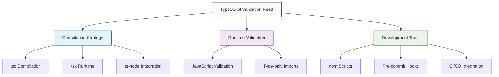

# TypeScript Validation and Node.js Compatibility Design

## Overview

Design a comprehensive solution for validating TypeScript files in a Next.js application, addressing the common issue where Node.js cannot directly execute TypeScript files due to syntax incompatibility. The current project uses TypeScript with ESNext modules, but Node.js requires CommonJS or compiled JavaScript for direct execution.

## Architecture

### Problem Analysis

The root issue occurs when Node.js attempts to parse TypeScript syntax directly:
- Node.js expects JavaScript syntax but encounters TypeScript-specific constructs
- Import type statements and interface definitions cause syntax errors
- The project uses ESNext module resolution but Node.js runs in CommonJS mode

### Solution Components



## Component Architecture

### 1. TypeScript Compilation Validation

**Build-time Type Checking**
- Leverage existing `next build` process for comprehensive type validation
- Utilize `tsc --noEmit` for type-only checking without output generation
- Integrate with existing tsconfig.json configuration

**Standalone Compilation**
```bash
# Type checking without output
npx tsc --noEmit

# Specific file validation
npx tsc --noEmit lib/metadata-config.ts
```

### 2. Runtime Execution Solutions

**Method 1: tsx Runtime Loader**
- Modern TypeScript execution runtime
- Direct TypeScript file execution without compilation
- Better performance than ts-node

**Method 2: Compiled JavaScript Validation**
- Compile TypeScript to JavaScript temporarily
- Execute compiled output for validation
- Clean up temporary files

**Method 3: Node.js ESM Compatibility**
- Use dynamic imports with proper module loading
- Handle TypeScript imports through build process

### 3. Development Workflow Integration

**Package.json Scripts Enhancement**
```json
{
  "scripts": {
    "type-check": "tsc --noEmit",
    "type-check:watch": "tsc --noEmit --watch",
    "validate-ts": "tsx lib/metadata-config.ts",
    "validate-config": "node -e \"import('./lib/metadata-config.js').then(() => console.log('Config valid'))\""
  }
}
```

**Dependency Management**
- Add tsx as development dependency for TypeScript execution
- Optional: ts-node for alternative TypeScript runtime
- Maintain existing TypeScript configuration

## Implementation Strategy

### Phase 1: Immediate Solution

**Quick Validation Method**
```bash
# Use TypeScript compiler for validation
npx tsc --noEmit lib/metadata-config.ts

# Alternative: Build and validate through Next.js
npm run build
```

### Phase 2: Enhanced Tooling

**Development Dependencies**
```json
{
  "devDependencies": {
    "tsx": "^4.0.0",
    "@types/node": "^20"
  }
}
```

**Validation Scripts**
```bash
# Direct TypeScript execution
npx tsx lib/metadata-config.ts

# Type validation with output
npx tsx -e "import('./lib/metadata-config.ts').then(() => console.log('Types valid'))"
```

### Phase 3: Automation Integration

**Pre-commit Hooks**
- Type checking before commits
- Automatic validation in development workflow
- Integration with git hooks

**CI/CD Integration**
- Automated type checking in build pipeline
- Validation before deployment
- Error reporting and feedback

## Configuration Adjustments

### TypeScript Configuration Optimization

**Enhanced tsconfig.json**
```json
{
  "compilerOptions": {
    "noEmit": true,
    "strict": true,
    "skipLibCheck": true,
    "moduleResolution": "bundler"
  },
  "include": ["**/*.ts", "**/*.tsx"],
  "exclude": ["node_modules", ".next"]
}
```

### Node.js Module Compatibility

**Package.json Module Configuration**
```json
{
  "type": "module",
  "exports": {
    "./lib/*": "./lib/*.ts"
  }
}
```

## Testing Strategy

### Unit Testing for Configuration
- Validate metadata generation functions
- Test environment-specific URL resolution
- Verify OpenGraph and Twitter card generation

### Integration Testing
- Test compilation process in different environments
- Validate runtime execution across Node.js versions
- Ensure compatibility with Next.js build process

## Error Handling

### Common Error Scenarios
1. **Import Type Syntax**: Node.js cannot parse TypeScript import types
2. **Interface Definitions**: TypeScript interfaces cause syntax errors
3. **Module Resolution**: ESNext vs CommonJS conflicts

### Error Recovery Strategies
- Graceful fallback to JavaScript validation
- Clear error messages with solution suggestions
- Development vs production error handling

## Performance Considerations

### Compilation Performance
- Use incremental compilation for faster builds
- Cache TypeScript compilation results
- Parallel type checking where possible

### Runtime Performance
- Minimize overhead of TypeScript validation
- Use efficient module loading strategies
- Optimize for development vs production environments

## Security Considerations

### Safe Script Execution
- Validate TypeScript files without executing arbitrary code
- Sandboxed validation environments
- Secure handling of environment variables

### Dependency Security
- Audit TypeScript validation tools
- Secure configuration file access
- Protection against malicious TypeScript code

## Monitoring and Diagnostics

### Validation Metrics
- Type checking performance tracking
- Error frequency and patterns
- Build time impact analysis

### Logging and Debugging
- Detailed error reporting for TypeScript issues
- Validation step tracking
- Performance bottleneck identification
