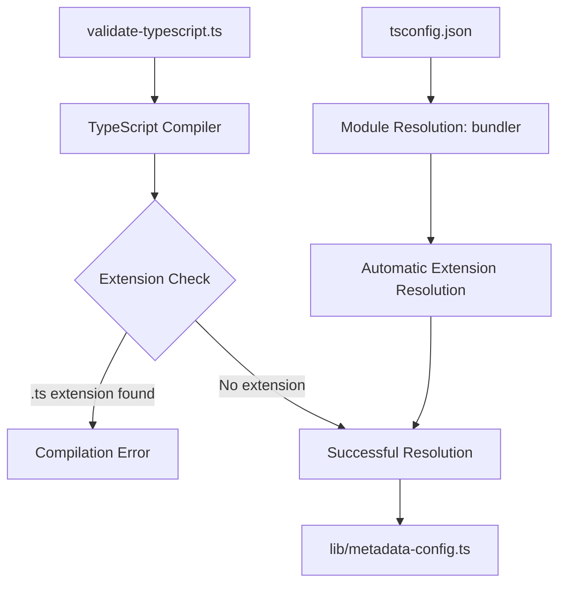
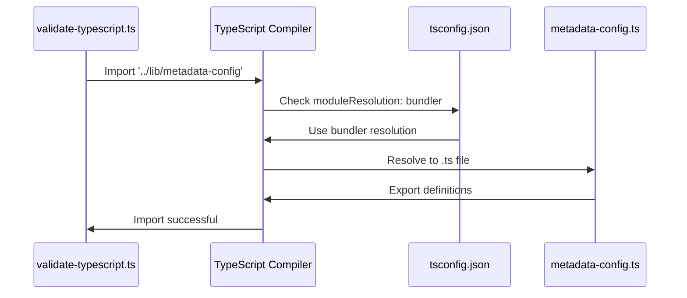
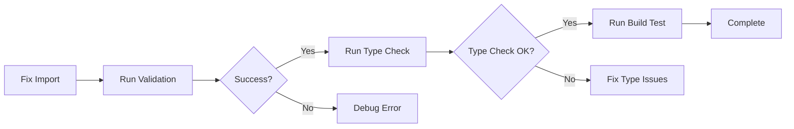

# TypeScript Import Extension Fix Design

## Overview

This design addresses the TypeScript compilation error occurring in the `validate-typescript.ts` script, where explicit `.ts` file extensions in import statements are causing build failures. The error occurs because TypeScript's module resolution doesn't allow `.ts` extensions in import paths unless specifically configured.

## Architecture

### Current Issue Analysis

The validation script `scripts/validate-typescript.ts` contains an import statement with an explicit `.ts` extension:

```typescript
import * as metadataConfig from '../lib/metadata-config.ts';
```

This causes the compilation error:
```
Type error: An import path can only end with a '.ts' extension when 'allowImportingTsExtensions' is enabled.
```

### Root Cause

TypeScript's standard module resolution expects import paths without file extensions for `.ts` files. The bundler module resolution strategy configured in `tsconfig.json` handles extension resolution automatically.

### Component Architecture



## Solution Implementation

### Primary Fix: Remove File Extensions

**Approach 1 (Recommended)**: Remove the `.ts` extension from the import statement

```typescript
// Before (causing error)
import * as metadataConfig from '../lib/metadata-config.ts';

// After (correct)
import * as metadataConfig from '../lib/metadata-config';
```

**Benefits**:
- Follows TypeScript best practices
- Compatible with existing `tsconfig.json` configuration
- No additional configuration required
- Maintains consistency with other imports in the codebase

### Alternative Fix: Enable Extension Imports

**Approach 2**: Add `allowImportingTsExtensions` to `tsconfig.json`

```json
{
  "compilerOptions": {
    "allowImportingTsExtensions": true,
    "noEmit": true,
    // ... other options
  }
}
```

**Considerations**:
- Requires `noEmit: true` (already present)
- Changes project-wide TypeScript behavior
- May impact build tools and bundlers
- Not recommended for this specific case

## Module Resolution Flow



## File Impact Analysis

### Files to Modify

| File | Change Type | Description |
|------|-------------|-------------|
| `scripts/validate-typescript.ts` | Import Statement | Remove `.ts` extension from import |

### Files to Verify

| File | Verification | Purpose |
|------|--------------|---------|
| `tsconfig.json` | Configuration Review | Ensure module resolution is correct |
| `lib/metadata-config.ts` | Export Validation | Confirm exports are accessible |

## Testing Strategy

### Unit Testing Approach

1. **Import Resolution Test**
   ```bash
   npm run validate-typescript
   ```

2. **Type Checking Validation**
   ```bash
   npm run type-check
   ```

3. **Build Process Verification**
   ```bash
   npm run build
   ```

### Validation Steps



## Implementation Details

### Code Changes

**File**: `scripts/validate-typescript.ts`
**Line**: 9
**Change**: Remove `.ts` extension from import path

```typescript
// Current (line 9)
import * as metadataConfig from '../lib/metadata-config.ts';

// Fixed (line 9)
import * as metadataConfig from '../lib/metadata-config';
```

### Configuration Verification

**File**: `tsconfig.json`
**Verify**: Module resolution configuration is correct

```json
{
  "compilerOptions": {
    "moduleResolution": "bundler",  // Enables automatic extension resolution
    "esModuleInterop": true,        // Supports ES module imports
    "allowSyntheticDefaultImports": true
  }
}
```

## Error Prevention Strategy

### Import Guidelines

1. **Never use file extensions** for TypeScript imports
2. **Use relative paths** for local modules
3. **Use path aliases** (`@/`) for project modules when configured

### Code Review Checklist

- [ ] Import paths do not contain `.ts` or `.tsx` extensions
- [ ] Module resolution follows project conventions
- [ ] Path aliases are used consistently
- [ ] All imports resolve correctly during type checking

## Validation Workflow

### Pre-Implementation Checks

1. Verify current TypeScript configuration
2. Confirm module structure and exports
3. Check for similar issues in other files

### Post-Implementation Verification

1. Run TypeScript validation script
2. Execute full type checking
3. Perform build process test
4. Verify runtime functionality

## Risk Assessment

### Low Risk Changes

- Removing file extension from import statement
- Standard TypeScript practice
- No runtime behavior changes

### Potential Issues

- Import resolution failures (mitigated by testing)
- Path resolution conflicts (prevented by existing config)
- Build tool compatibility (verified through testing)

## Performance Impact

### Build Performance

- **Positive Impact**: Faster module resolution
- **No Change**: Runtime performance unaffected
- **Compilation**: Standard TypeScript processing

### Development Experience

- **Improved**: Consistent with TypeScript conventions
- **Reduced Errors**: Eliminates extension-related issues
- **Better Tooling**: Enhanced IDE support and autocomplete