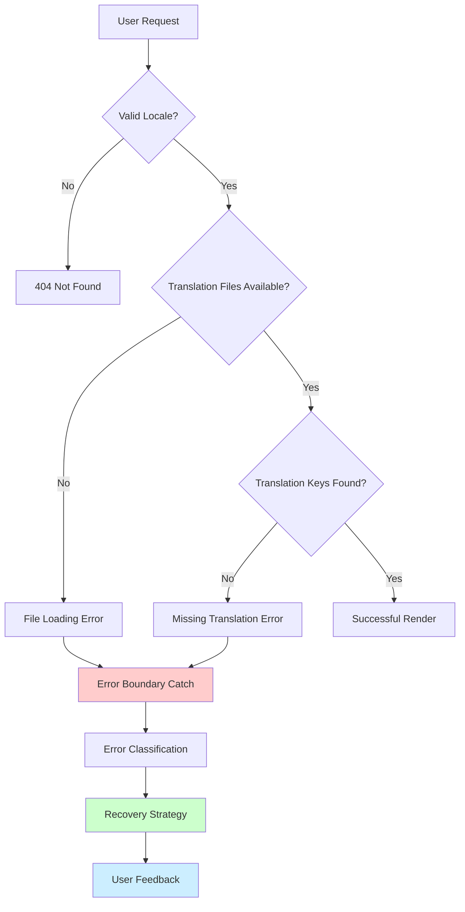
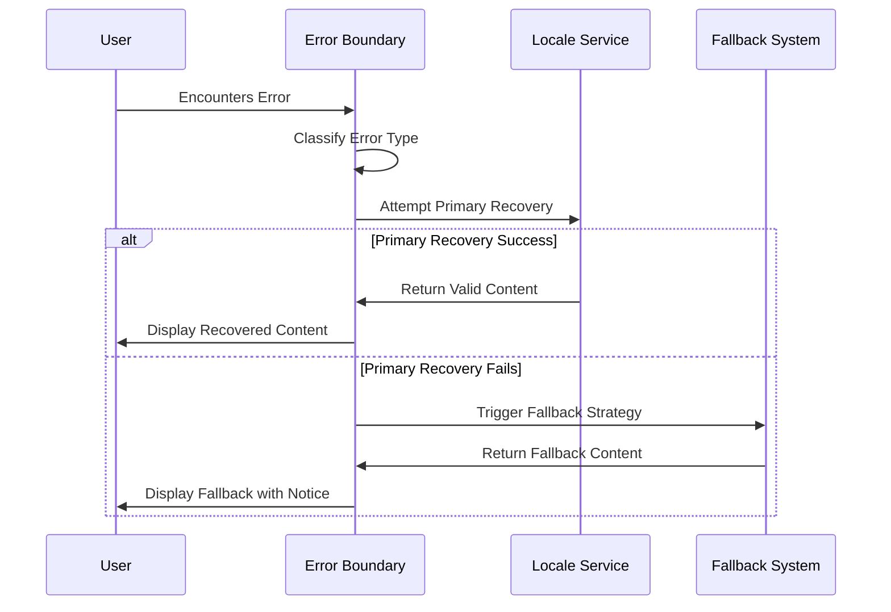
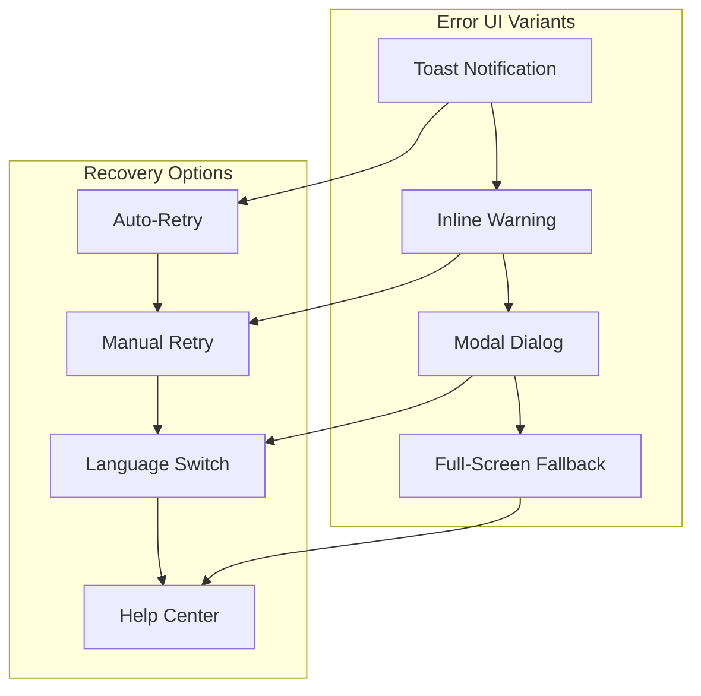
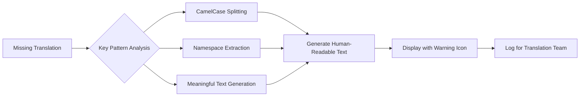
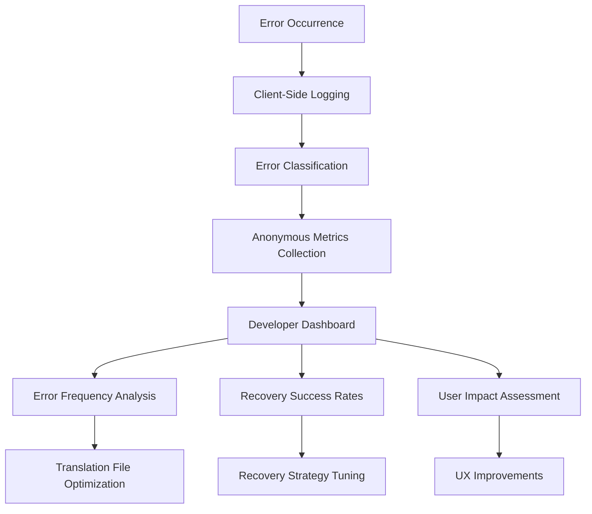
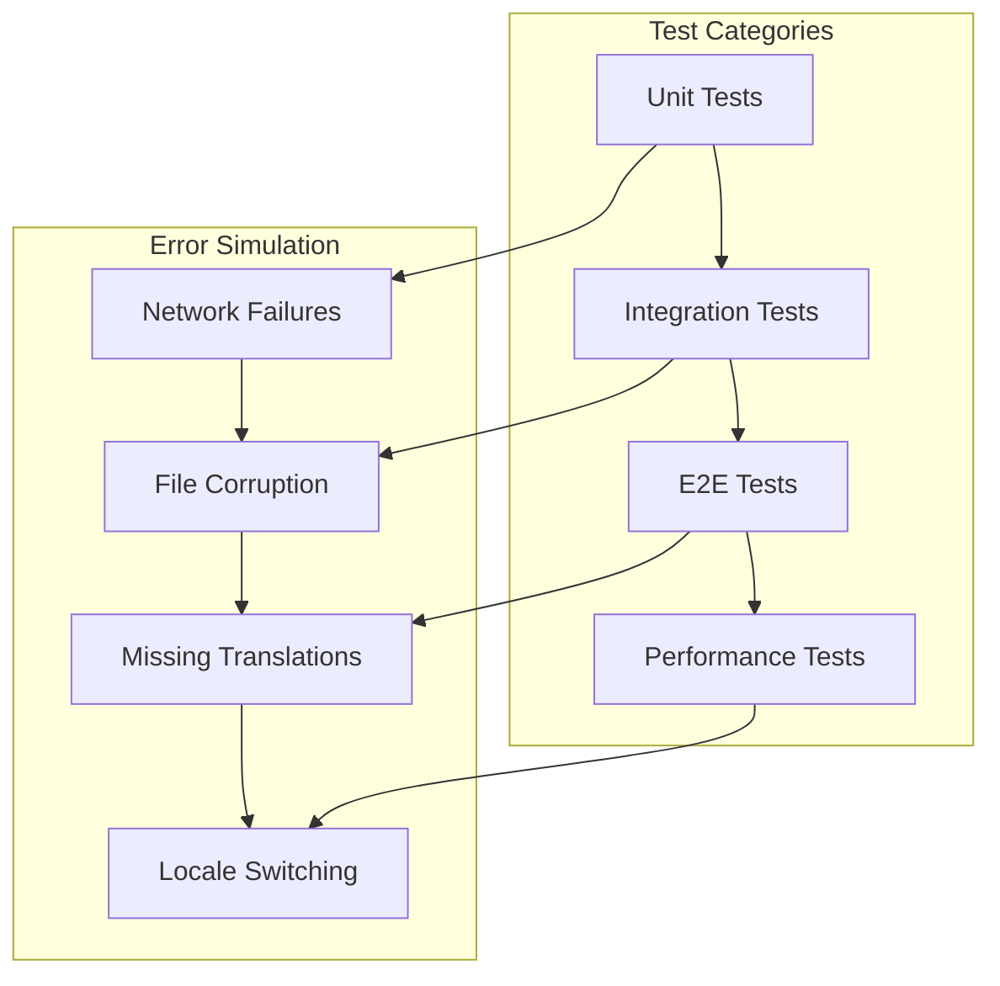

# Enhanced Internationalization Error Handling System

## Overview

This design enhances the existing internationalization (i18n) error handling system for the llvvaa multilingual tourism platform. The current system already includes a `LocaleErrorBoundary` component that displays the error message you encountered. This enhancement focuses on improving error recovery, user experience, and diagnostic capabilities while maintaining the existing robust foundation.

## Current State Analysis

The application currently implements:
- React Error Boundary for locale-related failures
- Fallback mechanism to default Spanish locale
- Retry functionality with page reload
- Development-mode error details display
- Comprehensive testing suite for error scenarios

## Architecture Enhancement

### Error Detection & Classification

### Enhanced Error Classification System

| Error Type | Cause | Recovery Strategy | User Impact |
|------------|-------|------------------|-------------|
| **File Not Found** | Missing translation JSON files | Load fallback locale | Automatic fallback |
| **Parse Error** | Malformed JSON syntax | Use cached version or fallback | Graceful degradation |
| **Missing Keys** | Undefined translation keys | Extract meaningful text from key | Display fallback text |
| **Network Error** | CDN/static file loading issues | Retry with exponential backoff | Loading indicator |
| **Hydration Mismatch** | Server/client locale differences | Force client remount | Brief loading state |

## Enhanced Error Boundary Features

### Smart Recovery Mechanisms

### Progressive Error Handling Strategy

1. **Immediate Recovery** (< 100ms)
   - Check browser cache for valid translations
   - Use previously loaded locale data
   - Extract meaningful text from translation keys

2. **Fallback Recovery** (100ms - 1s)
   - Load default Spanish locale
   - Use embedded fallback translations
   - Display loading indicators

3. **Manual Recovery** (> 1s)
   - Present user-friendly error interface
   - Offer manual language selection
   - Provide refresh/retry options

## User Experience Enhancements

### Improved Error UI Components

### Contextual Error Messages

| Context | Error Display | User Actions |
|---------|--------------|--------------|
| **Page Navigation** | Toast notification with auto-recovery | Continue browsing |
| **Form Submission** | Inline warning below form | Retry submission |
| **Critical Component** | Modal dialog with options | Choose recovery method |
| **Complete Failure** | Full-screen with contact info | Contact support |

## Implementation Strategy

### Enhanced Locale Error Boundary

**Key Improvements:**
- Error type classification and appropriate responses
- Progressive retry mechanisms with exponential backoff
- Browser storage for error frequency tracking
- Integration with analytics for error monitoring
- Customizable recovery strategies per component

### Fallback Translation System

### Smart Cache Management

**Browser Storage Strategy:**
- Store successful translation loads in localStorage
- Cache error states to prevent repeated failures
- Implement TTL (Time To Live) for cached data
- Clear cache on version updates

## Monitoring & Analytics

### Error Tracking System

### Performance Metrics

| Metric | Target | Measurement |
|--------|--------|-------------|
| **Error Recovery Time** | < 2 seconds | Time from error to successful display |
| **Fallback Success Rate** | > 95% | Percentage of successful fallback loads |
| **User Abandonment** | < 5% | Users leaving after error encounter |
| **Translation Coverage** | > 98% | Percentage of keys with valid translations |

## Testing Strategy

### Comprehensive Error Scenarios

### Test Scenarios Matrix

| Scenario | Error Type | Expected Behavior | Success Criteria |
|----------|------------|-------------------|------------------|
| **Missing es.json** | File Load Error | Load en.json fallback | Content displays in English |
| **Malformed JSON** | Parse Error | Use cached version | Previous content remains |
| **Network Timeout** | Network Error | Show loading state | Retry after delay |
| **Hydration Mismatch** | SSR/Client Diff | Remount component | No visual flash |
| **Rapid Locale Switch** | Race Condition | Cancel previous requests | Latest locale wins |

## Accessibility Considerations

### Screen Reader Support

- Announce error states and recovery actions
- Provide clear context for error messages
- Ensure all recovery buttons are keyboard accessible
- Use appropriate ARIA labels and roles

### Visual Accessibility

- High contrast error indicators
- Clear visual hierarchy in error messages
- Consistent iconography across error states
- Responsive design for all error interfaces

## Deployment & Rollback Strategy

### Phased Implementation

1. **Phase 1**: Enhanced error classification and logging
2. **Phase 2**: Improved fallback mechanisms
3. **Phase 3**: Advanced caching and performance optimizations
4. **Phase 4**: Analytics integration and monitoring

### Risk Mitigation

- Feature flags for new error handling behaviors
- A/B testing for different recovery strategies
- Automatic rollback triggers for increased error rates
- Comprehensive monitoring during deployment

## Success Metrics

### User Experience Indicators

- **Error Recovery Rate**: 95% of errors should recover within 2 seconds
- **User Satisfaction**: Maintain current satisfaction levels despite errors
- **Support Ticket Reduction**: 30% fewer i18n-related support requests
- **Conversion Impact**: No significant impact on booking conversions

### Technical Performance Goals

- **Error Detection Time**: < 50ms from occurrence to boundary catch
- **Fallback Load Time**: < 500ms for default locale loading
- **Cache Hit Rate**: > 80% for frequently accessed translations
- **Memory Usage**: No memory leaks in error boundary components