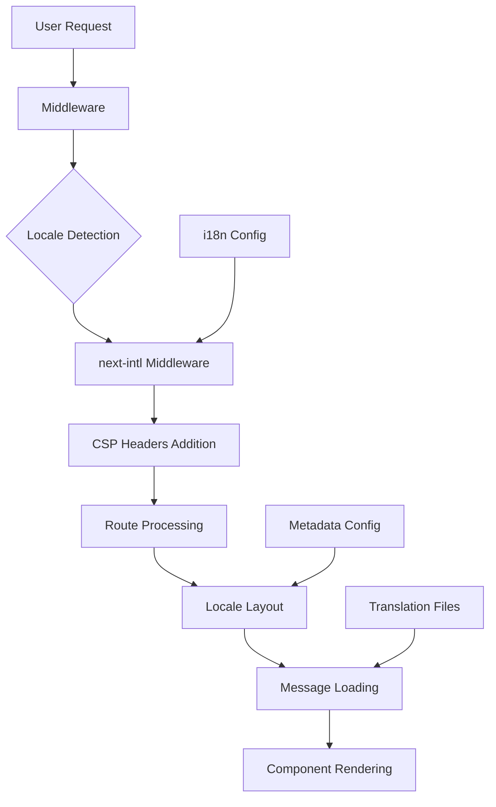
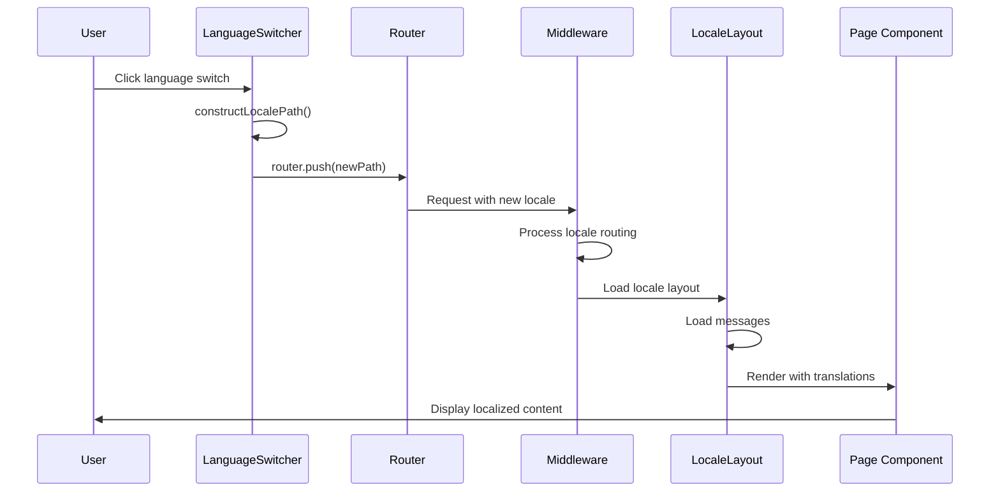
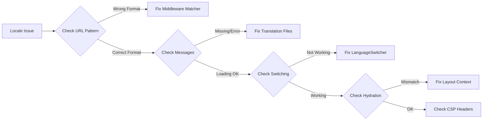
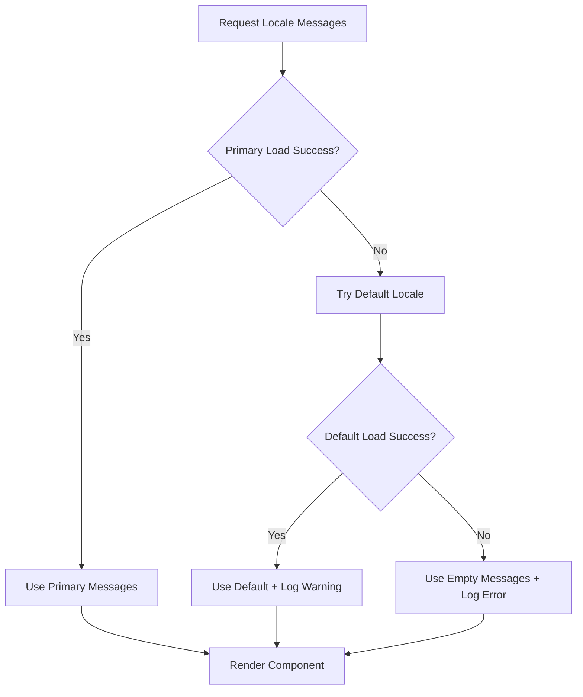
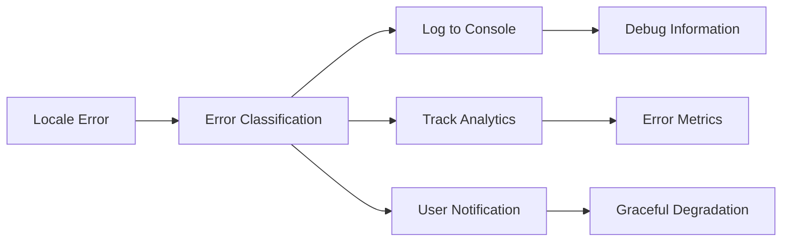

# Locale Functionality Troubleshooting and Fix Design

## Overview

This design addresses the locale functionality issues in the llvvaa Next.js application. The application uses `next-intl` for internationalization with support for Spanish (`es`) and English (`en`) locales, but users are experiencing problems with locale switching, routing, or content display.

## Architecture Analysis

### Current Internationalization Setup



### Component Interaction Flow



## Problem Diagnosis Framework

### Common Locale Issues

| Issue Type | Symptoms | Root Cause |
|------------|----------|------------|
| **Routing Problems** | URLs not changing, 404 errors | Middleware configuration, matcher patterns |
| **Translation Loading** | Missing text, fallback errors | Message file structure, loading logic |
| **Language Switching** | Button not working, wrong redirects | Path construction logic, router implementation |
| **Hydration Errors** | Server/client mismatch | Locale context inconsistency |
| **Middleware Conflicts** | CSP blocking, performance issues | Header processing order |

### Diagnostic Checklist



## Solution Architecture

### Enhanced Middleware Configuration

**Improved Matcher Pattern**
```typescript
export const config = {
  matcher: [
    // Exclude static files and API routes more precisely
    '/((?!api|_next/static|_next/image|_vercel|favicon.ico|sitemap.xml|robots.txt|.*\\.(jpg|jpeg|png|gif|svg|ico|webp|avif|css|js)$).*)',
    // Root path handling
    '/'
  ]
};
```

### Robust Language Switching Logic

**Path Construction Enhancement**
```typescript
const constructLocalePath = (locale: string, currentPath: string): string => {
  // Normalize path
  const cleanPath = currentPath.replace(/\/+/g, '/').replace(/\/$/, '') || '/';
  
  // Extract segments
  const segments = cleanPath.split('/').filter(Boolean);
  
  // Handle locale replacement/insertion
  if (segments.length > 0 && locales.includes(segments[0] as any)) {
    segments[0] = locale; // Replace existing locale
  } else {
    segments.unshift(locale); // Add locale prefix
  }
  
  return `/${segments.join('/')}`;
};
```

### Message Loading Resilience

**Fallback Strategy**


## Implementation Strategy

### Phase 1: Diagnostic Tools

**Debugging Utilities**
- Add comprehensive logging to middleware
- Create locale validation helper functions
- Implement client-side debugging tools
- Add error boundary with locale context

### Phase 2: Middleware Optimization

**Enhanced Configuration**
- Refine matcher patterns for better performance
- Optimize CSP header processing order
- Add locale validation before processing
- Implement request caching for repeated calls

### Phase 3: Component Improvements

**LanguageSwitcher Enhancements**
- Robust path construction with edge case handling
- Better error handling for invalid routes
- Visual feedback for switching states
- Accessibility improvements

**Layout Error Handling**
- Enhanced message loading with retries
- Progressive fallback mechanism
- Hydration mismatch prevention
- Performance monitoring

### Phase 4: Testing & Validation

**Comprehensive Test Coverage**
- Unit tests for path construction logic
- Integration tests for language switching
- E2E tests for user workflows
- Performance benchmarking

## Technical Specifications

### Middleware Enhancements

```typescript
// Enhanced locale detection with validation
function validateLocale(locale: string): boolean {
  return locales.includes(locale as any) && locale.length === 2;
}

// Improved CSP integration
function applySecurityHeaders(response: NextResponse, nonce: string): void {
  const headers = createCSPHeaders(isDevelopment, nonce, isReportOnly);
  Object.entries(headers).forEach(([name, value]) => {
    response.headers.set(name, value);
  });
}
```

### Error Recovery Mechanisms

```typescript
// Progressive message loading
async function loadMessagesWithFallback(locale: string) {
  try {
    return await import(`../messages/${locale}.json`).then(m => m.default);
  } catch (error) {
    console.warn(`Locale ${locale} failed, trying default`);
    return await import(`../messages/${defaultLocale}.json`).then(m => m.default);
  }
}
```

### Performance Optimizations

| Component | Optimization | Impact |
|-----------|--------------|--------|
| **Middleware** | Early return for static files | Reduced processing overhead |
| **Message Loading** | Lazy loading with caching | Faster page transitions |
| **Path Construction** | Memoization of common paths | Improved switching speed |
| **CSP Headers** | Conditional application | Better development experience |

## Testing Strategy

### Unit Testing Focus Areas

```typescript
describe('Locale Functionality', () => {
  test('Path construction handles edge cases');
  test('Message loading with fallbacks');
  test('Middleware locale detection');
  test('Language switcher state management');
});
```

### Integration Testing Scenarios

- Language switching preserves query parameters
- Deep linking to localized pages works correctly
- Error boundaries handle locale failures gracefully
- CSP headers don't interfere with functionality

### Performance Testing Metrics

- Middleware processing time per request
- Message loading time across locales
- Language switching response time
- Memory usage during locale operations

## Monitoring & Analytics

### Error Tracking



### Performance Monitoring

- Track locale switching success rates
- Monitor message loading performance
- Measure middleware impact on response times
- Analyze user behavior patterns across locales