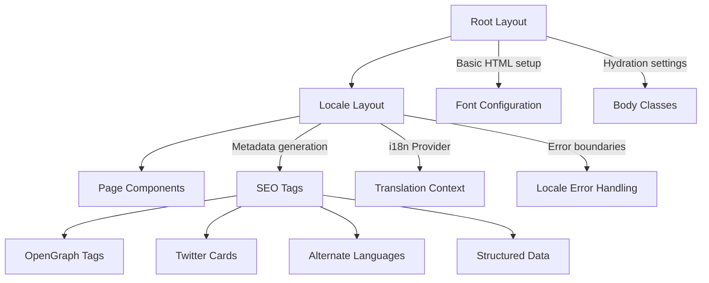
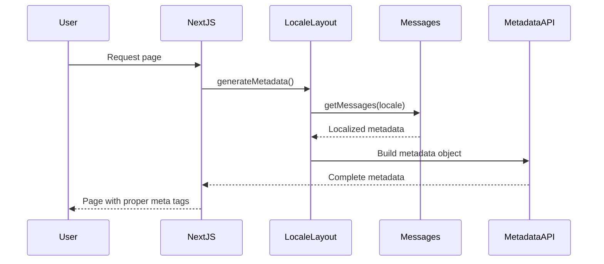
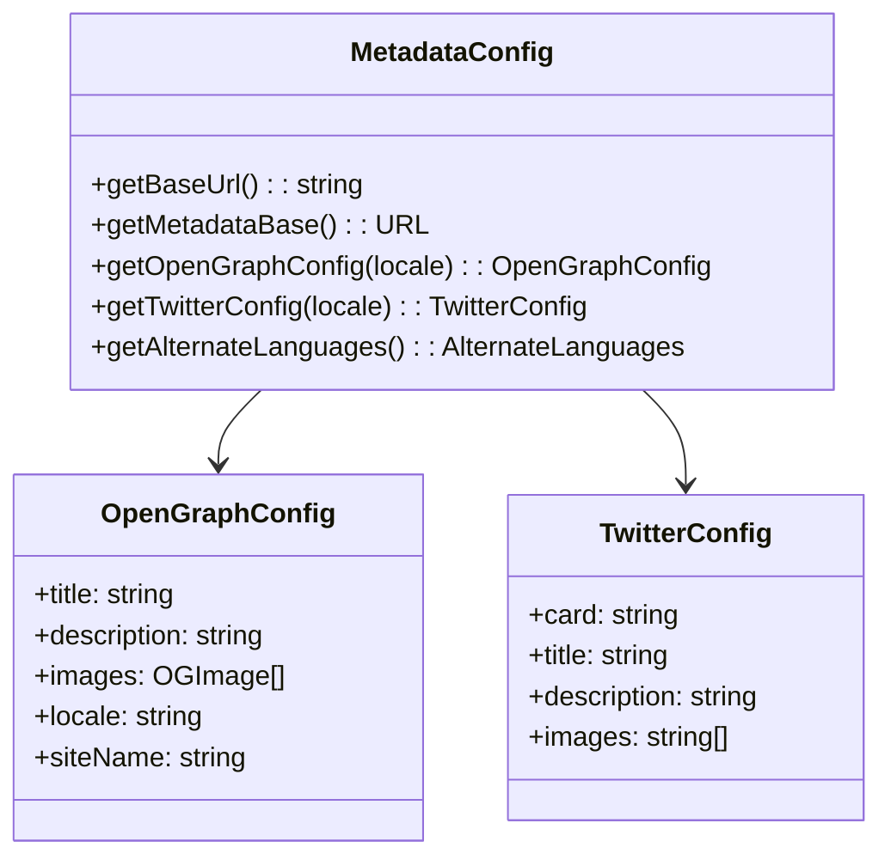
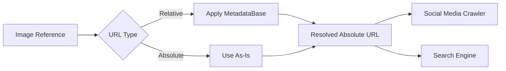

# Next.js MetadataBase Configuration Design

## Overview

This design addresses the Next.js warning: "metadataBase property in metadata export is not set for resolving social open graph or twitter images, using 'http://localhost:3000'". The solution implements proper metadata configuration to ensure correct social media sharing, SEO optimization, and image URL resolution across development and production environments.

## Architecture

### Current Metadata Structure

The application uses a two-tier layout structure for metadata management:



### Metadata Flow Architecture



## Current Implementation Analysis

### Existing Metadata Configuration

**Root Layout (`app/layout.tsx`)**:
- Minimal setup with fonts and hydration
- No metadata export (intentional for locale routing)

**Locale Layout (`app/[locale]/layout.tsx`)**:
- Dynamic metadata generation per locale
- OpenGraph and Twitter Card configuration
- Missing `metadataBase` property

**Issues Identified**:
1. No `metadataBase` configuration causing localhost fallback
2. Absolute URLs hardcoded instead of using dynamic base URL
3. No environment-specific URL resolution
4. Potential issues with image URL resolution in production

## Solution Design

### MetadataBase Configuration Strategy

#### 1. Environment-Aware Base URL Resolution

Create a dynamic `metadataBase` that adapts to different environments:

```typescript
// Environment detection logic
const getBaseUrl = (): string => {
  // Production environment
  if (process.env.NODE_ENV === 'production') {
    return process.env.NEXT_PUBLIC_SITE_URL || 'https://laviejaadventures.com';
  }
  
  // Development environment
  if (process.env.VERCEL_URL) {
    return `https://${process.env.VERCEL_URL}`;
  }
  
  // Local development fallback
  return 'http://localhost:3000';
};
```

#### 2. Centralized Metadata Configuration

Create a metadata utility module for consistent configuration:

```typescript
// lib/metadata-config.ts
export const getMetadataConfig = (locale: string) => ({
  metadataBase: new URL(getBaseUrl()),
  // Other metadata configurations...
});
```

### Implementation Components

#### 1. Environment Variables Setup

Required environment variables for proper URL resolution:

| Variable | Purpose | Example |
|----------|---------|---------|
| `NEXT_PUBLIC_SITE_URL` | Production base URL | `https://laviejaadventures.com` |
| `VERCEL_URL` | Automatic Vercel deployment URL | Auto-provided by Vercel |

#### 2. Metadata Configuration Module



#### 3. Updated Layout Metadata Generation

Enhanced `generateMetadata` function with proper base URL handling:

```typescript
export async function generateMetadata({ params }: LayoutProps): Promise<Metadata> {
  const { locale } = await params;
  const baseUrl = getBaseUrl();
  const messages = await getMessages({ locale });
  const metadata = messages.metadata as any;

  return {
    metadataBase: new URL(baseUrl),
    title: metadata?.site?.title || "La Vieja Adventures | La Aventura te Espera",
    description: metadata?.site?.description || "La Vieja Adventures: Empresa líder en turismo de aventura en Costa Rica",
    // ... rest of metadata configuration
  };
}
```

### Image URL Resolution Strategy

#### Current Issue
- Relative image URLs in OpenGraph and Twitter cards
- No proper base URL resolution
- Potential 404s for social media crawlers

#### Solution Architecture



#### Implementation Details

1. **Relative Image URLs**: Automatically resolved using `metadataBase`
2. **Absolute Image URLs**: Used directly without modification
3. **Dynamic Image URLs**: Constructed using base URL utility

### SEO and Social Media Optimization

#### OpenGraph Configuration Enhancement

```typescript
openGraph: {
  title: metadata?.site?.title,
  description: metadata?.site?.description,
  url: `${baseUrl}/${locale}`,
  siteName: "La Vieja Adventures",
  images: [
    {
      url: "/images/og-la-vieja-adventures.jpg", // Resolved via metadataBase
      width: 1200,
      height: 630,
      alt: "La Vieja Adventures en Costa Rica",
    },
  ],
  locale: locale === "es" ? "es_CR" : "en_US",
  type: "website",
}
```

#### Twitter Cards Enhancement

```typescript
twitter: {
  card: "summary_large_image",
  title: metadata?.site?.title,
  description: metadata?.site?.description,
  images: ["/images/twitter-la-vieja-adventures.jpg"], // Resolved via metadataBase
}
```

### Environment-Specific Considerations

#### Development Environment
- Uses `localhost:3000` as base URL
- Maintains functionality for local testing
- Proper image resolution for development tools

#### Staging/Preview Environment
- Uses Vercel preview URL when available
- Enables proper social media preview testing
- Maintains production-like behavior

#### Production Environment
- Uses configured production URL
- Optimized for SEO and social media crawlers
- Proper CDN integration support

## Implementation Benefits

### Technical Benefits
1. **Eliminates Warning**: Resolves Next.js metadataBase warning
2. **Proper URL Resolution**: Ensures correct absolute URLs in all environments
3. **Social Media Compatibility**: Proper image URLs for social media crawlers
4. **SEO Optimization**: Enhanced search engine visibility
5. **Environment Agnostic**: Works across development, staging, and production

### User Experience Benefits
1. **Improved Social Sharing**: Correct preview images and metadata
2. **Better Search Results**: Enhanced search engine snippets
3. **Professional Appearance**: Consistent branding across platforms

### Maintenance Benefits
1. **Centralized Configuration**: Single source of truth for metadata
2. **Environment Flexibility**: Easy deployment across different environments
3. **Type Safety**: Full TypeScript support for metadata configuration

## Testing Strategy

### Development Testing
- Verify localhost URL resolution
- Test social media preview tools
- Validate OpenGraph and Twitter Card rendering

### Staging Testing
- Test with Vercel preview URLs
- Validate social media sharing
- Check SEO metadata generation

### Production Testing
- Verify production URL configuration
- Test social media crawlers
- Validate search engine indexing

### Automated Testing
- Unit tests for metadata generation functions
- Integration tests for URL resolution
- E2E tests for social media preview functionality

## Migration Considerations

### Backward Compatibility
- Maintains existing metadata structure
- No breaking changes to existing functionality
- Gradual rollout capability

### Performance Impact
- Minimal runtime overhead
- Environment variable caching
- Efficient URL construction

### Monitoring and Validation
- Social media preview validation
- SEO monitoring tools integration
- Error tracking for metadata generation failures