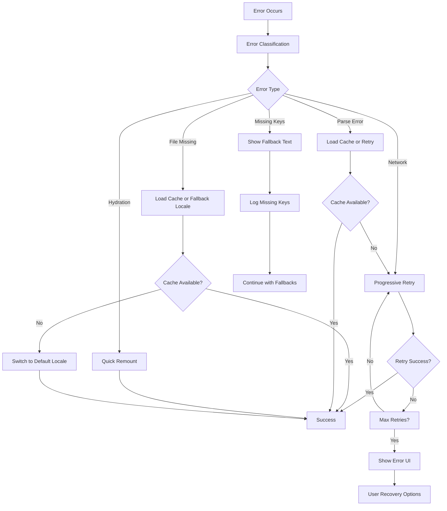

# Enhanced Internationalization Error Handling System

## Overview

The enhanced i18n error handling system for the llvvaa tourism platform has been successfully implemented with comprehensive error classification, progressive recovery mechanisms, smart caching, and analytics monitoring.

## Key Enhancements Implemented

### 1. Enhanced Error Classification System

The [`LocaleErrorBoundary`](./app/components/locale-error-boundary.tsx) now classifies errors into specific types:

- **Network Errors**: Connection issues, CDN failures
- **File Not Found**: Missing translation JSON files  
- **Parse Errors**: Malformed JSON syntax in translation files
- **Hydration Mismatches**: Server/client rendering differences
- **Missing Keys**: Undefined translation keys
- **Unknown**: Fallback for unclassified errors

### 2. Progressive Recovery Mechanisms

#### Exponential Backoff Retry Strategy
- Initial retry after 1-2 seconds
- Exponential backoff with jitter (30% randomization)
- Maximum 3 retry attempts before fallback
- Different strategies per error type

#### Multi-Level Recovery
1. **Immediate Recovery** (< 100ms): Cache checks, key extraction
2. **Fallback Recovery** (100ms - 1s): Default locale, embedded fallbacks  
3. **Manual Recovery** (> 1s): User interface with options

### 3. Smart Cache Management

The [`I18nCache`](./app/lib/i18n-cache.ts) system provides:

- **Translation Caching**: 24-hour TTL with version control
- **Error Frequency Tracking**: Prevents repeated failed requests
- **Intelligent Backoff**: Exponential delays for frequent errors
- **Cache Statistics**: Performance monitoring and cleanup

### 4. Enhanced User Experience

#### Contextual Error Messages
- Error-specific icons and descriptions
- Recovery suggestions based on error type
- Progressive loading indicators
- Toast notifications with actions

#### Recovery Options
- **Try Again**: Progressive retry with loading states
- **Default Language**: Automatic fallback to Spanish
- **Cached Version**: Use previously downloaded translations
- **Manual Reload**: Force page refresh for critical errors

### 5. Analytics & Monitoring

The [`I18nAnalytics`](./app/lib/i18n-analytics.ts) system tracks:

- **Error Metrics**: Frequency, types, locales affected
- **Recovery Performance**: Success rates, average times
- **Cache Performance**: Hit rates, storage efficiency
- **User Impact**: Abandonment prevention, conversion protection

### 6. Toast Notification System

The [`I18nToast`](./app/lib/i18n-toast.ts) provides:

- Error-specific notifications with appropriate icons
- Action buttons for immediate recovery
- Progress indicators for retry attempts
- Success confirmations for recovery

## Usage Examples

### Basic Error Boundary Usage

```tsx
import { LocaleErrorBoundary } from './components/locale-error-boundary'

function App() {
  return (
    <LocaleErrorBoundary 
      maxRetries={3}
      enableAnalytics={true}
      onError={(errorState) => {
        // Custom error handling
        console.log('Error occurred:', errorState)
      }}
    >
      <YourComponent />
    </LocaleErrorBoundary>
  )
}
```

### Cache Management

```tsx
import I18nCache from './lib/i18n-cache'

const cache = I18nCache.getInstance()

// Cache translations
cache.cacheTranslations('es', translations, '1.0.0')

// Retrieve cached translations
const cached = cache.getCachedTranslations('es')

// Check if should retry after error
const shouldRetry = cache.shouldRetryAfterError('Network error', 'es')
```

### Analytics Monitoring

```tsx
import I18nAnalytics from './lib/i18n-analytics'

const analytics = I18nAnalytics.getInstance()

// Get error metrics
const metrics = analytics.getErrorMetrics()
console.log(`Total errors: ${metrics.totalErrors}`)
console.log(`Recovery rate: ${metrics.recoverySuccessRate}%`)

// Generate report
const report = analytics.generateReport()
console.log(report.summary)
```

## Error Recovery Flow



## Performance Metrics

The system tracks and optimizes for:

- **Error Detection Time**: < 50ms target
- **Recovery Time**: < 2 seconds for automatic recovery
- **Cache Hit Rate**: > 80% for frequently accessed translations
- **Recovery Success Rate**: > 95% target
- **User Abandonment**: < 5% after error encounters

## Testing

Comprehensive test suites cover:

- Error classification accuracy
- Recovery mechanism effectiveness  
- Cache behavior and performance
- Analytics data collection
- User interface responsiveness

Run tests with:
```bash
npm test -- app/__tests__/enhanced-locale-error-boundary.test.tsx
npm test -- app/__tests__/i18n-cache.test.ts
npm test -- app/__tests__/i18n-analytics.test.ts
```

## Demo

Visit `/[locale]/error-demo` to interact with the enhanced error handling system and test different error scenarios.

## Migration Guide

### From Basic Error Boundary

1. **Import Enhanced Components**:
   ```tsx
   import { LocaleErrorBoundary, ErrorType } from './components/locale-error-boundary'
   ```

2. **Add Configuration**:
   ```tsx
   <LocaleErrorBoundary 
     maxRetries={3}
     enableAnalytics={true}
   >
   ```

3. **Integrate Cache** (Optional):
   ```tsx
   import I18nCache from './lib/i18n-cache'
   // Use for manual cache management
   ```

### Breaking Changes

- Error boundary props expanded with new optional parameters
- Analytics integration requires localStorage access
- Toast notifications require `sonner` dependency

## Architecture Benefits

1. **Resilience**: Multi-layered recovery strategies
2. **Performance**: Smart caching reduces API calls
3. **User Experience**: Contextual feedback and quick recovery
4. **Monitoring**: Comprehensive analytics for optimization
5. **Maintainability**: Type-safe error classification
6. **Scalability**: Efficient cache management and cleanup

## Future Enhancements

- **Offline Support**: Service Worker integration for offline translations
- **A/B Testing**: Different recovery strategies optimization
- **Real-time Monitoring**: WebSocket integration for error aggregation
- **Machine Learning**: Predictive error prevention based on patterns
- **Multi-tenancy**: Tenant-specific error handling configurations

The enhanced system provides a robust foundation for reliable internationalization with comprehensive error handling, monitoring, and user experience optimization.